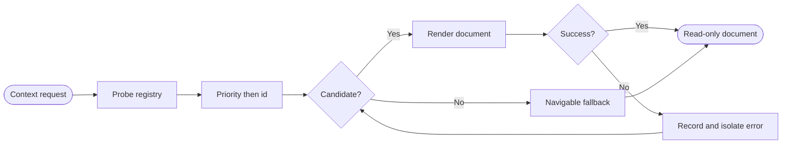

## Logic
<!-- type: logic lang: mermaid -->



`ContextRenderer` is a provider-neutral read-only trait with stable `id`, numeric `priority`, side-effect-free `supports`, and `render`. `RendererRegistry` probes all renderers, sorts supported candidates by priority descending and id ascending, and tries them in order. A renderer error becomes a disclosed warning and does not stop the next renderer, the terminal, or the PTY. If no renderer succeeds, the registry returns a fallback document with a source navigation target instead of an error or crash.

`ContextRequest` is rooted at canonical active cwd and targets either the workspace or one relative file. Path resolution rejects traversal outside that root. `ContextDocument` carries renderer id, document kind, title, safe HTML body, source navigation, warnings, and explicit root/path provenance. No renderer may mutate repository files, PTY state, cwd telemetry, or AW lifecycle state.

`MarkdownRenderer` supports `.md` and `.markdown` files up to a bounded size, requires UTF-8, and renders CommonMark plus tables/task lists/strikethrough through `pulldown-cmark`. Raw HTML is escaped as text and unsafe link/image schemes are neutralized before HTML reaches the WebView. The document links back to its canonical source path.

`GitRenderer` supports an ordinary Git working tree and invokes only read-only commands with explicit arguments: status, diff stat, and diff. Output is size-bounded and HTML-escaped; changed relative paths become navigation targets. It does not require `aw.toml`. Missing Git, corrupt Markdown, unsupported files, and renderer failures all converge on the same navigable fallback contract.

## Changes
<!-- type: changes lang: yaml -->

```yaml
changes:
  - path: Cargo.lock
    action: modify
    section: logic
    impl_mode: hand-written
    description: Record the Workbench direct pulldown-cmark dependency.
  - path: apps/workbench/Cargo.toml
    action: modify
    section: logic
    impl_mode: hand-written
    description: Add bounded CommonMark rendering support.
  - path: apps/workbench/src/context/mod.rs
    action: create
    section: logic
    impl_mode: hand-written
    description: Define renderer requests, structured documents, deterministic registry selection, error isolation, fallback, and path confinement.
  - path: apps/workbench/src/context/markdown.rs
    action: create
    section: logic
    impl_mode: hand-written
    description: Render bounded UTF-8 Markdown to safe HTML with explicit source navigation.
  - path: apps/workbench/src/context/git.rs
    action: create
    section: logic
    impl_mode: hand-written
    description: Render read-only Git status, diff stat, diff, and changed-path navigation for ordinary repositories.
  - path: apps/workbench/src/lib.rs
    action: modify
    section: logic
    impl_mode: hand-written
    anchor: run
    description: Export the generic context-renderer registry from the Workbench host crate.
  - path: apps/workbench/tests/generic_context_renderers.rs
    action: create
    section: unit-test
    impl_mode: hand-written
    description: Prove non-AW Markdown and Git rendering, deterministic selection, failure isolation, safe output, and navigable fallback.
  - path: apps/workbench/README.md
    action: modify
    section: logic
    impl_mode: hand-written
    description: Document provider-neutral Markdown/Git context, selection, provenance, and fallback behavior.
  - path: apps/workbench/CAPABILITIES.md
    action: modify
    section: logic
    impl_mode: hand-written
    description: Advance the generic-context-renderers work root and register its verification gate.
  - path: apps/workbench/CONTRIBUTING.md
    action: modify
    section: unit-test
    impl_mode: hand-written
    description: Record the non-AW renderer fixture gate and read-only isolation rules.
```
