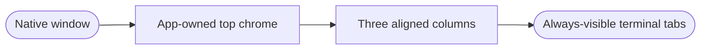
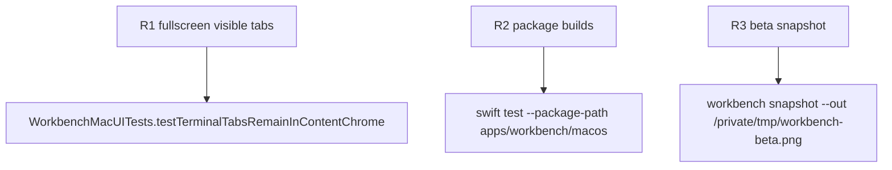

## Logic
<!-- type: logic lang: mermaid -->



The native window uses a transparent titlebar and full-size content view, while the terminal tab strip stays inside the SwiftUI terminal workspace. The root workspace therefore reaches the same top edge in the Projects, terminal, and Auxiliary columns. In both normal and macOS fullscreen modes, the tab strip is app content and never depends on native toolbar or titlebar hover reveal.

The Project column retains a narrow leading titlebar-safe region for traffic-light controls in a normal window. The center column owns a compact 40-point tab header, with ordinary whole-tab selection, independent close controls, keyboard shortcuts, and the add-shell action.

The layout operation cannot change project selection, PTY cwd, terminal lifecycle, renderer retention, tab identifiers, or Auxiliary file-listing state.

## Changes
<!-- type: changes lang: yaml -->

```yaml
changes:
  - path: apps/workbench/macos/Sources/WorkbenchMac/WorkbenchMacApp.swift
    action: modify
    section: logic
    impl_mode: hand-written
    anchor: WorkbenchMacApp
  - path: apps/workbench/macos/Sources/WorkbenchMac/WorkbenchView.swift
    action: modify
    section: logic
    impl_mode: hand-written
    anchor: WorkbenchView
  - path: apps/workbench/macos/UITests/WorkbenchMacUITests.swift
    action: modify
    section: unit-test
    impl_mode: hand-written
    anchor: WorkbenchMacUITests
```

## Unit Test
<!-- type: unit-test lang: mermaid -->


