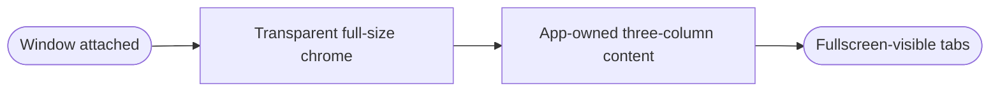
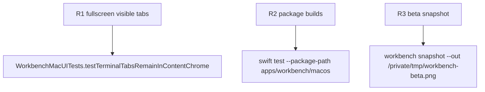

## Logic
<!-- type: logic lang: mermaid -->



`WorkbenchMacApp` installs an AppKit bridge that configures only the hosting `NSWindow`: `titlebarAppearsTransparent` is enabled, the title visibility is hidden, and `fullSizeContentView` is present. The bridge is idempotent, runs on the main actor, and changes no window state after the first successful attachment.

`WorkbenchView` draws its `NavigationSplitView` through the top container safe area. The Project, terminal, and optional Beta Auxiliary columns therefore begin at the same y-origin. The terminal tab strip remains the first child of `terminalWorkspace`; it owns the terminal action controls and stays visible when macOS hides native chrome in fullscreen.

The Project column includes a titlebar-leading clearance in windowed mode only for traffic-light safety. Its project buttons, terminal tab state, PTY sessions, files listing, and runtime profile remain unchanged.
## Changes
<!-- type: changes lang: yaml -->

```yaml
changes:
  - path: apps/workbench/macos/Sources/WorkbenchMac/WorkbenchMacApp.swift
    action: modify
    section: logic
    impl_mode: hand-written
    anchor: WorkbenchMacApp
  - path: apps/workbench/macos/Sources/WorkbenchMac/WorkbenchView.swift
    action: modify
    section: logic
    impl_mode: hand-written
    anchor: WorkbenchView
  - path: apps/workbench/macos/UITests/WorkbenchMacUITests.swift
    action: modify
    section: unit-test
    impl_mode: hand-written
    anchor: WorkbenchMacUITests
```

## Unit Test
<!-- type: unit-test lang: mermaid -->


