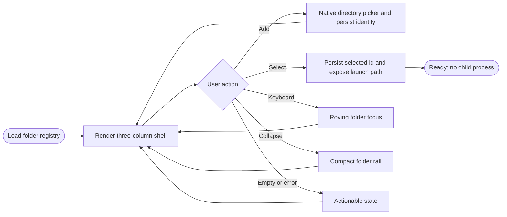

## Logic
<!-- type: logic lang: mermaid -->

The shell keeps two state boundaries deliberately separate. Rust owns a small
`LaunchFolderRegistry` containing canonical directory identity plus the
selected folder id, persisted below the Tauri application configuration
directory. The navigation collapsed state is transient UI preference and is
not written into that registry. Terminal cwd remains absent until child WI
#2194.

The native host exposes commands to load the registry, choose/register a folder
through the Tauri dialog plugin, select a registered folder, and resolve the
selected canonical path for the future agent-launch boundary. Registration
rejects non-directories, de-duplicates canonical paths, and preserves the prior
selection when a picker is cancelled or persistence fails. No command in this
slice starts a process, allocates a PTY, or mutates AW.

The local WebView renders accessible `nav`, `main`, and `aside` landmarks.
The folder list uses ordinary buttons plus ArrowUp/ArrowDown and Enter/Space
navigation, the collapse control remains keyboard reachable, and a live status
region reports cancellation and errors. Desktop and constrained-desktop
layouts keep all three regions functional: the constrained layout uses a
compact folder rail and a bounded context pane rather than hiding primary
actions.

A browser-only test bridge supplies deterministic command results to the same
UI module for Jet E2E execution. Production always selects the Tauri invoke
bridge. The journey records rendered desktop and constrained-width PNG
evidence, interaction results, focus order, landmark/readability assertions,
and the future launch path without spawning any agent process.
