## Logic
<!-- type: logic lang: mermaid -->


The shell keeps two state boundaries deliberately separate. Rust owns a small
`LaunchFolderRegistry` containing canonical directory identity plus the
selected folder id, persisted below the Tauri application configuration
directory. The navigation collapsed state is transient UI preference and is
not written into that registry. Terminal cwd remains absent until child WI
#2194.

The native host exposes commands to load the registry, choose/register a folder
through the Tauri dialog plugin, select a registered folder, and resolve the
selected canonical path for the future agent-launch boundary. Registration
rejects non-directories, de-duplicates canonical paths, and preserves the prior
selection when a picker is cancelled or persistence fails. No command in this
slice starts a process, allocates a PTY, or mutates AW.

The local WebView renders accessible `nav`, `main`, and `aside` landmarks.
The folder list uses ordinary buttons plus ArrowUp/ArrowDown and Enter/Space
navigation, the collapse control remains keyboard reachable, and a live status
region reports cancellation and errors. Desktop and constrained-desktop
layouts keep all three regions functional: the constrained layout uses a
compact folder rail and a bounded context pane rather than hiding primary
actions.

A browser-only test bridge supplies deterministic command results to the same
UI module for Jet E2E execution. Production always selects the Tauri invoke
bridge. The journey records rendered desktop and constrained-width PNG
evidence, interaction results, focus order, landmark/readability assertions,
and the future launch path without spawning any agent process.

## Changes
<!-- type: changes lang: yaml -->

```yaml
changes:
  - path: Cargo.lock
    action: modify
    section: logic
    impl_mode: hand-written
    description: Lock the Tauri dialog plugin and its native directory-picker dependency graph.
  - path: apps/workbench/Cargo.toml
    action: modify
    section: logic
    impl_mode: hand-written
    description: Add the dialog plugin and test-only temporary-directory support.
  - path: apps/workbench/src/folder_shell.rs
    action: create
    section: logic
    impl_mode: hand-written
    description: Own canonical launch-folder identity, selected-id persistence, native folder registration, and future launch-path resolution.
  - path: apps/workbench/src/lib.rs
    action: modify
    section: logic
    impl_mode: hand-written
    anchor: run
    description: Install folder-shell state, dialog integration, and bounded Tauri commands in the existing desktop builder.
  - path: apps/workbench/tauri.conf.json
    action: modify
    section: logic
    impl_mode: hand-written
    description: Expose the local Tauri invoke bridge and retain a constrained-desktop minimum window contract.
  - path: apps/workbench/ui/index.html
    action: modify
    section: logic
    impl_mode: hand-written
    description: Replace the bootstrap document with accessible launch-folder, terminal-preparation, and context landmarks plus functional states.
  - path: apps/workbench/ui/shell.css
    action: create
    section: logic
    impl_mode: hand-written
    description: Define the desktop and constrained-width three-column visual system, compact rail, focus, status, and readability states.
  - path: apps/workbench/ui/shell.js
    action: create
    section: logic
    impl_mode: hand-written
    description: Drive Tauri or deterministic test bridge commands, folder selection, collapse, keyboard navigation, and actionable errors.
  - path: apps/workbench/e2e/folder-shell.spec.js
    action: create
    section: unit-test
    impl_mode: hand-written
    description: Exercise the rendered shell through Jet at desktop and constrained widths and retain screenshot and interaction evidence.
  - path: apps/workbench/tests/folder_shell_journey.rs
    action: create
    section: unit-test
    impl_mode: hand-written
    description: Prove registry persistence, selection, future launch path, absence of child launch, UI contract, and the Jet E2E evidence gate.
  - path: apps/workbench/evidence/folder-shell/2192/desktop.png
    action: create
    section: unit-test
    impl_mode: hand-written
    description: Retain the rendered 1440 by 900 primary-state viewport evidence.
  - path: apps/workbench/evidence/folder-shell/2192/constrained.png
    action: create
    section: unit-test
    impl_mode: hand-written
    description: Retain the rendered 860 by 720 constrained-desktop viewport evidence.
  - path: apps/workbench/evidence/folder-shell/2192/journey.json
    action: create
    section: unit-test
    impl_mode: hand-written
    description: Retain machine-readable interaction, focus, accessibility, and no-child-process evidence from the Jet journey.
  - path: apps/workbench/README.md
    action: modify
    section: logic
    impl_mode: hand-written
    description: Document registered launch folders, three-column shell behavior, and the boundary from terminal cwd and agent launch.
  - path: apps/workbench/CAPABILITIES.md
    action: modify
    section: logic
    impl_mode: hand-written
    description: Advance the three-column-folder-shell work root with its implementation and retained evidence gate.
  - path: apps/workbench/CONTRIBUTING.md
    action: modify
    section: unit-test
    impl_mode: hand-written
    description: Record the folder-shell journey command and escalated headless-browser requirement.
  - path: apps/workbench/aw.toml
    action: modify
    section: unit-test
    impl_mode: hand-written
    description: Make the cumulative Workbench project test gate run every integration target.
```

## Unit Test

```mermaid
---
id: workbench-three-column-folder-shell-verification
requirements:
  collapse_focus_and_keyboard_operation:
    id: R3
    text: "The launch-folder navigation collapses to a compact rail, keeps the toggle reachable, and supports deterministic Tab, ArrowUp, ArrowDown, Enter, and Space operation with visible focus."
    kind: accessibility
    risk: medium
    verify: e2e/folder-shell.spec.js::keyboard navigation and compact rail
  desktop_and_constrained_viewport_evidence:
    id: R2
    text: "The primary three-column state renders at 1440x900 and remains functional at 860x720 with retained PNG evidence and no clipped primary action."
    kind: visual
    risk: high
    verify: tests/folder_shell_journey.rs::rendered_folder_shell_journey_passes
  folder_identity_persistence_and_launch_boundary:
    id: R1
    text: "Registering a valid directory canonicalizes and de-duplicates its identity, persists only registered folders plus selected id, reloads that state, and returns the selected canonical path to the future launch boundary without defining terminal cwd."
    kind: functional
    risk: high
    verify: tests/folder_shell_journey.rs::registry_persists_identity_selection_and_future_launch_path
  functional_empty_error_and_landmark_states:
    id: R4
    text: "Empty, cancelled-picker, invalid-path, and persistence-error states remain actionable; nav, main, aside, headings, controls, status messages, contrast tokens, and readable text are machine-observable without skeleton placeholders."
    kind: regression
    risk: medium
    verify: e2e/folder-shell.spec.js::functional states and accessibility contract
  no_agent_process_or_pty_ownership:
    id: R5
    text: "This slice exposes no child-process, PTY, terminal-session, agent-launch, renderer, or AW mutation implementation and its browser journey records that no launch command was invoked."
    kind: contract
    risk: high
    verify: tests/folder_shell_journey.rs::folder_shell_does_not_own_agent_process_or_terminal_cwd
---
flowchart TD
    r1[R1 folder identity persistence and launch boundary] --> tests_folder_shell_journey_rs_registry_persists_identity_selection_and_future_launch_path[tests/folder_shell_journey.rs::registry_persists_identity_selection_and_future_launch_path]
    r2[R2 desktop and constrained viewport evidence] --> tests_folder_shell_journey_rs_rendered_folder_shell_journey_passes[tests/folder_shell_journey.rs::rendered_folder_shell_journey_passes]
    r3[R3 collapse focus and keyboard operation] --> e2e_folder_shell_spec_js_keyboard_navigation_and_compact_rail[e2e/folder-shell.spec.js::keyboard navigation and compact rail]
    r4[R4 functional empty error and landmark states] --> e2e_folder_shell_spec_js_functional_states_and_accessibility_contract[e2e/folder-shell.spec.js::functional states and accessibility contract]
    r5[R5 no agent process or pty ownership] --> tests_folder_shell_journey_rs_folder_shell_does_not_own_agent_process_or_terminal_cwd[tests/folder_shell_journey.rs::folder_shell_does_not_own_agent_process_or_terminal_cwd]
```

<!-- type: unit-test lang: mermaid -->


