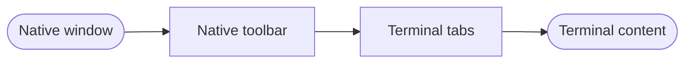
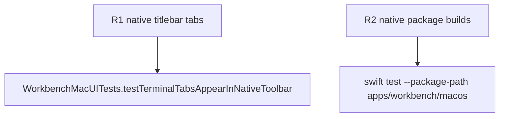

## Logic
<!-- type: logic lang: mermaid -->



The terminal tab strip is a SwiftUI `ToolbarItem` in the native `.principal` toolbar placement. AppKit owns traffic lights and unused titlebar space; the tab strip owns only normal interactive controls. The terminal body begins below the toolbar and no content view ignores its safe area.

This layout cannot change project selection, terminal tab identity, PTY lifecycle, terminal renderer retention, or auxiliary-column ordering.
## Changes
<!-- type: changes lang: yaml -->

```yaml
changes:
  - path: apps/workbench/macos/Sources/WorkbenchMac/WorkbenchView.swift
    action: modify
    section: logic
    impl_mode: hand-written
    anchor: WorkbenchView
  - path: apps/workbench/macos/UITests/WorkbenchMacUITests.swift
    action: modify
    section: unit-test
    impl_mode: hand-written
    anchor: WorkbenchMacUITests
```
## Unit Test
<!-- type: unit-test lang: mermaid -->


