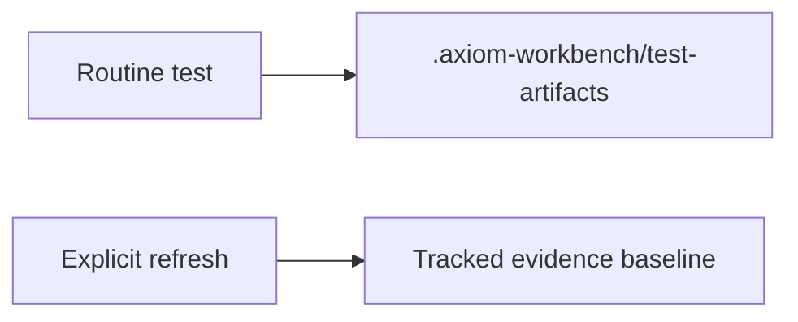
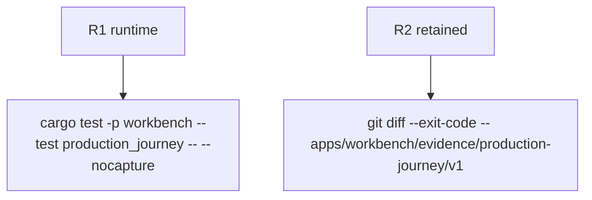

## Logic
<!-- type: logic lang: mermaid -->



Both Rust and browser production journeys resolve one artifact root. The default is `<repo>/.axiom-workbench/test-artifacts/production-journey/v1`; `WORKBENCH_REFRESH_EVIDENCE=1` selects the retained `apps/workbench/evidence/production-journey/v1` path. The runtime root is repository-ignored. Assertions and manifest schema remain unchanged.
## Changes
<!-- type: changes lang: yaml -->

```yaml
changes:
  - path: .gitignore
    action: modify
    section: logic
    impl_mode: hand-written
    anchor: repository ignore rules
  - path: apps/workbench/tests/production_journey.rs
    action: modify
    section: logic
    impl_mode: hand-written
    anchor: evidence_root
  - path: apps/workbench/e2e/production-journey.spec.js
    action: modify
    section: logic
    impl_mode: hand-written
    anchor: evidenceDir
```
## Unit Test
<!-- type: unit-test lang: mermaid -->


