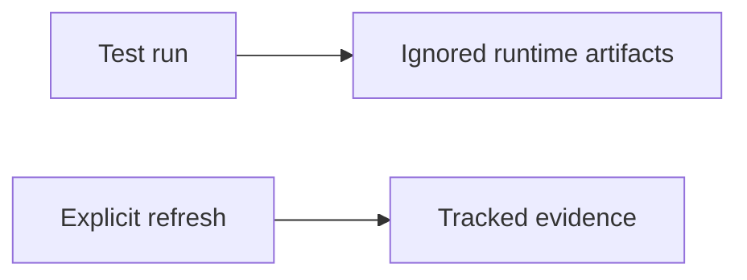
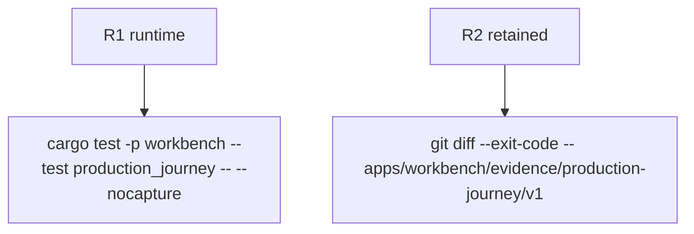

## Logic
<!-- type: logic lang: mermaid -->



Routine tests write run-specific screenshots, transcripts, and measurements below repository-local ignored runtime state. The existing tracked evidence remains the retained review baseline and is updated only through an explicit refresh environment switch.

## Changes
<!-- type: changes lang: yaml -->

```yaml
changes:
  - path: .gitignore
    action: modify
    section: logic
    impl_mode: hand-written
    anchor: repository ignore rules
  - path: apps/workbench/tests/production_journey.rs
    action: modify
    section: logic
    impl_mode: hand-written
    anchor: evidence_root
  - path: apps/workbench/e2e/production-journey.spec.js
    action: modify
    section: logic
    impl_mode: hand-written
    anchor: evidenceDir
```

## Unit Test
<!-- type: unit-test lang: mermaid -->


