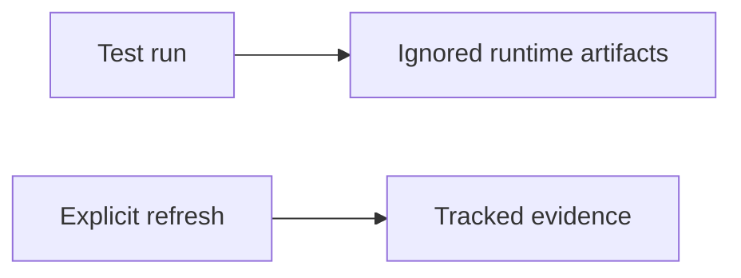

## Logic
<!-- type: logic lang: mermaid -->

Routine tests write run-specific screenshots, transcripts, and measurements below repository-local ignored runtime state. The existing tracked evidence remains the retained review baseline and is updated only through an explicit refresh environment switch.
