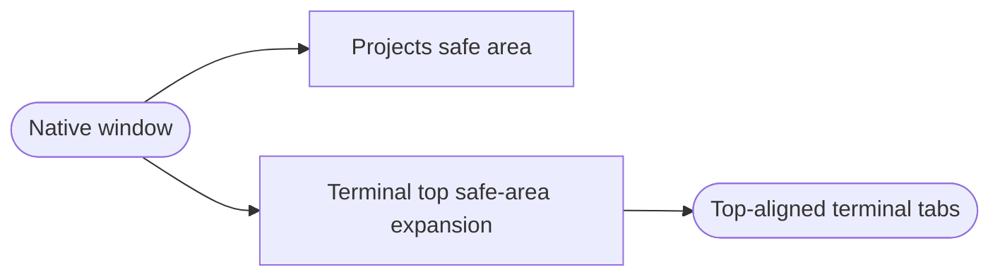
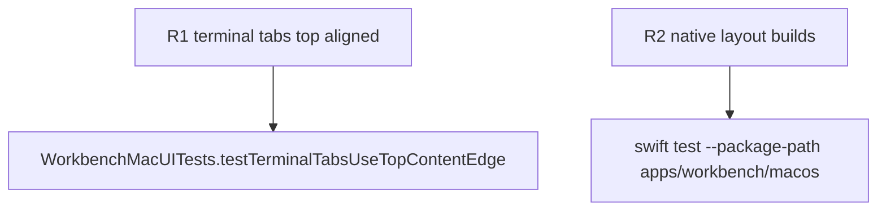

## Logic
<!-- type: logic lang: mermaid -->



This change applies only to the central terminal workspace in the native macOS `NavigationSplitView` detail region. The terminal tab strip draws through the window's top content safe area so it occupies the titlebar-adjacent space, while the sidebar and auxiliary column retain their normal safe-area layout.

`WorkbenchView` remains the split-layout owner. It applies top-edge safe-area expansion only to `terminalWorkspace`; it does not alter `folderSidebar` or `auxiliaryColumn`. Existing tab controls, identifiers, lifecycle composition, and renderer identity remain unchanged. The tab strip stays the first visual and keyboard-focusable element in the terminal workspace.

The Projects sidebar titlebar controls remain outside this expansion. No terminal process, tab identity, renderer, project selection, or PTY cwd changes as part of this layout update.

## Changes
<!-- type: changes lang: yaml -->

```yaml
changes:
  - path: apps/workbench/macos/Sources/WorkbenchMac/WorkbenchView.swift
    action: modify
    section: logic
    impl_mode: hand-written
    anchor: WorkbenchView
  - path: apps/workbench/macos/UITests/WorkbenchMacUITests.swift
    action: modify
    section: unit-test
    impl_mode: hand-written
    anchor: WorkbenchMacUITests
```

## Unit Test
<!-- type: unit-test lang: mermaid -->


