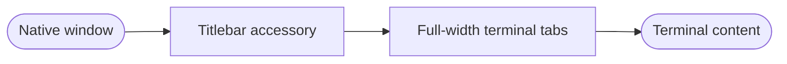
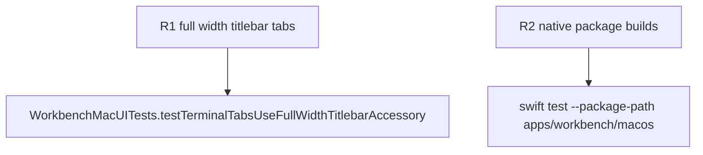

## Logic
<!-- type: logic lang: mermaid -->



An AppKit `NSTitlebarAccessoryViewController` hosts a SwiftUI tab row across the titlebar's content width. It maintains a 40-point row and resizes with the window. The normal terminal workspace no longer owns tab chrome; it begins immediately below the titlebar accessory.

The accessory has no effect on traffic lights, draggable native chrome, project selection, terminal tab identity, PTY lifecycle, or renderer retention.
## Changes
<!-- type: changes lang: yaml -->

```yaml
changes:
  - path: apps/workbench/macos/Sources/WorkbenchMac/WorkbenchView.swift
    action: modify
    section: logic
    impl_mode: hand-written
    anchor: WorkbenchView
  - path: apps/workbench/macos/UITests/WorkbenchMacUITests.swift
    action: modify
    section: unit-test
    impl_mode: hand-written
    anchor: WorkbenchMacUITests
```
## Unit Test
<!-- type: unit-test lang: mermaid -->


