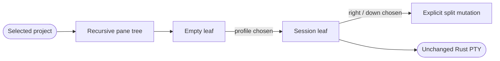

## Logic
<!-- type: logic lang: mermaid -->



`PaneNode` is an indirect recursive enum: `leaf(id, tabId?)` or `split(id, axis, first, second, ratio)`. Leaf ids are stable presentation identities; a nonempty leaf references exactly one existing `TerminalTab`. `ProjectTerminalWorkspace` stores the tree root and focused leaf id beside its existing tab collection.

`addTerminal(profile:)` only fills the focused empty leaf. `splitFocusedPane(axis, profile)` creates a new sibling leaf, places the profile's idle `TerminalTab` in that sibling, and replaces the focused leaf in the tree with a 0.5 split. `moveTerminal(tabId, targetLeafId, placement)` is structural only: it creates the destination split, reassigns the existing leaf reference, and removes/collapses the emptied source branch. `closePane(leafId)` terminates its referenced session through the existing close path then collapses its branch. A workspace never has no root: final collapse normalizes to one empty leaf.

Ratios are clamped to 0.15 through 0.85. Tree transitions reject unknown ids, a nonempty target for an implicit add, source/target no-ops, and moves across projects. Any rejection leaves tabs, focus, tree, output, and sidecar state untouched. Changing selected project or focused leaf only swaps model presentation fields. It must not invoke `launch`, `shutdown`, `resize`, `input`, or `poll`; existing per-session renderer keys remain stable.
## Changes
<!-- type: changes lang: yaml -->

```yaml
changes:
  - path: apps/workbench/macos/Sources/WorkbenchMacCore/WorkbenchModel.swift
    action: modify
    section: logic
    impl_mode: hand-written
    anchor: WorkbenchModel
  - path: apps/workbench/macos/Tests/WorkbenchMacCoreTests/WorkbenchModelTests.swift
    action: modify
    section: unit-test
    impl_mode: hand-written
    anchor: WorkbenchModelTests
```
## Unit Test

```mermaid
---
id: workbench-recursive-pane-model-verification
requirements:
  explicit_split:
    id: R2
    text: "A new profile cannot silently alter an occupied pane layout."
    kind: regression
    risk: high
    verify: WorkbenchModelTests.testProfileLaunchRequiresExplicitSplitForOccupiedLeaf
  isolation:
    id: R3
    text: "Project and pane selection preserve existing session identity without sidecar lifecycle calls."
    kind: regression
    risk: high
    verify: WorkbenchModelTests.testProjectsRetainIndependentRecursivePaneWorkspaces
  native_suite:
    id: R4
    text: "The native package compiles and runs its model regression suite."
    kind: regression
    risk: medium
    verify: swift test --package-path apps/workbench/macos
  tree:
    id: R1
    text: "A project workspace supports nested horizontal and vertical session leaves without a fixed pane count."
    kind: functional
    risk: high
    verify: WorkbenchModelTests.testRecursivePaneTreeSupportsNestedSplits
---
flowchart TD
    r1[R1 tree] --> workbenchmodeltests_testrecursivepanetreesupportsnestedsplits[WorkbenchModelTests.testRecursivePaneTreeSupportsNestedSplits]
    r2[R2 explicit split] --> workbenchmodeltests_testprofilelaunchrequiresexplicitsplitforoccupiedleaf[WorkbenchModelTests.testProfileLaunchRequiresExplicitSplitForOccupiedLeaf]
    r3[R3 isolation] --> workbenchmodeltests_testprojectsretainindependentrecursivepaneworkspaces[WorkbenchModelTests.testProjectsRetainIndependentRecursivePaneWorkspaces]
    r4[R4 native suite] --> swift_test_package_path_apps_workbench_macos[swift test --package-path apps/workbench/macos]
```

<!-- type: unit-test lang: mermaid -->


