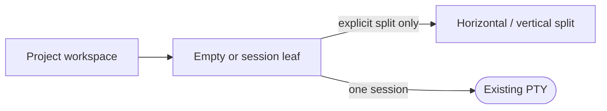

## Logic
<!-- type: logic lang: mermaid -->



`WorkbenchModel` owns one in-memory recursive layout tree per project. A leaf references zero or one existing `TerminalTab`; that tab id remains the sole key routed to the Rust sidecar. A split owns orientation and a bounded first-child ratio.

Opening a profile into a nonempty leaf is rejected unless an explicit horizontal or vertical split placement is supplied. Project and pane selection are presentation transitions only: they never launch, shut down, resize, input, or poll a sidecar. Moving or closing the last session in a branch collapses it, leaving one empty root leaf when a workspace has no sessions. Sidecar ids remain ASCII-safe and stable for each session lifetime.

This slice does not render the tree, persist it across relaunch, create pane-internal tab groups, or introduce drag recognition.

## Changes
<!-- type: changes lang: yaml -->

```yaml
changes:
  - path: apps/workbench/macos/Sources/WorkbenchMacCore/WorkbenchModel.swift
    action: modify
    section: logic
    impl_mode: hand-written
    anchor: WorkbenchModel
  - path: apps/workbench/macos/Tests/WorkbenchMacCoreTests/WorkbenchModelTests.swift
    action: modify
    section: unit-test
    impl_mode: hand-written
    anchor: WorkbenchModelTests
```

## Unit Test

```mermaid
---
id: workbench-recursive-pane-model-verification
requirements:
  explicit_split:
    id: R2
    text: "A new profile cannot silently alter an occupied pane layout."
    kind: regression
    risk: high
    verify: WorkbenchModelTests.testProfileLaunchRequiresExplicitSplitForOccupiedLeaf
  isolation:
    id: R3
    text: "Project and pane selection preserve existing session identity without sidecar lifecycle calls."
    kind: regression
    risk: high
    verify: WorkbenchModelTests.testProjectsRetainIndependentRecursivePaneWorkspaces
  native_suite:
    id: R4
    text: "The native package compiles and runs its model regression suite."
    kind: regression
    risk: medium
    verify: swift test --package-path apps/workbench/macos
  tree:
    id: R1
    text: "A project workspace supports nested horizontal and vertical session leaves without a fixed pane count."
    kind: functional
    risk: high
    verify: WorkbenchModelTests.testRecursivePaneTreeSupportsNestedSplits
---
flowchart TD
    r1[R1 tree] --> workbenchmodeltests_testrecursivepanetreesupportsnestedsplits[WorkbenchModelTests.testRecursivePaneTreeSupportsNestedSplits]
    r2[R2 explicit split] --> workbenchmodeltests_testprofilelaunchrequiresexplicitsplitforoccupiedleaf[WorkbenchModelTests.testProfileLaunchRequiresExplicitSplitForOccupiedLeaf]
    r3[R3 isolation] --> workbenchmodeltests_testprojectsretainindependentrecursivepaneworkspaces[WorkbenchModelTests.testProjectsRetainIndependentRecursivePaneWorkspaces]
    r4[R4 native suite] --> swift_test_package_path_apps_workbench_macos[swift test --package-path apps/workbench/macos]
```

<!-- type: unit-test lang: mermaid -->


