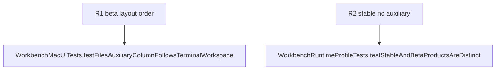

## Logic
<!-- type: logic lang: mermaid -->

```mermaid
---
id: workbench-auxiliary-right-contract
entry: selected-project
nodes:
  selected-project: { kind: start, label: "selected registered project" }
  profile: { kind: decision, label: "beta runtime profile?" }
  terminal: { kind: process, label: "render central terminal workspace" }
  files: { kind: process, label: "render read-only Files auxiliary" }
  stable: { kind: terminal, label: "Projects | Terminal" }
  beta: { kind: terminal, label: "Projects | Terminal | Auxiliary" }
edges:
  - { from: selected-project, to: profile }
  - { from: profile, to: stable, label: "stable" }
  - { from: profile, to: terminal, label: "beta" }
  - { from: terminal, to: files }
  - { from: files, to: beta }
---
flowchart LR
    selectedProject([Selected project]) --> profile{Beta profile?}
    profile -->|Stable| stable([Projects | Terminal])
    profile -->|Beta| terminal[Central terminal]
    terminal --> files[Read-only Files]
    files --> beta([Projects | Terminal | Auxiliary])
```

The user-visible layout contract is fixed: Projects is the native NavigationSplitView sidebar, Terminal is the primary flexible detail region, and Beta-only Auxiliary is the trailing bounded detail region. `terminalWorkspace` must precede `auxiliaryColumn` in the detail HStack, separated by exactly one divider. Stable omits the trailing divider and Auxiliary column.

The file listing stays read-only and project-scoped. The layout reorder does not initiate a process, alter an existing terminal's cwd, change the active tab, or affect the native window sidebar toggle.
## Changes
<!-- type: changes lang: yaml -->

```yaml
changes:
  - path: apps/workbench/macos/Sources/WorkbenchMac/WorkbenchView.swift
    action: modify
    section: logic
    impl_mode: hand-written
    anchor: WorkbenchView
  - path: apps/workbench/macos/UITests/WorkbenchMacUITests.swift
    action: modify
    section: unit-test
    impl_mode: hand-written
    anchor: WorkbenchMacUITests
```
## Unit Test
<!-- type: unit-test lang: mermaid -->


