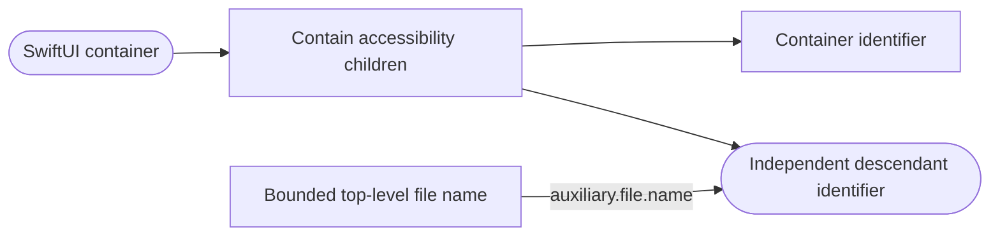
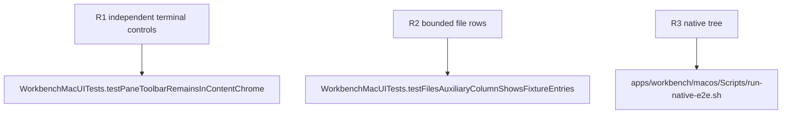

## Logic
<!-- type: logic lang: mermaid -->



Each terminal container becomes an explicit accessibility element with contained children before its identifier is assigned. SwiftUI then exposes both the container and descendant controls instead of propagating the parent identifier onto every accessible leaf. Auxiliary rows use the top-level entry name, which is unique within one project root and bounded independently of the absolute fixture path.

## Changes
<!-- type: changes lang: yaml -->

```yaml
changes:
  - path: apps/workbench/macos/Sources/WorkbenchMac/WorkbenchView.swift
    action: modify
    section: logic
    impl_mode: hand-written
    anchor: WorkbenchView
  - path: apps/workbench/macos/UITests/WorkbenchMacUITests.swift
    action: modify
    section: unit-test
    impl_mode: hand-written
    anchor: WorkbenchMacUITests
```

## Unit Test
<!-- type: unit-test lang: mermaid -->


