## Logic

```mermaid
---
id: workbench-context-provenance-applicability
entry: item
nodes:
  item: { kind: start, label: "provider-neutral context item" }
  classify: { kind: process, label: "classify extracted, inferred, or ambiguous" }
  resolve: { kind: process, label: "resolve confined file and optional span" }
  valid: { kind: decision, label: "canonical source exists and span is valid?" }
  canonical: { kind: process, label: "emit canonical source navigation" }
  unavailable: { kind: process, label: "emit visible non-authoritative state" }
  label: { kind: process, label: "disclose provider and derivation inputs" }
  done: { kind: terminal, label: "read-only provenance view" }
edges:
  - { from: item, to: classify }
  - { from: classify, to: resolve }
  - { from: resolve, to: valid }
  - { from: valid, to: canonical, label: "yes" }
  - { from: valid, to: unavailable, label: "no" }
  - { from: canonical, to: label }
  - { from: unavailable, to: label }
  - { from: label, to: done }
---
flowchart LR
    item([Context item]) --> classify[Classify]
    classify --> resolve[Resolve source/span]
    resolve --> valid{Canonical?}
    valid -->|Yes| canonical[Source navigation]
    valid -->|No| unavailable[Non-authoritative state]
    canonical --> label[Provider and inputs]
    unavailable --> label
    label --> done([Provenance view])
```

<!-- type: logic lang: mermaid -->



Create a provider-neutral provenance module below the renderer registry. It models a confined repository-relative file, optional one-based source span, provider identity, and extracted/inferred/ambiguous classification without importing any Graphify, wiki, AW, PTY, or cwd types. Graph-style EXTRACTED/INFERRED/AMBIGUOUS trust labels inform the closed classification vocabulary, while compiled wiki pages remain derived views over immutable canonical inputs.

Resolution canonicalizes the selected root and requested source, rejects traversal and symlink escape, validates ordered non-zero spans, and distinguishes canonical, missing, and invalid states. Extracted items link only when their direct source resolves. Inferred items retain every input location and always carry a visible derived label; unavailable inputs are disclosed rather than replaced with fabricated links.

The module is a pure read-only data and resolution boundary. It exposes no repository write, AW transition, provider invocation, or verification mutation; repository bytes and declared executable gates remain authoritative outside the provenance view.

## Changes
<!-- type: changes lang: yaml -->

```yaml
changes:
  - path: apps/workbench/src/context/provenance.rs
    action: create
    section: logic
    impl_mode: hand-written
    description: Define provider identity, extraction classification, confined file/span inputs, canonical/missing/invalid resolution, visible authority labels, and source navigation.
  - path: apps/workbench/src/context/mod.rs
    action: modify
    section: logic
    impl_mode: hand-written
    anchor: ContextProvenance
    description: Export the provider-neutral provenance contract beside renderer document provenance.
  - path: apps/workbench/tests/context_provenance.rs
    action: create
    section: unit-test
    impl_mode: hand-written
    description: Prove extracted round-trip, inferred labels and inputs, missing/invalid degradation, path confinement, and mutation-surface isolation.
  - path: apps/workbench/README.md
    action: modify
    section: logic
    impl_mode: hand-written
    description: Document canonical-source authority, extracted/inferred classification, and non-authoritative fallback states.
  - path: apps/workbench/CAPABILITIES.md
    action: modify
    section: logic
    impl_mode: hand-written
    description: Register and verify the context-provenance work root.
  - path: apps/workbench/CONTRIBUTING.md
    action: modify
    section: unit-test
    impl_mode: hand-written
    description: Record provenance round-trip, confinement, labeling, and no-mutation verification rules.
```

## Unit Test

```mermaid
---
id: workbench-context-provenance-verification
requirements:
  extracted_round_trip:
    id: R1
    text: "An extracted item resolves a confined repository-relative file and valid one-based span into canonical source navigation with provider identity intact."
    kind: contract
    risk: high
    verify: tests/context_provenance.rs::extracted_item_round_trips_to_canonical_file_and_span
  inferred_inputs_visible:
    id: R2
    text: "An inferred or ambiguous item is visibly classified as derived and retains every canonical, missing, or invalid source input used to derive it."
    kind: integration
    risk: high
    verify: tests/context_provenance.rs::inferred_items_disclose_provider_label_and_all_inputs
  invalid_sources_non_authoritative:
    id: R3
    text: "Missing files, invalid spans, traversal, and symlink escape produce explicit non-authoritative states with no fabricated navigation target."
    kind: failure-recovery
    risk: high
    verify: tests/context_provenance.rs::invalid_and_missing_sources_never_fabricate_links
  read_only_boundary:
    id: R4
    text: "Provenance resolution performs bounded reads only and exposes no repository, AW, provider, or verification mutation operation."
    kind: boundary
    risk: high
    verify: tests/context_provenance.rs::provenance_api_is_provider_neutral_and_read_only
---
flowchart TD
    r1[R1 extracted round trip] --> tests_context_provenance_rs_extracted_item_round_trips_to_canonical_file_and_span[tests/context_provenance.rs::extracted_item_round_trips_to_canonical_file_and_span]
    r2[R2 inferred inputs visible] --> tests_context_provenance_rs_inferred_items_disclose_provider_label_and_all_inputs[tests/context_provenance.rs::inferred_items_disclose_provider_label_and_all_inputs]
    r3[R3 invalid sources non authoritative] --> tests_context_provenance_rs_invalid_and_missing_sources_never_fabricate_links[tests/context_provenance.rs::invalid_and_missing_sources_never_fabricate_links]
    r4[R4 read only boundary] --> tests_context_provenance_rs_provenance_api_is_provider_neutral_and_read_only[tests/context_provenance.rs::provenance_api_is_provider_neutral_and_read_only]
```

<!-- type: unit-test lang: mermaid -->


