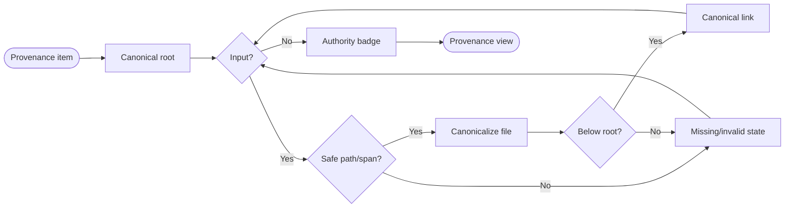

## Logic
<!-- type: logic lang: mermaid -->



`ProviderIdentity` contains only stable string id and display label. `ProvenanceClassification` is the closed `Extracted | Inferred | Ambiguous` vocabulary. `SourcePosition` uses one-based line and column, `SourceSpan` requires an ordered non-zero inclusive start and exclusive end, and `SourceLocation` contains one repository-relative path plus an optional span. `ContextProvenanceItem::{extracted,inferred,ambiguous}` retains the provider and exact input locations without importing provider SDK types. All public data types are serializable so adapters can round-trip them without losing spans or classification.

`ContextProvenanceItem::resolve(root)` returns an immutable `ProvenanceView`. Each input becomes a `ResolvedSource` with `Canonical`, `Missing`, or `Invalid { reason }` status. Canonical resolution first validates lexical confinement and the span, canonicalizes root and an existing regular file, then rejects any symlink escape. Only canonical sources receive `ProvenanceNavigation { relative_path, span }`; missing/invalid inputs retain their requested location and reason but never a guessed link.

Authority derives independently from provider: an extracted item is `Canonical` only when its single direct source resolves, otherwise `Unavailable`; inferred and ambiguous items are always `Derived`, visibly labeled with classification, provider, input count, and any unavailable-input count. This keeps Graphify-style confidence disclosure and compiled-view source layering while repository bytes and executable verification evidence remain authoritative. Resolution uses metadata/canonicalization reads only and exposes no write, command execution, AW, GitHub, PTY, cwd, provider invocation, or approval surface.
## Changes
<!-- type: changes lang: yaml -->

```yaml
changes:
  - path: apps/workbench/src/context/provenance.rs
    action: create
    section: logic
    impl_mode: hand-written
    description: Define provider identity, extraction classification, confined file/span inputs, canonical/missing/invalid resolution, visible authority labels, and source navigation.
  - path: apps/workbench/src/context/mod.rs
    action: modify
    section: logic
    impl_mode: hand-written
    anchor: ContextProvenance
    description: Export the provider-neutral provenance contract beside renderer document provenance.
  - path: apps/workbench/tests/context_provenance.rs
    action: create
    section: unit-test
    impl_mode: hand-written
    description: Prove extracted round-trip, inferred labels and inputs, missing/invalid degradation, path confinement, and mutation-surface isolation.
  - path: apps/workbench/README.md
    action: modify
    section: logic
    impl_mode: hand-written
    description: Document canonical-source authority, extracted/inferred classification, and non-authoritative fallback states.
  - path: apps/workbench/CAPABILITIES.md
    action: modify
    section: logic
    impl_mode: hand-written
    description: Register and verify the context-provenance work root.
  - path: apps/workbench/CONTRIBUTING.md
    action: modify
    section: unit-test
    impl_mode: hand-written
    description: Record provenance round-trip, confinement, labeling, and no-mutation verification rules.
```
## Unit Test

```mermaid
---
id: workbench-context-provenance-verification
requirements:
  extracted_round_trip:
    id: R1
    text: "An extracted item resolves a confined repository-relative file and valid one-based span into canonical source navigation with provider identity intact."
    kind: contract
    risk: high
    verify: tests/context_provenance.rs::extracted_item_round_trips_to_canonical_file_and_span
  inferred_inputs_visible:
    id: R2
    text: "An inferred or ambiguous item is visibly classified as derived and retains every canonical, missing, or invalid source input used to derive it."
    kind: integration
    risk: high
    verify: tests/context_provenance.rs::inferred_items_disclose_provider_label_and_all_inputs
  invalid_sources_non_authoritative:
    id: R3
    text: "Missing files, invalid spans, traversal, and symlink escape produce explicit non-authoritative states with no fabricated navigation target."
    kind: failure-recovery
    risk: high
    verify: tests/context_provenance.rs::invalid_and_missing_sources_never_fabricate_links
  read_only_boundary:
    id: R4
    text: "Provenance resolution performs bounded reads only and exposes no repository, AW, provider, or verification mutation operation."
    kind: boundary
    risk: high
    verify: tests/context_provenance.rs::provenance_api_is_provider_neutral_and_read_only
---
flowchart TD
    r1[R1 extracted round trip] --> tests_context_provenance_rs_extracted_item_round_trips_to_canonical_file_and_span[tests/context_provenance.rs::extracted_item_round_trips_to_canonical_file_and_span]
    r2[R2 inferred inputs visible] --> tests_context_provenance_rs_inferred_items_disclose_provider_label_and_all_inputs[tests/context_provenance.rs::inferred_items_disclose_provider_label_and_all_inputs]
    r3[R3 invalid sources non authoritative] --> tests_context_provenance_rs_invalid_and_missing_sources_never_fabricate_links[tests/context_provenance.rs::invalid_and_missing_sources_never_fabricate_links]
    r4[R4 read only boundary] --> tests_context_provenance_rs_provenance_api_is_provider_neutral_and_read_only[tests/context_provenance.rs::provenance_api_is_provider_neutral_and_read_only]
```

<!-- type: unit-test lang: mermaid -->


