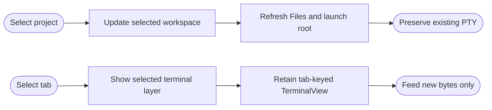

## Logic
<!-- type: logic lang: mermaid -->

Project selection updates the selected project id, launch root, and file listing together on the main actor. This selection is for future terminal launches; it never sends a lifecycle request or rewrites an existing tab's cwd.

Every non-idle and non-failed tab owns a mounted `TerminalSurface` keyed by tab id. Inactive layers are visually hidden and non-interactive instead of destroyed. Their coordinators retain both the SwiftTerm terminal buffer and fed-byte cursor, so a tab switch only exposes its existing renderer; polling supplies subsequent incremental bytes.
