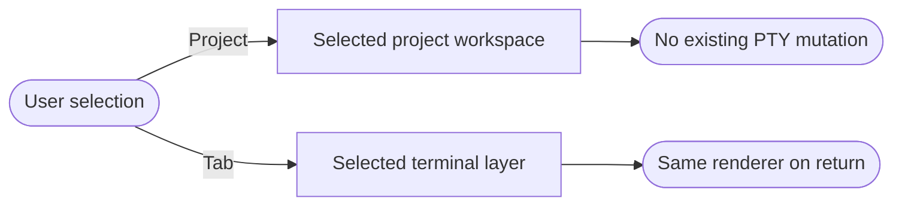
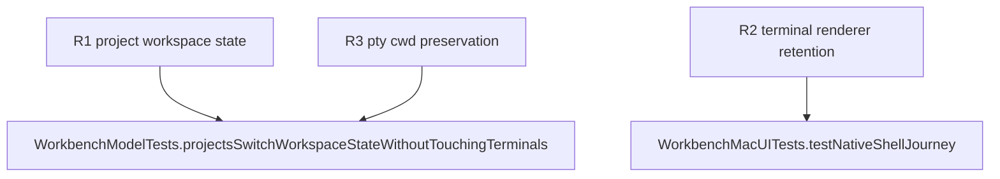

## Contract
<!-- type: logic lang: mermaid -->



A project selection is a synchronous presentation-state transition: the selected project id, launch folder, and visible file listing describe the same registered project. It affects only future launches; active and exited terminal tabs retain their own process state and cwd.

A tab selection is also a presentation-state transition. It must not launch, terminate, resize, or rebuild a terminal process. Each launched tab keeps one native SwiftTerm view and coordinator for its lifetime; only the selected layer accepts input and is visible.
## Changes
<!-- type: changes lang: yaml -->

```yaml
changes:
  - path: apps/workbench/macos/Sources/WorkbenchMacCore/WorkbenchModel.swift
    action: modify
    section: contract
    impl_mode: hand-written
    anchor: WorkbenchModel
    description: Make selected project workspace state coherent and expose the project identity used for launch and file content.
  - path: apps/workbench/macos/Sources/WorkbenchMac/WorkbenchView.swift
    action: modify
    section: contract
    impl_mode: hand-written
    anchor: WorkbenchView
    description: Render stable tab-keyed terminal layers so selection changes visibility and focus rather than renderer identity.
```
## Unit Test
<!-- type: unit-test lang: mermaid -->


