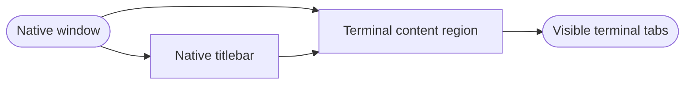

## Logic
<!-- type: logic lang: mermaid -->

`terminalWorkspace` stays inside the normal top container safe area. The native titlebar keeps ownership of its hit-test and drawing region, while the tab strip remains the first visible control in the terminal content area.

The recovery does not change project selection, PTY cwd, terminal lifecycle, terminal renderer identity, or terminal-tab identifiers. A future native toolbar integration may change titlebar placement only with a dedicated AppKit integration contract.
