## Logic

```mermaid
---
id: workbench-production-journey-applicability
entry: folder
nodes:
  folder: { kind: start, label: "select registered canonical folder" }
  agent: { kind: process, label: "select and launch native agent through real PTY" }
  output: { kind: process, label: "stream transcript and explicit OSC 7 cwd" }
  context: { kind: process, label: "render Markdown, Git, and optional AW context" }
  provenance: { kind: process, label: "show canonical source navigation and labels" }
  recover: { kind: decision, label: "agent or artifact error?" }
  evidence: { kind: process, label: "retain viewport, interaction, accessibility, transcript, and context evidence" }
  done: { kind: terminal, label: "repeatable production gate" }
edges:
  - { from: folder, to: agent }
  - { from: agent, to: output }
  - { from: output, to: context }
  - { from: context, to: provenance }
  - { from: provenance, to: recover }
  - { from: recover, to: evidence, label: "recovered or none" }
  - { from: evidence, to: done }
---
flowchart LR
    folder([Folder]) --> agent[Native PTY]
    agent --> output[Transcript and OSC7 cwd]
    output --> context[Markdown Git AW context]
    context --> provenance[Source navigation]
    provenance --> recover{Recovery state?}
    recover --> evidence[Retained evidence]
    evidence --> done([Production gate])
```

<!-- type: logic lang: mermaid -->



Assemble the existing folder registry, provider-neutral real PTY, OSC 7 active cwd, renderer registry, and canonical provenance into one desktop session boundary. Tauri commands start exactly one selected Claude Code, Codex, or AGY process in the selected canonical folder, stream bounded output, accept input/resize/terminate, expose recoverable unavailable-agent errors, and render Markdown/Git/optional AW context from the explicit active cwd. A deterministic local shell exercises the same session type in tests; installed vendor CLIs remain optional.

Upgrade the three-column primary state without moving folder ownership into the runtime: the center pane gains accessible agent choice, start/retry, terminal transcript/input, status and active-cwd disclosure; the right pane gains keyboard-operable Markdown/Git/AW choices, safe preview, provenance label, and source navigation. Preserve the established dark developer-tool system, visible focus, minimum 44px targets, stable 150-300ms color/opacity transitions, minimum 16px body readability, constrained-width fit, and reduced-motion behavior.

`production_journey` runs the real-PTY functional journey plus Jet at 1440x900 and 860x720. Jet writes a deterministic v1 manifest and retained screenshots; Rust adds transcript and context summaries. The manifest maps every assertion to its artifact and the external contract plus capability gate invoke the exact same Cargo test command. Optional graph/page providers remain outside the production prerequisite.

## Changes
<!-- type: changes lang: yaml -->

```yaml
changes:
  - path: apps/workbench/src/production_journey.rs
    action: create
    section: logic
    impl_mode: hand-written
    description: Assemble real PTY launch/IO/poll/resize/terminate, OSC7 cwd, bounded transcript, renderer requests, recoverable agent errors, and serializable desktop snapshots.
  - path: apps/workbench/src/lib.rs
    action: modify
    section: logic
    impl_mode: hand-written
    anchor: run
    description: Manage the production session store and expose bounded Tauri journey commands beside folder commands.
  - path: apps/workbench/ui/index.html
    action: modify
    section: logic
    impl_mode: hand-written
    description: Add accessible agent, terminal, cwd, context-kind, preview, provenance, source-navigation, retry, and recovery controls to the primary three-column state.
  - path: apps/workbench/ui/journey.js
    action: create
    section: logic
    impl_mode: hand-written
    description: Drive the native or deterministic test bridge production session without absorbing folder registry ownership.
  - path: apps/workbench/ui/shell.css
    action: modify
    section: logic
    impl_mode: hand-written
    description: Extend the established dark developer-tool system with readable terminal/context states, 44px targets, constrained layout, focus, and reduced motion.
  - path: apps/workbench/e2e/production-journey.spec.js
    action: create
    section: unit-test
    impl_mode: hand-written
    description: Exercise keyboard operation, launch, transcript, cwd, context navigation, unavailable-agent recovery, accessibility, and retained desktop/constrained evidence through Jet.
  - path: apps/workbench/tests/production_journey.rs
    action: create
    section: unit-test
    impl_mode: hand-written
    description: Prove the real-PTY folder-to-cwd-to-Markdown/Git/AW journey and validate every retained manifest artifact and assertion.
  - path: apps/workbench/external-contracts/behavior/folder-agent-artifact-journey.md
    action: create
    section: unit-test
    impl_mode: hand-written
    description: Bind the release external contract to the same production_journey Cargo command and retained evidence schema.
  - path: apps/workbench/evidence/production-journey/v1/desktop.png
    action: create
    section: unit-test
    impl_mode: hand-written
    description: Retain the 1440x900 complete primary-state viewport.
  - path: apps/workbench/evidence/production-journey/v1/constrained.png
    action: create
    section: unit-test
    impl_mode: hand-written
    description: Retain the 860x720 constrained-desktop primary state.
  - path: apps/workbench/evidence/production-journey/v1/manifest.json
    action: create
    section: unit-test
    impl_mode: hand-written
    description: Map every functional, accessibility, recovery, viewport, and evidence-integrity assertion to retained artifacts.
  - path: apps/workbench/evidence/production-journey/v1/pty-transcript.txt
    action: create
    section: unit-test
    impl_mode: hand-written
    description: Retain deterministic real-PTY input/output and cwd telemetry evidence.
  - path: apps/workbench/evidence/production-journey/v1/context-summary.json
    action: create
    section: unit-test
    impl_mode: hand-written
    description: Retain Markdown, Git, AW, provenance, and source-navigation result evidence.
  - path: apps/workbench/README.md
    action: modify
    section: logic
    impl_mode: hand-written
    description: Document the complete primary journey, recovery behavior, and retained evidence schema.
  - path: apps/workbench/CAPABILITIES.md
    action: modify
    section: logic
    impl_mode: hand-written
    description: Complete the production-journey work root with the exact repeated Cargo gate and evidence root.
  - path: apps/workbench/CONTRIBUTING.md
    action: modify
    section: unit-test
    impl_mode: hand-written
    description: Record the production command, real-PTY and Jet requirements, evidence manifest validation, and UI quality rules.
  - path: apps/workbench/aw.toml
    action: modify
    section: unit-test
    impl_mode: hand-written
    description: Configure the production external contract with agent-backed semantic review and the exact production_journey runner.
```

## Unit Test

```mermaid
---
id: workbench-production-journey-verification
requirements:
  agent_recovery:
    id: R3
    text: "An unavailable vendor binary returns an actionable recoverable state and a subsequent deterministic local session and context render still succeed."
    kind: failure-recovery
    risk: high
    verify: tests/production_journey.rs::unavailable_agent_is_recoverable
  artifact_context_and_provenance:
    id: R2
    text: "The resulting active cwd renders representative Markdown, Git, and configured AW artifacts with disclosed renderer, canonical provenance, and source navigation."
    kind: integration
    risk: high
    verify: tests/production_journey.rs::real_pty_folder_cwd_and_artifact_journey
  desktop_and_constrained_ui:
    id: R4
    text: "Jet proves the complete placeholder-free primary state at 1440x900 and 860x720 with retained screenshots and no horizontal clipping."
    kind: visual-regression
    risk: high
    verify: tests/production_journey.rs::production_ui_quality_journey_passes
  evidence_and_gate_integrity:
    id: R6
    text: "The v1 manifest identifies every assertion and retained artifact, and capability plus external contract reference the exact same production_journey Cargo command."
    kind: contract
    risk: high
    verify: tests/production_journey.rs::retained_production_evidence_manifest_is_complete
  keyboard_accessibility_and_navigation:
    id: R5
    text: "Agent selection, launch/retry, terminal input, context choice, and source navigation are keyboard operable with labelled controls, visible focus, readable text, live status, and reduced-motion support."
    kind: accessibility
    risk: high
    verify: tests/production_journey.rs::production_ui_quality_journey_passes
  real_pty_assembled_journey:
    id: R1
    text: "A registered canonical folder launches a deterministic process through the production real-PTY session, exchanges input, accepts resize, consumes explicit OSC7 cwd, exits cleanly, and retains a bounded transcript."
    kind: e2e
    risk: high
    verify: tests/production_journey.rs::real_pty_folder_cwd_and_artifact_journey
---
flowchart TD
    r1[R1 real pty assembled journey] --> tests_production_journey_rs_real_pty_folder_cwd_and_artifact_journey[tests/production_journey.rs::real_pty_folder_cwd_and_artifact_journey]
    r2[R2 artifact context and provenance] --> tests_production_journey_rs_real_pty_folder_cwd_and_artifact_journey
    r3[R3 agent recovery] --> tests_production_journey_rs_unavailable_agent_is_recoverable[tests/production_journey.rs::unavailable_agent_is_recoverable]
    r4[R4 desktop and constrained ui] --> tests_production_journey_rs_production_ui_quality_journey_passes[tests/production_journey.rs::production_ui_quality_journey_passes]
    r5[R5 keyboard accessibility and navigation] --> tests_production_journey_rs_production_ui_quality_journey_passes
    r6[R6 evidence and gate integrity] --> tests_production_journey_rs_retained_production_evidence_manifest_is_complete[tests/production_journey.rs::retained_production_evidence_manifest_is_complete]
```

<!-- type: unit-test lang: mermaid -->


