## Logic

```mermaid
---
id: workbench-production-journey
entry: selection
nodes:
  selection: { kind: start, label: "selected canonical launch path and AgentKind" }
  spawn: { kind: process, label: "JourneySession launches exact AgentLaunchCommand through PtyRuntime" }
  reader: { kind: process, label: "background reader sends bounded PTY chunks" }
  poll: { kind: process, label: "poll drains transcript, OSC7 cwd, and child status" }
  input: { kind: process, label: "write input, resize, interrupt, or terminate" }
  render: { kind: process, label: "render workspace or confined file at explicit active cwd" }
  ui: { kind: process, label: "render accessible terminal and source context states" }
  evidence: { kind: process, label: "write deterministic v1 evidence manifest and artifacts" }
  done: { kind: terminal, label: "one repeatable Cargo and EC gate" }
edges:
  - { from: selection, to: spawn }
  - { from: spawn, to: reader }
  - { from: reader, to: poll }
  - { from: poll, to: input }
  - { from: input, to: poll, label: "session active" }
  - { from: poll, to: render, label: "snapshot or exit" }
  - { from: render, to: ui }
  - { from: ui, to: evidence }
  - { from: evidence, to: done }
---
flowchart LR
    selection([Folder + agent]) --> spawn[Real PTY]
    spawn --> reader[Output channel]
    reader --> poll[Transcript + OSC7 cwd]
    poll --> input[Input/resize/terminate]
    input --> poll
    poll --> render[Markdown/Git/AW context]
    render --> ui[Accessible three-column state]
    ui --> evidence[Retained v1 evidence]
    evidence --> done([Cargo + EC gate])
```

<!-- type: logic lang: mermaid -->



`JourneySession` composes `PtyRuntime`, `PtySession`, and `ActiveCwdContext`. `spawn_agent` resolves an exact `AgentLaunchCommand`; `spawn_command` accepts the same provider-neutral deterministic shell fixture used by tests. A cloned PTY reader sends bounded chunks through a channel. `poll` drains available chunks, caps the retained transcript at 512 KiB, applies only OSC 7 telemetry, and returns serializable `JourneySnapshot { agent, running, exit_code, active_cwd, cwd_source, transcript }`. Input, resize, interrupt, wait, and terminate delegate to the real PTY lifecycle and preserve cleanup on drop.

`ProductionJourneyStore` owns at most one session behind a mutex. Tauri commands `launch_journey_agent`, `poll_journey_agent`, `send_journey_input`, `resize_journey_agent`, `interrupt_journey_agent`, and `terminate_journey_agent` validate parameters and surface recoverable errors. `render_journey_context` accepts the explicit active root plus workspace or confined relative file target and uses `RendererRegistry::generic_with_optional_aw`; it never infers cwd from prompt text or mutates sources. The existing folder module only emits selection/path events and does not own the session.

`journey.js` listens for folder selection, manages agent/context controls, polls only while active, renders transcript with `textContent`, inserts safe renderer HTML only from the backend contract, discloses active cwd/provenance/source links, and keeps failed launch/retry actionable. The HTML uses semantic fieldsets, labels, buttons, output/status, and navigation. CSS extends the current slate/green/blue dark developer-tool system with IBM-Plex-like system sans plus monospace terminal treatment, 44px targets, visible focus, 16px readable body text, stable 180ms color/opacity transitions, no layout-shifting hover, an 860px stacked context treatment, and `prefers-reduced-motion`.

The Rust test constructs a Git repository containing Markdown plus configured AW artifacts, registers/selects it, launches `/bin/sh` through `JourneySession`, exchanges input, resizes, emits a nested OSC 7 cwd, and renders Markdown/Git/AW with canonical provenance. Jet uses a deterministic bridge to prove successful and unavailable-agent paths, keyboard/focus order, source navigation, accessibility, placeholder-free states, and 1440x900 plus 860x720 screenshots. It writes `manifest.json`; Rust writes the real PTY transcript and context summary, then validates every manifest assertion/artifact. CAPABILITIES and the agent-reviewed external contract both use exactly `cargo test -p workbench --test production_journey -- --nocapture`.
## Changes
<!-- type: changes lang: yaml -->

```yaml
changes:
  - path: apps/workbench/src/production_journey.rs
    action: create
    section: logic
    impl_mode: hand-written
    description: Assemble real PTY launch/IO/poll/resize/terminate, OSC7 cwd, bounded transcript, renderer requests, recoverable agent errors, and serializable desktop snapshots.
  - path: apps/workbench/src/lib.rs
    action: modify
    section: logic
    impl_mode: hand-written
    anchor: run
    description: Manage the production session store and expose bounded Tauri journey commands beside folder commands.
  - path: apps/workbench/ui/index.html
    action: modify
    section: logic
    impl_mode: hand-written
    description: Add accessible agent, terminal, cwd, context-kind, preview, provenance, source-navigation, retry, and recovery controls to the primary three-column state.
  - path: apps/workbench/ui/journey.js
    action: create
    section: logic
    impl_mode: hand-written
    description: Drive the native or deterministic test bridge production session without absorbing folder registry ownership.
  - path: apps/workbench/ui/shell.css
    action: modify
    section: logic
    impl_mode: hand-written
    description: Extend the established dark developer-tool system with readable terminal/context states, 44px targets, constrained layout, focus, and reduced motion.
  - path: apps/workbench/e2e/production-journey.spec.js
    action: create
    section: unit-test
    impl_mode: hand-written
    description: Exercise keyboard operation, launch, transcript, cwd, context navigation, unavailable-agent recovery, accessibility, and retained desktop/constrained evidence through Jet.
  - path: apps/workbench/tests/production_journey.rs
    action: create
    section: unit-test
    impl_mode: hand-written
    description: Prove the real-PTY folder-to-cwd-to-Markdown/Git/AW journey and validate every retained manifest artifact and assertion.
  - path: apps/workbench/external-contracts/behavior/folder-agent-artifact-journey.md
    action: create
    section: unit-test
    impl_mode: hand-written
    description: Bind the release external contract to the same production_journey Cargo command and retained evidence schema.
  - path: apps/workbench/evidence/production-journey/v1/desktop.png
    action: create
    section: unit-test
    impl_mode: hand-written
    description: Retain the 1440x900 complete primary-state viewport.
  - path: apps/workbench/evidence/production-journey/v1/constrained.png
    action: create
    section: unit-test
    impl_mode: hand-written
    description: Retain the 860x720 constrained-desktop primary state.
  - path: apps/workbench/evidence/production-journey/v1/manifest.json
    action: create
    section: unit-test
    impl_mode: hand-written
    description: Map every functional, accessibility, recovery, viewport, and evidence-integrity assertion to retained artifacts.
  - path: apps/workbench/evidence/production-journey/v1/pty-transcript.txt
    action: create
    section: unit-test
    impl_mode: hand-written
    description: Retain deterministic real-PTY input/output and cwd telemetry evidence.
  - path: apps/workbench/evidence/production-journey/v1/context-summary.json
    action: create
    section: unit-test
    impl_mode: hand-written
    description: Retain Markdown, Git, AW, provenance, and source-navigation result evidence.
  - path: apps/workbench/README.md
    action: modify
    section: logic
    impl_mode: hand-written
    description: Document the complete primary journey, recovery behavior, and retained evidence schema.
  - path: apps/workbench/CAPABILITIES.md
    action: modify
    section: logic
    impl_mode: hand-written
    description: Complete the production-journey work root with the exact repeated Cargo gate and evidence root.
  - path: apps/workbench/CONTRIBUTING.md
    action: modify
    section: unit-test
    impl_mode: hand-written
    description: Record the production command, real-PTY and Jet requirements, evidence manifest validation, and UI quality rules.
  - path: apps/workbench/aw.toml
    action: modify
    section: unit-test
    impl_mode: hand-written
    description: Configure the production external contract with agent-backed semantic review and the exact production_journey runner.
```
## Unit Test

```mermaid
---
id: workbench-production-journey-verification
requirements:
  agent_recovery:
    id: R3
    text: "An unavailable vendor binary returns an actionable recoverable state and a subsequent deterministic local session and context render still succeed."
    kind: failure-recovery
    risk: high
    verify: tests/production_journey.rs::unavailable_agent_is_recoverable
  artifact_context_and_provenance:
    id: R2
    text: "The resulting active cwd renders representative Markdown, Git, and configured AW artifacts with disclosed renderer, canonical provenance, and source navigation."
    kind: integration
    risk: high
    verify: tests/production_journey.rs::real_pty_folder_cwd_and_artifact_journey
  desktop_and_constrained_ui:
    id: R4
    text: "Jet proves the complete placeholder-free primary state at 1440x900 and 860x720 with retained screenshots and no horizontal clipping."
    kind: visual-regression
    risk: high
    verify: tests/production_journey.rs::production_ui_quality_journey_passes
  evidence_and_gate_integrity:
    id: R6
    text: "The v1 manifest identifies every assertion and retained artifact, and capability plus external contract reference the exact same production_journey Cargo command."
    kind: contract
    risk: high
    verify: tests/production_journey.rs::retained_production_evidence_manifest_is_complete
  keyboard_accessibility_and_navigation:
    id: R5
    text: "Agent selection, launch/retry, terminal input, context choice, and source navigation are keyboard operable with labelled controls, visible focus, readable text, live status, and reduced-motion support."
    kind: accessibility
    risk: high
    verify: tests/production_journey.rs::production_ui_quality_journey_passes
  real_pty_assembled_journey:
    id: R1
    text: "A registered canonical folder launches a deterministic process through the production real-PTY session, exchanges input, accepts resize, consumes explicit OSC7 cwd, exits cleanly, and retains a bounded transcript."
    kind: e2e
    risk: high
    verify: tests/production_journey.rs::real_pty_folder_cwd_and_artifact_journey
---
flowchart TD
    r1[R1 real pty assembled journey] --> tests_production_journey_rs_real_pty_folder_cwd_and_artifact_journey[tests/production_journey.rs::real_pty_folder_cwd_and_artifact_journey]
    r2[R2 artifact context and provenance] --> tests_production_journey_rs_real_pty_folder_cwd_and_artifact_journey
    r3[R3 agent recovery] --> tests_production_journey_rs_unavailable_agent_is_recoverable[tests/production_journey.rs::unavailable_agent_is_recoverable]
    r4[R4 desktop and constrained ui] --> tests_production_journey_rs_production_ui_quality_journey_passes[tests/production_journey.rs::production_ui_quality_journey_passes]
    r5[R5 keyboard accessibility and navigation] --> tests_production_journey_rs_production_ui_quality_journey_passes
    r6[R6 evidence and gate integrity] --> tests_production_journey_rs_retained_production_evidence_manifest_is_complete[tests/production_journey.rs::retained_production_evidence_manifest_is_complete]
```

<!-- type: unit-test lang: mermaid -->


