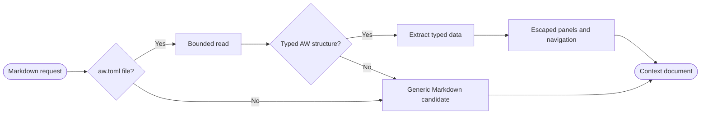

## Logic
<!-- type: logic lang: mermaid -->



`AwTypedRenderer` has priority 300 and supports only confined `.md` or `.markdown` file requests whose canonical root contains a regular `aw.toml` activation file. Activation is a local presence check, not an AW command or configuration mutation. It reads at most one MiB and recognizes four structures: TD frontmatter with `fill_sections`, EC headings or frontmatter declaring an external contract, capability documents containing `## Capabilities` plus a capability index, and bounded WI documents containing Problem, Capability Alignment, Scope, Acceptance Criteria, and Reference Context sections. Unrecognized or unconfigured input reports unsupported so the existing priority-200 `MarkdownRenderer` remains the deterministic fallback.

The parser returns an `AwArtifactModel` with `AwArtifactKind`, YAML frontmatter key/value rows, Markdown headings with one-based source lines, Mermaid fenced blocks, shell/console command blocks, assertion identifiers, and explicit `.md` or `#<issue>` relationships. Extraction is line-oriented and bounded; all values are treated as untrusted source text. The renderer HTML-escapes typed panels, reuses safe generic Markdown for readable body content, and adds navigation entries labeled with artifact section and line while preserving the confined source path in provenance. Parse/render failures remain isolated by `RendererRegistry` and allow generic Markdown to run with a warning.

`RendererRegistry::generic_with_optional_aw` registers `AwTypedRenderer`, `MarkdownRenderer`, and `GitRenderer` in that order by priority. The typed renderer owns no mutable state or handles: open and refresh repeat the same pure read, navigation returns existing path metadata, and close is ordinary drop. Production and tests contain no `Command` invocation for `aw` or `gh`, no approval API, no write/open-options path, and no PTY, cwd, launch-folder, or lifecycle-state dependency. Source relations are presented as derived navigation only; canonical truth stays in repository bytes and AW itself.
## Changes
<!-- type: changes lang: yaml -->

```yaml
changes:
  - path: apps/workbench/src/context/aw.rs
    action: create
    section: logic
    impl_mode: hand-written
    description: Detect configured AW TD, EC, capability, and WI Markdown; extract typed sections, commands, assertions, relationships, and source navigation without mutation.
  - path: apps/workbench/src/context/markdown.rs
    action: modify
    section: logic
    impl_mode: hand-written
    anchor: safe_markdown_html
    description: Reuse the existing safe Markdown conversion inside the typed renderer.
  - path: apps/workbench/src/context/mod.rs
    action: modify
    section: logic
    impl_mode: hand-written
    anchor: impl RendererRegistry
    description: Export and opt in the AW renderer ahead of generic Markdown while preserving fallback behavior.
  - path: apps/workbench/tests/aw_typed_renderer.rs
    action: create
    section: unit-test
    impl_mode: hand-written
    description: Prove all four typed artifact kinds, relationships, commands, Mermaid, byte identity, missing-configuration fallback, and mutation isolation.
  - path: apps/workbench/tests/fixtures/aw-context/aw.toml
    action: create
    section: unit-test
    impl_mode: hand-written
    description: Activate the optional renderer in the deterministic fixture without invoking AW.
  - path: apps/workbench/tests/fixtures/aw-context/tech-design.md
    action: create
    section: unit-test
    impl_mode: hand-written
    description: Minimal typed TD fixture with YAML frontmatter, Mermaid, commands, and relationships.
  - path: apps/workbench/tests/fixtures/aw-context/external-contract.md
    action: create
    section: unit-test
    impl_mode: hand-written
    description: Minimal typed EC fixture with assertions and a verifier command.
  - path: apps/workbench/tests/fixtures/aw-context/capabilities.md
    action: create
    section: unit-test
    impl_mode: hand-written
    description: Minimal capability contract fixture with an index and work-root relationship.
  - path: apps/workbench/tests/fixtures/aw-context/work-item.md
    action: create
    section: unit-test
    impl_mode: hand-written
    description: Minimal WI fixture with the canonical bounded sections and artifact references.
  - path: apps/workbench/README.md
    action: modify
    section: logic
    impl_mode: hand-written
    description: Document optional activation, typed views, generic fallback, and strict read-only ownership.
  - path: apps/workbench/CAPABILITIES.md
    action: modify
    section: logic
    impl_mode: hand-written
    description: Advance the optional-aw-typed-renderer work root and register its verification gate.
  - path: apps/workbench/CONTRIBUTING.md
    action: modify
    section: unit-test
    impl_mode: hand-written
    description: Record fixture, byte-identity, command-isolation, and fallback verification rules.
```

## Unit Test

```mermaid
---
id: workbench-aw-typed-renderer-verification
requirements:
  byte_identity_lifecycle:
    id: R3
    text: "Open, navigate, refresh, and close/drop leave all four source fixture byte streams identical."
    kind: regression
    risk: high
    verify: tests/aw_typed_renderer.rs::open_navigate_refresh_and_close_preserve_source_bytes
  four_typed_artifact_kinds:
    id: R1
    text: "Configured fixtures for TD, EC, capability, and WI documents are detected independently and rendered with their typed sections and source navigation."
    kind: integration
    risk: high
    verify: tests/aw_typed_renderer.rs::renders_td_ec_capability_and_wi_fixtures
  missing_configuration_fallback:
    id: R4
    text: "Without an aw.toml activation file the same Markdown artifact is rendered by the generic Markdown renderer, not rejected or mutated."
    kind: failure-recovery
    risk: high
    verify: tests/aw_typed_renderer.rs::missing_aw_configuration_uses_generic_markdown
  no_lifecycle_mutation_surface:
    id: R5
    text: "The typed adapter performs no AW, GitHub, approval, or lifecycle transition command and stays confined to the selected root."
    kind: boundary
    risk: high
    verify: tests/aw_typed_renderer.rs::typed_renderer_exposes_no_mutating_operation
  typed_content_and_relationships:
    id: R2
    text: "Typed output exposes YAML fields, Mermaid blocks, commands, assertion identifiers, and explicit artifact relationships as escaped read-only context."
    kind: contract
    risk: high
    verify: tests/aw_typed_renderer.rs::renders_commands_assertions_mermaid_and_relationships
---
flowchart TD
    r1[R1 four typed artifact kinds] --> tests_aw_typed_renderer_rs_renders_td_ec_capability_and_wi_fixtures[tests/aw_typed_renderer.rs::renders_td_ec_capability_and_wi_fixtures]
    r2[R2 typed content and relationships] --> tests_aw_typed_renderer_rs_renders_commands_assertions_mermaid_and_relationships[tests/aw_typed_renderer.rs::renders_commands_assertions_mermaid_and_relationships]
    r3[R3 byte identity lifecycle] --> tests_aw_typed_renderer_rs_open_navigate_refresh_and_close_preserve_source_bytes[tests/aw_typed_renderer.rs::open_navigate_refresh_and_close_preserve_source_bytes]
    r4[R4 missing configuration fallback] --> tests_aw_typed_renderer_rs_missing_aw_configuration_uses_generic_markdown[tests/aw_typed_renderer.rs::missing_aw_configuration_uses_generic_markdown]
    r5[R5 no lifecycle mutation surface] --> tests_aw_typed_renderer_rs_typed_renderer_exposes_no_mutating_operation[tests/aw_typed_renderer.rs::typed_renderer_exposes_no_mutating_operation]
```

<!-- type: unit-test lang: mermaid -->


