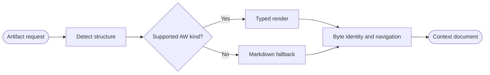

## Logic
<!-- type: logic lang: mermaid -->



Create a separate optional `AwTypedRenderer` registered above generic Markdown only when an artifact is structurally recognizable as a TD, EC, capability contract, or WI document. Detection and rendering read the confined source path directly; they never invoke `aw`, GitHub, approval, lifecycle, or repository mutation operations.

The renderer extracts YAML frontmatter, typed Markdown headings, fenced Mermaid diagrams, command blocks, assertion identifiers, and explicit artifact references into a structured context document with source navigation. Unknown or incomplete documents remain eligible for the existing `MarkdownRenderer`; absent `aw.toml` is not an error and is not itself used as the support signal.

Open, navigate, refresh, and drop/close are pure reads over the same source bytes. Parse failures are isolated by the existing registry and fall through to safe generic Markdown with warnings, while all relationships remain disclosed as derived links rather than canonical lifecycle state.

## Changes
<!-- type: changes lang: yaml -->

```yaml
changes:
  - path: apps/workbench/src/context/aw.rs
    action: create
    section: logic
    impl_mode: hand-written
    description: Detect configured AW TD, EC, capability, and WI Markdown; extract typed sections, commands, assertions, relationships, and source navigation without mutation.
  - path: apps/workbench/src/context/markdown.rs
    action: modify
    section: logic
    impl_mode: hand-written
    anchor: safe_markdown_html
    description: Reuse the existing safe Markdown conversion inside the typed renderer.
  - path: apps/workbench/src/context/mod.rs
    action: modify
    section: logic
    impl_mode: hand-written
    anchor: impl RendererRegistry
    description: Export and opt in the AW renderer ahead of generic Markdown while preserving fallback behavior.
  - path: apps/workbench/tests/aw_typed_renderer.rs
    action: create
    section: unit-test
    impl_mode: hand-written
    description: Prove all four typed artifact kinds, relationships, commands, Mermaid, byte identity, missing-configuration fallback, and mutation isolation.
  - path: apps/workbench/tests/fixtures/aw-context/aw.toml
    action: create
    section: unit-test
    impl_mode: hand-written
    description: Activate the optional renderer in the deterministic fixture without invoking AW.
  - path: apps/workbench/tests/fixtures/aw-context/tech-design.md
    action: create
    section: unit-test
    impl_mode: hand-written
    description: Minimal typed TD fixture with YAML frontmatter, Mermaid, commands, and relationships.
  - path: apps/workbench/tests/fixtures/aw-context/external-contract.md
    action: create
    section: unit-test
    impl_mode: hand-written
    description: Minimal typed EC fixture with assertions and a verifier command.
  - path: apps/workbench/tests/fixtures/aw-context/capabilities.md
    action: create
    section: unit-test
    impl_mode: hand-written
    description: Minimal capability contract fixture with an index and work-root relationship.
  - path: apps/workbench/tests/fixtures/aw-context/work-item.md
    action: create
    section: unit-test
    impl_mode: hand-written
    description: Minimal WI fixture with the canonical bounded sections and artifact references.
  - path: apps/workbench/README.md
    action: modify
    section: logic
    impl_mode: hand-written
    description: Document optional activation, typed views, generic fallback, and strict read-only ownership.
  - path: apps/workbench/CAPABILITIES.md
    action: modify
    section: logic
    impl_mode: hand-written
    description: Advance the optional-aw-typed-renderer work root and register its verification gate.
  - path: apps/workbench/CONTRIBUTING.md
    action: modify
    section: unit-test
    impl_mode: hand-written
    description: Record fixture, byte-identity, command-isolation, and fallback verification rules.
```
