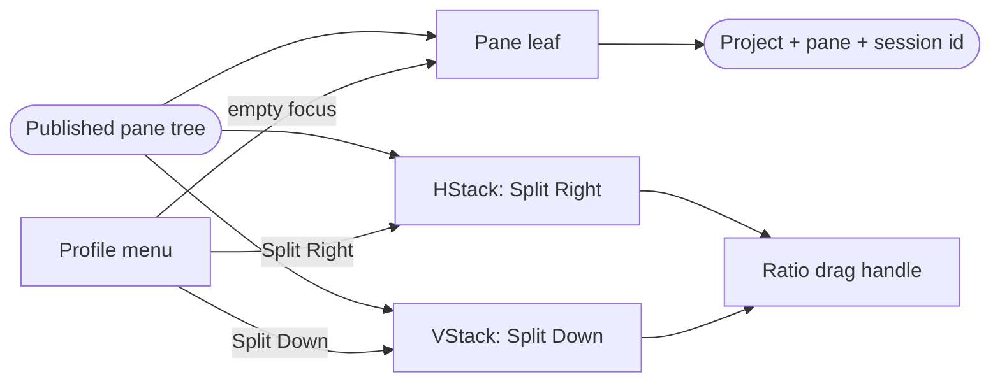

## Logic
<!-- type: logic lang: mermaid -->



`paneTreeContent(_:)` recursively renders `TerminalPaneTree`. A `.leaf` delegates to the existing pane header, idle/failure state, or `TerminalSurface`. A `.split(axis: .horizontal)` places first, divider, and second in an `HStack`; `.vertical` uses a `VStack`. The first child receives `ratio` of the available axis and the second receives the remainder. A divider drag computes a normalized ratio from the container-local pointer and calls `setSplitRatio(splitId:ratio:)`; the model recursively changes only that split and clamps the value to `0.15...0.85`. Leaf and tab identifiers are unchanged.

The top `+` menu is state-sensitive. When the focused leaf is empty, each profile calls `addTerminal(profile:)`. When it contains a session, the menu shows `Split Right` and `Split Down` submenus; each profile calls `splitActivePane(axis:profile:)`. Pane headers repeat the same explicit split options near the focused terminal, show only the lifecycle color dot and profile title, and omit the redundant `Running` text. Every control has a stable accessibility identifier and label.

`TerminalSurface` keeps the identity `projectId::paneId::tabId`. Focus changes do not conditionally remove a leaf or change this id, so SwiftUI updates input eligibility in place rather than replaying terminal output. Layout changes preserve the original leaf as the first child and mount only the newly created sibling. Each pane reserves a practical minimum of 240 points horizontally and 160 points vertically; impossible drags clamp rather than collapse either side.
## Changes
<!-- type: changes lang: yaml -->

```yaml
changes:
  - path: apps/workbench/macos/Sources/WorkbenchMacCore/WorkbenchModel.swift
    action: modify
    section: logic
    impl_mode: hand-written
    anchor: WorkbenchModel
  - path: apps/workbench/macos/Sources/WorkbenchMac/WorkbenchView.swift
    action: modify
    section: logic
    impl_mode: hand-written
    anchor: WorkbenchView
  - path: apps/workbench/macos/Tests/WorkbenchMacCoreTests/WorkbenchModelTests.swift
    action: modify
    section: unit-test
    impl_mode: hand-written
    anchor: WorkbenchModelTests
  - path: apps/workbench/macos/UITests/WorkbenchMacUITests.swift
    action: modify
    section: unit-test
    impl_mode: hand-written
    anchor: WorkbenchMacUITests
```

## Unit Test

```mermaid
---
id: workbench-recursive-pane-renderer-contract-verification
requirements:
  explicit_controls:
    id: R2
    text: "An empty focused leaf accepts a profile directly while an occupied leaf exposes explicit Split Right and Split Down profile actions."
    kind: regression
    risk: high
    verify: WorkbenchMacUITests.testPaneToolbarOffersAddAndExplicitSplitActions
  native_suite:
    id: R5
    text: "The native Swift package compiles and executes its deterministic model and source-contract regressions."
    kind: regression
    risk: medium
    verify: swift test --package-path apps/workbench/macos
  ratio:
    id: R3
    text: "Divider changes update only the addressed split ratio, clamp it to 0.15 through 0.85, and preserve leaf identities."
    kind: functional
    risk: high
    verify: WorkbenchModelTests.testSplitRatioUpdatesClampAndPreserveLeafIdentity
  recursive_renderer:
    id: R1
    text: "The native workspace renders every leaf and nested horizontal or vertical split from TerminalPaneTree."
    kind: functional
    risk: high
    verify: WorkbenchModelTests.testNativeClientUsesRecursivePaneRendererAndExplicitSplitMenus
  renderer_identity:
    id: R4
    text: "Focus, ratio, and project presentation changes retain the project-pane-session SwiftTerm surface identity."
    kind: regression
    risk: high
    verify: WorkbenchModelTests.testNativeClientUsesRecursivePaneRendererAndExplicitSplitMenus
---
flowchart TD
    r1[R1 recursive renderer] --> workbenchmodeltests_testnativeclientusesrecursivepanerendererandexplicitsplitmenus[WorkbenchModelTests.testNativeClientUsesRecursivePaneRendererAndExplicitSplitMenus]
    r4[R4 renderer identity] --> workbenchmodeltests_testnativeclientusesrecursivepanerendererandexplicitsplitmenus
    r2[R2 explicit controls] --> workbenchmacuitests_testpanetoolbaroffersaddandexplicitsplitactions[WorkbenchMacUITests.testPaneToolbarOffersAddAndExplicitSplitActions]
    r3[R3 ratio] --> workbenchmodeltests_testsplitratioupdatesclampandpreserveleafidentity[WorkbenchModelTests.testSplitRatioUpdatesClampAndPreserveLeafIdentity]
    r5[R5 native suite] --> swift_test_package_path_apps_workbench_macos[swift test --package-path apps/workbench/macos]
```

<!-- type: unit-test lang: mermaid -->


