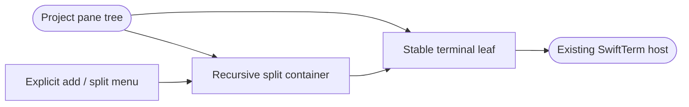

## Logic
<!-- type: logic lang: mermaid -->



This design applies only to the native macOS presentation of the project-scoped `TerminalPaneTree` introduced by #2499. It replaces the flat pane `HStack` with a recursive SwiftUI renderer, exposes explicit Split Right and Split Down profile actions, and allows a split ratio to be updated without changing terminal-session identity. Rust remains the sole PTY owner and the existing `TerminalSurface` continues to render bytes for the referenced `TerminalTab`.

Drag-to-split, worktree lifecycle, persisted restart restoration, tabs inside a pane, and Auxiliary feature expansion remain outside this slice.

## Changes
<!-- type: changes lang: yaml -->

```yaml
changes:
  - path: apps/workbench/macos/Sources/WorkbenchMacCore/WorkbenchModel.swift
    action: modify
    section: logic
    impl_mode: hand-written
    anchor: WorkbenchModel
  - path: apps/workbench/macos/Sources/WorkbenchMac/WorkbenchView.swift
    action: modify
    section: logic
    impl_mode: hand-written
    anchor: WorkbenchView
  - path: apps/workbench/macos/Tests/WorkbenchMacCoreTests/WorkbenchModelTests.swift
    action: modify
    section: unit-test
    impl_mode: hand-written
    anchor: WorkbenchModelTests
  - path: apps/workbench/macos/UITests/WorkbenchMacUITests.swift
    action: modify
    section: unit-test
    impl_mode: hand-written
    anchor: WorkbenchMacUITests
```

## Unit Test

```mermaid
---
id: workbench-recursive-pane-renderer-contract-verification
requirements:
  explicit_controls:
    id: R2
    text: "An empty focused leaf accepts a profile directly while an occupied leaf exposes explicit Split Right and Split Down profile actions."
    kind: regression
    risk: high
    verify: WorkbenchMacUITests.testPaneToolbarOffersAddAndExplicitSplitActions
  native_suite:
    id: R5
    text: "The native Swift package compiles and executes its deterministic model and source-contract regressions."
    kind: regression
    risk: medium
    verify: swift test --package-path apps/workbench/macos
  ratio:
    id: R3
    text: "Divider changes update only the addressed split ratio, clamp it to 0.15 through 0.85, and preserve leaf identities."
    kind: functional
    risk: high
    verify: WorkbenchModelTests.testSplitRatioUpdatesClampAndPreserveLeafIdentity
  recursive_renderer:
    id: R1
    text: "The native workspace renders every leaf and nested horizontal or vertical split from TerminalPaneTree."
    kind: functional
    risk: high
    verify: WorkbenchModelTests.testNativeClientUsesRecursivePaneRendererAndExplicitSplitMenus
  renderer_identity:
    id: R4
    text: "Focus, ratio, and project presentation changes retain the project-pane-session SwiftTerm surface identity."
    kind: regression
    risk: high
    verify: WorkbenchModelTests.testNativeClientUsesRecursivePaneRendererAndExplicitSplitMenus
---
flowchart TD
    r1[R1 recursive renderer] --> workbenchmodeltests_testnativeclientusesrecursivepanerendererandexplicitsplitmenus[WorkbenchModelTests.testNativeClientUsesRecursivePaneRendererAndExplicitSplitMenus]
    r4[R4 renderer identity] --> workbenchmodeltests_testnativeclientusesrecursivepanerendererandexplicitsplitmenus
    r2[R2 explicit controls] --> workbenchmacuitests_testpanetoolbaroffersaddandexplicitsplitactions[WorkbenchMacUITests.testPaneToolbarOffersAddAndExplicitSplitActions]
    r3[R3 ratio] --> workbenchmodeltests_testsplitratioupdatesclampandpreserveleafidentity[WorkbenchModelTests.testSplitRatioUpdatesClampAndPreserveLeafIdentity]
    r5[R5 native suite] --> swift_test_package_path_apps_workbench_macos[swift test --package-path apps/workbench/macos]
```

<!-- type: unit-test lang: mermaid -->


