## Logic
<!-- type: logic lang: mermaid -->


Stable is `Axiom Workbench`, bundle id `com.axiom.workbench`, profile `stable`, and state root `~/.axiom-workbench`. Beta is `Axiom Workbench Beta`, bundle id `com.axiom.workbench.beta`, profile `beta`, and state root `~/.axiom-workbench-beta`. Each has its own runtime registry, lock, logs, and project metadata. Stable uses the approved cobalt/amber icon; Beta uses the ultraviolet/mint icon.

Build scripts select an explicit Xcode scheme/configuration and only terminate the matching bundle executable. `workbench-build-beta` may never touch Stable. `workbench-build-stable` builds/opens Stable only when invoked. The CLI accepts `--profile stable|beta`, defaults to stable, and derives all local paths from that profile; a cross-profile snapshot cannot discover another runtime.

The legacy cclab bundle is not deleted. A new product starts independently; its one-runtime lease is scoped to its own state root. Tests inspect bundle identities, app names, state-root derivation, icon assets, and two simultaneous profile registries without Computer Use.

## Changes
<!-- type: changes lang: yaml -->

```yaml
changes:
  - path: apps/workbench/macos/WorkbenchMac.xcodeproj/project.pbxproj
    action: modify
    section: logic
    impl_mode: hand-written
    description: Define isolated Stable and Beta products, bundle identities, display names, build settings, and icon asset catalogs.
  - path: apps/workbench/macos/Sources/WorkbenchMacCore/WorkbenchRuntimeProfile.swift
    action: create
    section: logic
    impl_mode: hand-written
    description: Derive explicit stable or beta local state roots and bundle-owned runtime identity from application configuration.
  - path: apps/workbench/macos/Sources/WorkbenchMacCore/ProjectStore.swift
    action: modify
    section: logic
    impl_mode: hand-written
    description: Scope project metadata persistence to the selected runtime profile root.
  - path: apps/workbench/macos/Sources/WorkbenchMacCore/DiagnosticLog.swift
    action: modify
    section: logic
    impl_mode: hand-written
    description: Scope bounded diagnostics to the selected runtime profile root.
  - path: apps/workbench/macos/Sources/WorkbenchMacCore/LocalRuntimeServer.swift
    action: modify
    section: logic
    impl_mode: hand-written
    description: Scope singleton lease and registry publication to the selected runtime profile.
  - path: apps/workbench/macos/Sources/WorkbenchMac/WorkbenchMacApp.swift
    action: modify
    section: logic
    impl_mode: hand-written
    description: Initialize model, diagnostics, and runtime server from the bundle-owned profile.
  - path: apps/workbench/src/observability_cli.rs
    action: modify
    section: logic
    impl_mode: hand-written
    anchor: run_if_requested
    description: Parse --profile stable|beta and derive log and runtime paths without cross-profile fallback.
  - path: apps/workbench/tests/observability_cli.rs
    action: modify
    section: unit-test
    impl_mode: hand-written
    anchor: logs_tail_is_local_line_bounded_and_runtime_independent
    description: Prove profile parsing and stable/beta path isolation.
  - path: apps/workbench/macos/Tests/WorkbenchMacCoreTests/WorkbenchRuntimeProfileTests.swift
    action: create
    section: unit-test
    impl_mode: hand-written
    description: Prove distinct stable/beta state roots, bundle identities, and no cross-profile singleton collision.
  - path: apps/workbench/macos/Assets/Stable/AppIcon.appiconset/Contents.json
    action: create
    section: logic
    impl_mode: hand-written
    description: Register the approved cobalt and amber Stable icon asset.
  - path: apps/workbench/macos/Assets/Beta/AppIcon.appiconset/Contents.json
    action: create
    section: logic
    impl_mode: hand-written
    description: Register the approved ultraviolet and mint Beta icon asset.
  - path: .agents/skills/workbench-build-stable/SKILL.md
    action: create
    section: logic
    impl_mode: hand-written
    description: Document the explicit Stable-only build and launch workflow.
  - path: .agents/skills/workbench-build-stable/scripts/build.sh
    action: create
    section: logic
    impl_mode: hand-written
    description: Build and launch only the Stable product.
  - path: .agents/skills/workbench-build-beta/SKILL.md
    action: create
    section: logic
    impl_mode: hand-written
    description: Document the Beta-only build and launch workflow.
  - path: .agents/skills/workbench-build-beta/scripts/build.sh
    action: create
    section: logic
    impl_mode: hand-written
    description: Build and launch only the Beta product.
```

## Unit Test

```mermaid
---
id: workbench-delivery-channels-verification
requirements:
  native_products_are_distinct:
    id: R2
    text: "The two Xcode products expose Axiom names, com.axiom bundle identities, and separate icon asset catalogs."
    kind: integration
    risk: high
    verify: macos/Tests/WorkbenchMacCoreTests/WorkbenchRuntimeProfileTests.swift::testStableAndBetaProductsAreDistinct
  profile_paths_are_isolated:
    id: R1
    text: "Stable and Beta derive distinct bundle-owned state roots, registry paths, logs, and project metadata with no fallback between profiles."
    kind: contract
    risk: high
    verify: tests/observability_cli.rs::profiles_have_distinct_runtime_and_log_paths
  skills_never_cross_terminate:
    id: R3
    text: "Stable and Beta build scripts target and terminate only their matching product executable."
    kind: regression
    risk: high
    verify: macos/Tests/WorkbenchMacCoreTests/WorkbenchRuntimeProfileTests.swift::testBuildSkillsAreProductScoped
---
flowchart TD
    r1[R1 profile paths are isolated] --> tests_observability_cli_rs_profiles_have_distinct_runtime_and_log_paths[tests/observability_cli.rs::profiles_have_distinct_runtime_and_log_paths]
    r2[R2 native products are distinct] --> macos_tests_workbenchmaccoretests_workbenchruntimeprofiletests_swift_teststableandbetaproductsaredistinct[macos/Tests/WorkbenchMacCoreTests/WorkbenchRuntimeProfileTests.swift::testStableAndBetaProductsAreDistinct]
    r3[R3 skills never cross terminate] --> macos_tests_workbenchmaccoretests_workbenchruntimeprofiletests_swift_testbuildskillsareproductscoped[macos/Tests/WorkbenchMacCoreTests/WorkbenchRuntimeProfileTests.swift::testBuildSkillsAreProductScoped]
```

<!-- type: unit-test lang: mermaid -->


