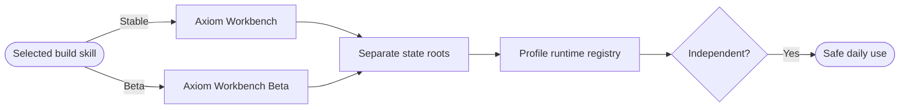

## Logic
<!-- type: logic lang: mermaid -->

Stable is `Axiom Workbench`, bundle id `com.axiom.workbench`, profile `stable`, and state root `~/.axiom-workbench`. Beta is `Axiom Workbench Beta`, bundle id `com.axiom.workbench.beta`, profile `beta`, and state root `~/.axiom-workbench-beta`. Each has its own runtime registry, lock, logs, and project metadata. Stable uses the approved cobalt/amber icon; Beta uses the ultraviolet/mint icon.

Build scripts select an explicit Xcode scheme/configuration and only terminate the matching bundle executable. `workbench-build-beta` may never touch Stable. `workbench-build-stable` builds/opens Stable only when invoked. The CLI accepts `--profile stable|beta`, defaults to stable, and derives all local paths from that profile; a cross-profile snapshot cannot discover another runtime.

The legacy cclab bundle is not deleted. A new product starts independently; its one-runtime lease is scoped to its own state root. Tests inspect bundle identities, app names, state-root derivation, icon assets, and two simultaneous profile registries without Computer Use.
