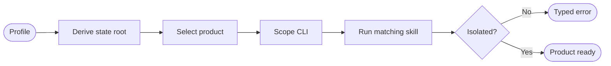

## Contract
<!-- type: logic lang: mermaid -->



`stable` and `beta` are the only profiles. Stable has product name `Axiom Workbench`, bundle id `com.axiom.workbench`, state root `~/.axiom-workbench`, app bundle `Axiom Workbench.app`, and the cobalt/amber icon. Beta has product name `Axiom Workbench Beta`, bundle id `com.axiom.workbench.beta`, state root `~/.axiom-workbench-beta`, app bundle `Axiom Workbench Beta.app`, and the ultraviolet/mint icon. Both settings are supplied by the compiled application bundle, never inferred from process name.

All profile-owned state is rooted under the selected profile: `projects/`, `logs/workbench.log`, and `runtime/current.json` plus lock. `workbench snapshot|logs --profile stable|beta` defaults to stable, rejects duplicate or unknown profile flags with `invalid_arguments`, and reads exactly that profile root. A missing profile runtime returns `runtime_unavailable`; it must not inspect, activate, or substitute the other profile.

The Stable and Beta skills invoke their own named Xcode schemes/configurations, query the exact product bundle path, terminate only the exact matching executable, and open only that bundle. They build the Rust sidecar as a shared dependency but never replace the other app product. Stable build is explicit; no Beta/debug command may invoke it. Legacy `com.cclab.workbench` is neither deleted nor adopted.

Each app icon asset catalog names its own `AppIcon` and includes a generated 1024px source that Xcode derives into the application icon. The Stable and Beta icon images retain the same geometric mark but distinct approved palettes. Tests assert identities, root derivation, CLI profile boundaries, and script/product matching; integration evidence builds both app bundles and proves each profile registry responds only to its matching CLI request.
## Changes
<!-- type: changes lang: yaml -->

```yaml
changes:
  - path: apps/workbench/macos/WorkbenchMac.xcodeproj/project.pbxproj
    action: modify
    section: contract
    impl_mode: hand-written
    description: Define stable and beta product configurations with separate name, bundle identifier, runtime profile, and asset catalog.
  - path: apps/workbench/macos/Info.plist
    action: create
    section: contract
    impl_mode: hand-written
    description: Expand the configuration-owned runtime profile into each app bundle's Info.plist.
  - path: apps/workbench/macos/Sources/WorkbenchMacCore/WorkbenchRuntimeProfile.swift
    action: create
    section: contract
    impl_mode: hand-written
    description: Own the closed profile enum and state-root derivation contract.
  - path: apps/workbench/macos/Sources/WorkbenchMacCore/ProjectStore.swift
    action: modify
    section: contract
    impl_mode: hand-written
    description: Accept the profile-owned storage root.
  - path: apps/workbench/macos/Sources/WorkbenchMacCore/DiagnosticLog.swift
    action: modify
    section: contract
    impl_mode: hand-written
    description: Write only the active profile diagnostic log.
  - path: apps/workbench/macos/Sources/WorkbenchMacCore/LocalRuntimeServer.swift
    action: modify
    section: contract
    impl_mode: hand-written
    description: Scope singleton runtime files to the active profile root.
  - path: apps/workbench/macos/Sources/WorkbenchMac/WorkbenchMacApp.swift
    action: modify
    section: contract
    impl_mode: hand-written
    description: Read profile identity from bundle configuration.
  - path: apps/workbench/src/observability_cli.rs
    action: modify
    section: contract
    impl_mode: hand-written
    anchor: run_if_requested
    description: Parse profile and enforce profile-scoped runtime and log discovery.
  - path: apps/workbench/tests/observability_cli.rs
    action: modify
    section: contract
    impl_mode: hand-written
    anchor: logs_tail_is_local_line_bounded_and_runtime_independent
    description: Verify profile argv and isolated paths.
  - path: apps/workbench/macos/Tests/WorkbenchMacCoreTests/WorkbenchRuntimeProfileTests.swift
    action: create
    section: contract
    impl_mode: hand-written
    description: Verify native identities and profile roots.
  - path: apps/workbench/macos/Assets/Stable/AppIcon.appiconset/Contents.json
    action: create
    section: contract
    impl_mode: hand-written
    description: Register stable app icon.
  - path: apps/workbench/macos/Assets/Beta/AppIcon.appiconset/Contents.json
    action: create
    section: contract
    impl_mode: hand-written
    description: Register beta app icon.
  - path: .agents/skills/workbench-build-stable/SKILL.md
    action: create
    section: contract
    impl_mode: hand-written
    description: Stable-only skill contract.
  - path: .agents/skills/workbench-build-stable/scripts/build.sh
    action: create
    section: contract
    impl_mode: hand-written
    description: Stable product build dispatcher.
  - path: .agents/skills/workbench-build-beta/SKILL.md
    action: create
    section: contract
    impl_mode: hand-written
    description: Beta-only skill contract.
  - path: .agents/skills/workbench-build-beta/scripts/build.sh
    action: create
    section: contract
    impl_mode: hand-written
    description: Beta product build dispatcher.
  - path: .agents/skills/workbench-build-debug/SKILL.md
    action: modify
    section: contract
    impl_mode: hand-written
    description: Preserve the legacy debug skill as an explicit alias for the Beta product.
  - path: .agents/skills/workbench-build-debug/scripts/build.sh
    action: modify
    section: contract
    impl_mode: hand-written
    description: Dispatch the legacy debug entry point only to the Beta product.
```
## Unit Test

```mermaid
---
id: workbench-channel-contract-verification
requirements:
  cli_cannot_cross_profile:
    id: R3
    text: "Snapshot and logs parse only stable or beta and resolve exactly that profile path without fallback."
    kind: failure-recovery
    risk: high
    verify: tests/observability_cli.rs::profiles_have_distinct_runtime_and_log_paths
  profile_local_state:
    id: R2
    text: "Stable and Beta derive disjoint state roots for projects, logs, lock, and runtime registry."
    kind: security
    risk: high
    verify: macos/Tests/WorkbenchMacCoreTests/WorkbenchRuntimeProfileTests.swift::testProfileRootsDoNotOverlap
  skills_are_scoped:
    id: R4
    text: "Stable and Beta build skills select only their matching product and executable process target."
    kind: regression
    risk: high
    verify: macos/Tests/WorkbenchMacCoreTests/WorkbenchRuntimeProfileTests.swift::testBuildSkillsAreProductScoped
  stable_beta_bundle_identity:
    id: R1
    text: "Stable and Beta products declare exact distinct Axiom names and com.axiom bundle identifiers."
    kind: contract
    risk: high
    verify: macos/Tests/WorkbenchMacCoreTests/WorkbenchRuntimeProfileTests.swift::testStableAndBetaProductsAreDistinct
---
flowchart TD
    r1[R1 stable beta bundle identity] --> macos_tests_workbenchmaccoretests_workbenchruntimeprofiletests_swift_teststableandbetaproductsaredistinct[macos/Tests/WorkbenchMacCoreTests/WorkbenchRuntimeProfileTests.swift::testStableAndBetaProductsAreDistinct]
    r2[R2 profile local state] --> macos_tests_workbenchmaccoretests_workbenchruntimeprofiletests_swift_testprofilerootsdonotoverlap[macos/Tests/WorkbenchMacCoreTests/WorkbenchRuntimeProfileTests.swift::testProfileRootsDoNotOverlap]
    r3[R3 cli cannot cross profile] --> tests_observability_cli_rs_profiles_have_distinct_runtime_and_log_paths[tests/observability_cli.rs::profiles_have_distinct_runtime_and_log_paths]
    r4[R4 skills are scoped] --> macos_tests_workbenchmaccoretests_workbenchruntimeprofiletests_swift_testbuildskillsareproductscoped[macos/Tests/WorkbenchMacCoreTests/WorkbenchRuntimeProfileTests.swift::testBuildSkillsAreProductScoped]
```

<!-- type: unit-test lang: mermaid -->


