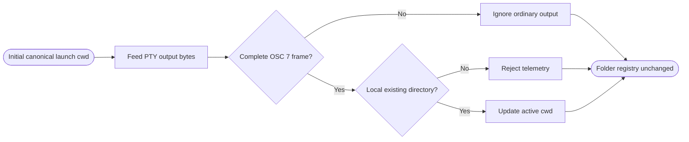

## Logic
<!-- type: logic lang: mermaid -->

Workbench uses the explicit OSC 7 current-directory protocol: `ESC ] 7 ; file://localhost/<percent-encoded-path> BEL` (and the standard ST terminator). `CwdTelemetryDecoder` accepts raw PTY byte chunks, survives frames split across arbitrary read boundaries, bounds retained incomplete data, and returns only complete file-URI payloads. Ordinary output is never parsed for paths, prompts, `cd`, or shell syntax.

`ActiveCwdContext` starts from the canonical selected launch folder and owns only the active context path plus the decoder. For each decoded URI it requires the `file` scheme, an empty or `localhost` host, a percent-decoded local path that canonicalizes successfully, and directory metadata. A valid changed directory replaces the active path and returns `CwdContextUpdate { path, source: Osc7 }`; malformed, remote, missing, and non-directory frames leave the prior context untouched. Duplicate frames are idempotent.

The PTY command environment discloses `WORKBENCH_CWD_TELEMETRY=osc7-file-uri-v1`. Integrated shells emit one frame after each successful directory transition; deterministic fixtures call the same `cwd_telemetry_frame` encoder. Failed `cd` operations emit ordinary error text but no successful frame. Direct vendor CLIs remain authoritative and may opt into the same terminal protocol without Workbench scraping their display output.

The tracker has no mutable access to `ShellState`; the registered folder list and selected launch id remain identity/launch configuration while active cwd is ephemeral runtime context. Tests retain a registry snapshot across successful and failed real-PTY transitions and assert byte-for-byte equality. Renderer selection remains outside this WI.
