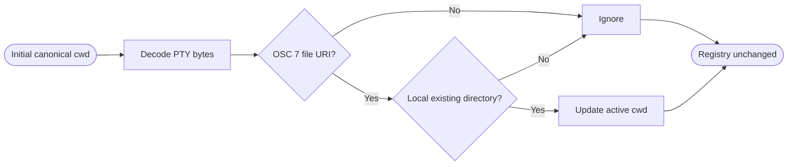

## Logic
<!-- type: logic lang: mermaid -->



The only authoritative telemetry is an OSC 7 control frame terminated by BEL or ST. `CwdTelemetryDecoder` retains a bounded suffix across PTY reads, recognizes `ESC ] 7 ;`, and yields complete URI payloads. It never scans ordinary output for prompts, paths, `cd`, or shell messages.

`ActiveCwdContext` is initialized from the canonical selected launch folder. A candidate must parse as a `file` URI, use an empty or `localhost` host, convert to a local path, canonicalize successfully, and be a directory. A changed path returns `CwdContextUpdate` with `CwdTelemetrySource::Osc7`; duplicates and invalid candidates return no update and preserve prior state.

Every PTY child receives `WORKBENCH_CWD_TELEMETRY=osc7-file-uri-v1`, and `cwd_telemetry_frame` provides the canonical encoder for integrated shells and deterministic fixtures. Failed or non-directory shell transitions emit no valid frame. The tracker cannot mutate `ShellState`, so registered folders and selected launch identity remain stable while active cwd changes ephemerally.
## Changes
<!-- type: changes lang: yaml -->

```yaml
changes:
  - path: Cargo.lock
    action: modify
    section: logic
    impl_mode: hand-written
    description: Record the Workbench direct URL parser dependency in the lock graph.
  - path: apps/workbench/Cargo.toml
    action: modify
    section: logic
    impl_mode: hand-written
    description: Add the workspace URL parser for strict file-URI telemetry decoding.
  - path: apps/workbench/src/cwd_context.rs
    action: create
    section: logic
    impl_mode: hand-written
    description: Decode bounded OSC 7 frames and own validated ephemeral active-cwd context updates.
  - path: apps/workbench/src/native_agent_pty.rs
    action: modify
    section: logic
    impl_mode: hand-written
    anchor: impl PtyRuntime
    description: Disclose the supported cwd telemetry protocol in every PTY child environment.
  - path: apps/workbench/src/lib.rs
    action: modify
    section: logic
    impl_mode: hand-written
    anchor: run
    description: Export the active cwd-context telemetry boundary from the Workbench host crate.
  - path: apps/workbench/tests/pty_cwd_context.rs
    action: create
    section: unit-test
    impl_mode: hand-written
    description: Prove real-PTY nested cwd transitions, fragmented telemetry, invalid transitions, prompt non-scraping, and folder-registry immutability.
  - path: apps/workbench/README.md
    action: modify
    section: logic
    impl_mode: hand-written
    description: Document OSC 7 authority, validation, and separation of active cwd from registered launch folders.
  - path: apps/workbench/CAPABILITIES.md
    action: modify
    section: logic
    impl_mode: hand-written
    description: Advance the authoritative-cwd-context work root and register its verification gate.
  - path: apps/workbench/CONTRIBUTING.md
    action: modify
    section: unit-test
    impl_mode: hand-written
    description: Record the real PTY cwd-context test and forbid prompt or ordinary-output path scraping.
```

## Unit Test

```mermaid
---
id: workbench-authoritative-cwd-context-verification
requirements:
  bounded_stream_decoder:
    id: R5
    text: "The streaming decoder accepts BEL and ST terminators across arbitrary byte chunks and bounds retained incomplete control data."
    kind: regression
    risk: medium
    verify: tests/pty_cwd_context.rs::decoder_is_fragment_safe_and_never_scrapes_ordinary_output
  failed_transitions_preserve_state:
    id: R4
    text: "Malformed, remote-host, missing, and non-directory telemetry plus failed shell cd operations leave both active cwd and the registered launch-folder snapshot unchanged."
    kind: failure-recovery
    risk: high
    verify: tests/pty_cwd_context.rs::failed_transitions_never_mutate_context_or_launch_folders
  ordinary_output_is_never_cwd:
    id: R2
    text: "Prompt text, cd-like output, filesystem-looking strings, and OSC-like incomplete bytes never update cwd unless they form a valid complete OSC 7 frame."
    kind: boundary
    risk: high
    verify: tests/pty_cwd_context.rs::decoder_is_fragment_safe_and_never_scrapes_ordinary_output
  real_pty_osc7_transition:
    id: R1
    text: "A real PTY shell fixture changes into a nested directory, emits the explicit OSC 7 file-URI frame, and updates active context to the canonical nested path."
    kind: integration
    risk: high
    verify: tests/pty_cwd_context.rs::real_pty_updates_active_context_from_osc7
  successful_validated_updates:
    id: R3
    text: "Only a local file URI that percent-decodes, canonicalizes, and names an existing directory changes active context; duplicates are idempotent and disclose OSC 7 as their source."
    kind: functional
    risk: high
    verify: tests/pty_cwd_context.rs::decoder_validates_local_existing_directories
---
flowchart TD
    r1[R1 real pty osc7 transition] --> tests_pty_cwd_context_rs_real_pty_updates_active_context_from_osc7[tests/pty_cwd_context.rs::real_pty_updates_active_context_from_osc7]
    r2[R2 ordinary output is never cwd] --> tests_pty_cwd_context_rs_decoder_is_fragment_safe_and_never_scrapes_ordinary_output[tests/pty_cwd_context.rs::decoder_is_fragment_safe_and_never_scrapes_ordinary_output]
    r5[R5 bounded stream decoder] --> tests_pty_cwd_context_rs_decoder_is_fragment_safe_and_never_scrapes_ordinary_output
    r3[R3 successful validated updates] --> tests_pty_cwd_context_rs_decoder_validates_local_existing_directories[tests/pty_cwd_context.rs::decoder_validates_local_existing_directories]
    r4[R4 failed transitions preserve state] --> tests_pty_cwd_context_rs_failed_transitions_never_mutate_context_or_launch_folders[tests/pty_cwd_context.rs::failed_transitions_never_mutate_context_or_launch_folders]
```

<!-- type: unit-test lang: mermaid -->


