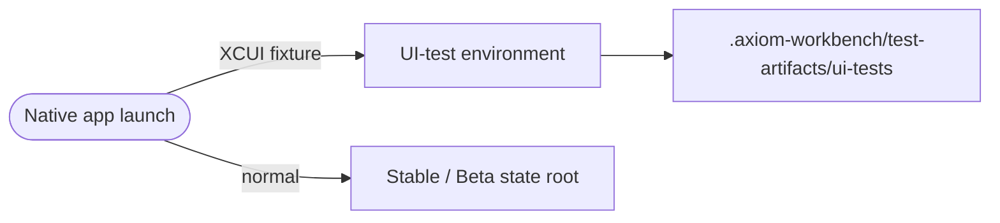

## Logic
<!-- type: logic lang: mermaid -->



This design applies only to native app bootstrap when `WORKBENCH_UI_TEST_FOLDER` is present. The XCUI launcher supplies an explicit `WORKBENCH_UI_TEST_STATE_ROOT` below the repository-local ignored test-artifact directory. ProjectStore, LocalRuntimeServer, and diagnostic logging use that root for the test process. Normal stable and beta launches continue using their existing profile roots.

## Changes
<!-- type: changes lang: yaml -->

```yaml
changes:
  - path: apps/workbench/macos/Sources/WorkbenchMacCore/WorkbenchRuntimeProfile.swift
    action: modify
    section: logic
    impl_mode: hand-written
    anchor: WorkbenchRuntimeProfile
  - path: apps/workbench/macos/Sources/WorkbenchMacCore/DiagnosticLog.swift
    action: modify
    section: logic
    impl_mode: hand-written
    anchor: WorkbenchDiagnosticLog
  - path: apps/workbench/macos/Sources/WorkbenchMac/WorkbenchMacApp.swift
    action: modify
    section: logic
    impl_mode: hand-written
    anchor: WorkbenchMacApp
  - path: apps/workbench/macos/Tests/WorkbenchMacCoreTests/WorkbenchRuntimeProfileTests.swift
    action: modify
    section: unit-test
    impl_mode: hand-written
    anchor: WorkbenchRuntimeProfileTests
  - path: apps/workbench/macos/UITests/WorkbenchMacUITests.swift
    action: modify
    section: unit-test
    impl_mode: hand-written
    anchor: WorkbenchMacUITests
```

## Unit Test

```mermaid
---
id: workbench-native-ui-test-state-isolation-verification
requirements:
  native_suite:
    id: R4
    text: "The native Swift package compiles and executes all state isolation regressions."
    kind: regression
    risk: medium
    verify: swift test --package-path apps/workbench/macos
  normal_profiles:
    id: R2
    text: "A normal stable or beta launch ignores the UI-test override and retains its profile-specific state root."
    kind: regression
    risk: high
    verify: WorkbenchRuntimeProfileTests.testNormalLaunchDoesNotAcceptUITestStateOverride
  override:
    id: R1
    text: "A fixture launch accepts an absolute UI-test state root and routes native application state there."
    kind: functional
    risk: high
    verify: WorkbenchRuntimeProfileTests.testUITestStateRootRequiresFixtureAndAbsoluteOverride
  xcui_wiring:
    id: R3
    text: "XCUI launches supply one isolated repository-local root and continue to complete the pane interaction journey."
    kind: regression
    risk: medium
    verify: WorkbenchMacUITests.testPaneToolbarOffersAddAndExplicitSplitActions
---
flowchart TD
    r1[R1 override] --> workbenchruntimeprofiletests_testuiteststaterootrequiresfixtureandabsoluteoverride[WorkbenchRuntimeProfileTests.testUITestStateRootRequiresFixtureAndAbsoluteOverride]
    r2[R2 normal profiles] --> workbenchruntimeprofiletests_testnormallaunchdoesnotacceptuiteststateoverride[WorkbenchRuntimeProfileTests.testNormalLaunchDoesNotAcceptUITestStateOverride]
    r3[R3 xcui wiring] --> workbenchmacuitests_testpanetoolbaroffersaddandexplicitsplitactions[WorkbenchMacUITests.testPaneToolbarOffersAddAndExplicitSplitActions]
    r4[R4 native suite] --> swift_test_package_path_apps_workbench_macos[swift test --package-path apps/workbench/macos]
```

<!-- type: unit-test lang: mermaid -->


