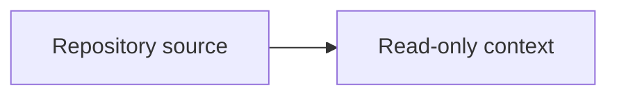

<!-- HANDWRITE-BEGIN gap="missing-generator:unit-test:ae1f8d30" tracker="pending-tracker" reason="Minimal typed TD fixture with YAML frontmatter, Mermaid, commands, and relationships." -->
---
id: fixture-aw-context-td
summary: Typed renderer fixture
fill_sections: [logic, changes, unit-test]
---

# Fixture Tech Design

## Logic



The verifier is generated with:

```bash
aw td gen 2196
```

## Changes

The corresponding verifier is `external-contract.md` and the work root is #2196.

## Unit Test

The fixture is verified without changing its source bytes.
<!-- HANDWRITE-END -->
