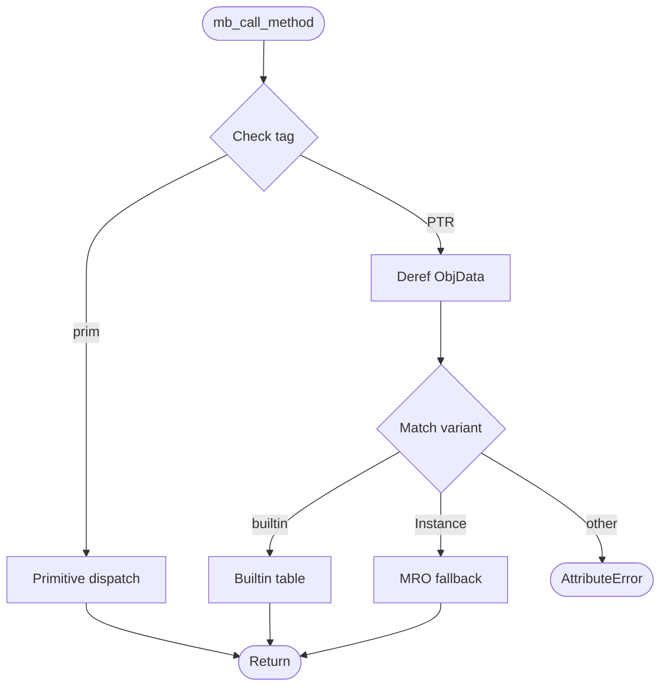
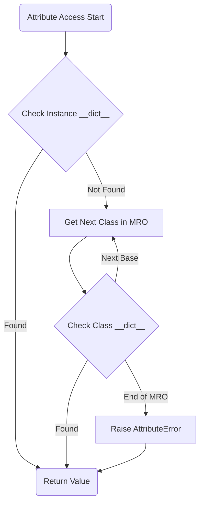

# Class System

## Overview

Complete class system for the Mamba runtime. Covers MbClass struct definition, instance creation, C3 MRO computation, super() support, attribute access model, type-tagged method dispatch for built-in types, magic method dispatch (operators, conversions, protocols), `__format__` protocol, context manager protocol, and `__slots__` support.

Merged from: method-dispatch.md, oop-model.md, advanced-features.md R1/R4.

## Source Files

| File | LOC | Responsibility |
|------|-----|----------------|
| `runtime/class.rs` | 1,238 | Class definition, dispatch, MRO, magic methods |

## Requirements

### R1 - Type-Tagged Dispatch for Built-in Types

```yaml
id: R1
priority: high
```

`mb_call_method(receiver, method_name, args, argc)` extracts the ObjData variant tag from the receiver and dispatches to the corresponding Rust runtime function. For NaN-boxed primitives (TAG_INT, TAG_BOOL, TAG_NONE), dispatch methods without heap allocation. Raises AttributeError for unknown methods.

### R2 - MRO Fallback for User Classes

```yaml
id: R2
priority: high
```

When receiver is `ObjData::Instance`, fall back to MRO-based attribute lookup on the instance's class hierarchy.

### R3 - C3 MRO Computation

```yaml
id: R3
priority: high
```

Implement C3 linearization to compute a stable and consistent Method Resolution Order for all classes, supporting single and multiple inheritance.

### R4 - super() Support

```yaml
id: R4
priority: high
```

Built-in `super()` identifies the next class in the MRO relative to the current method's defining class and instance, enabling cooperative multiple inheritance.

### R5 - Magic Method Dispatch

```yaml
id: R5
priority: high
```

Dispatch operators and protocol methods to dunder methods:
- **Arithmetic**: `mb_binop(left, right, op)` -> `__add__/__sub__/__mul__/__truediv__/__floordiv__/__mod__/__pow__`
- **Comparison**: `mb_compare(left, right, op)` -> `__eq__/__ne__/__lt__/__le__/__gt__/__ge__`
- **Conversion**: `mb_call_str(obj)`, `mb_call_repr(obj)`, `mb_call_bool(obj)`
- **Protocol**: `mb_call_len(obj)` -> `__len__`, `mb_call_iter(obj)` -> `__iter__`, `mb_call_next(obj)` -> `__next__`, `mb_call_contains(c, item)` -> `__contains__`

### R6 - Attribute Access Model

```yaml
id: R6
priority: high
```

Instance and class attribute access via `__getattr__`, `__setattr__`, `__delattr__` equivalent logic. Instance `__dict__` checked first, then class MRO.

### R7 - __slots__ Support

```yaml
id: R7
priority: medium
```

Optional `slots: Vec<String>` on MbClass. If defined, `mb_setattr` rejects attribute names not in the slots list, raising AttributeError.

### R8 - Context Manager Protocol

```yaml
id: R8
priority: medium
```

Support `with` statement via `__enter__` and `__exit__` protocol. `__enter__` runs before the body, `__exit__` runs after (including on exception).

### R9 - __format__ Protocol Dispatch

```yaml
id: R9
priority: medium
```

`mb_obj_format(obj, spec)` looks up `__format__` dunder on obj's class. If found, calls it with the format spec string. Falls back to `mb_obj_str()` if not defined.

## Acceptance Criteria

| Scenario | Given/When | Then |
|----------|-----------|------|
| String method dispatch | `s.split(' ')` on string | Routes to `mb_string_split` |
| Primitive dispatch | `str(42)` on int | Handles TAG_INT without heap lookup |
| MRO fallback | `Foo().bar()` on user class | Falls back to MRO |
| AttributeError | `42.nonexistent()` | Raises AttributeError |
| super() dispatch | B inherits A; `super().speak()` | A's `speak` invoked via MRO |
| Operator overloading | Class C with `__add__`; `C(1)+C(2)` | `__add__` called via MRO |
| __slots__ restriction | Foo with `__slots__=['x','y']`; `foo.z=1` | AttributeError raised |
| Context manager | Class with `__enter__`/`__exit__` in `with` | `__enter__` before body, `__exit__` after |

## Diagrams

### Dispatch Flow



### OOP Attribute Lookup (MRO) Flow



## Recommended Codebase Split

class.rs is currently 1,238 lines. The following split is prescribed:

| Future file | Responsibility | Approx LOC |
|-------------|---------------|------------|
| `class.rs` | MbClass, instance creation, MRO, super(), __slots__ | ~400 |
| `dispatch.rs` | mb_call_method, dispatch table, type-tagged routing | ~400 |
| `magic.rs` | Dunder methods, operator overloading, protocol dispatch | ~400 |
