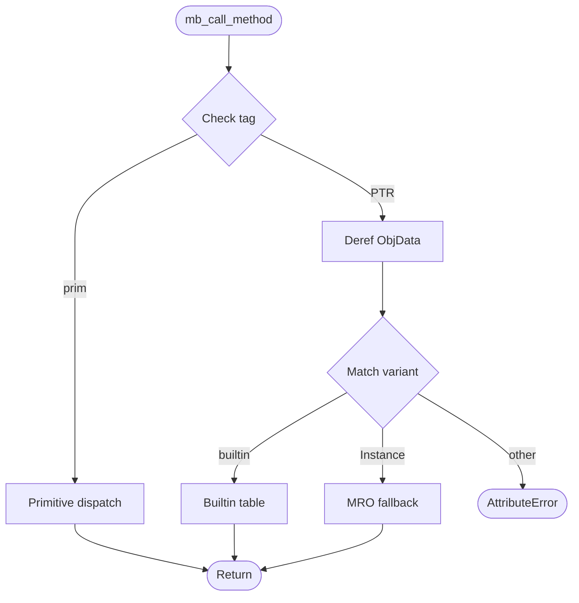
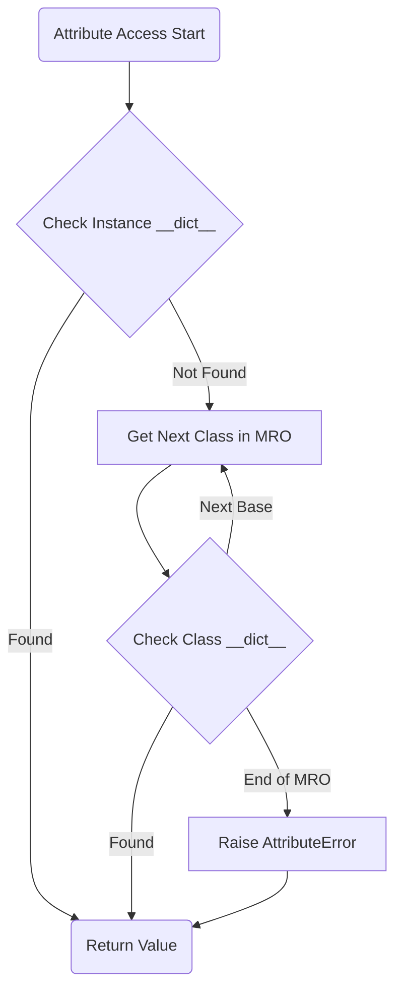

# Class System

## Overview

## Overview
<!-- type: overview lang: markdown -->

Extend the Mamba class system to support advanced Python 3.12 class features: `__init_subclass__` with keyword arguments (PEP 487), `__class_getitem__` for generic subscript syntax (PEP 560), `__set_name__` descriptor naming protocol (PEP 487), `__slots__` inheritance chain merging with `__dict__` suppression, and compiler-side emission for `__slots__` declarations.

The runtime (class.rs) already supports basic `__slots__` enforcement, `__init_subclass__` invocation without kwargs, property/classmethod/staticmethod descriptors, and full MRO-based dispatch. This change extends those foundations and adds the missing PEP 487/560 protocols.

Base spec: `crates/cclab-mamba/runtime/class.md` (R1–R9 unchanged, new requirements R10–R14 added).

### Source Files

| File | LOC | Responsibility |
|------|-----|----------------|
| `runtime/class.rs` | 4,402 | Class definition, dispatch, MRO, magic methods, descriptors |
| `lower/hir_to_mir.rs` | ~2,500 | Class registration, decorator application, class-attr emission |
| `lower/ast_to_hir.rs` | ~720 | Class body scanning, field/method extraction |
| `runtime/symbols.rs` | ~500 | Runtime symbol table for JIT-linked functions |
## Source Files

| File | LOC | Responsibility |
|------|-----|----------------|
| `runtime/class.rs` | 1,238 | Class definition, dispatch, MRO, magic methods |

## Requirements

## Requirements
<!-- type: requirements lang: markdown -->

### R10 - __init_subclass__ Keyword Arguments

```yaml
id: R10
priority: high
depends: [R4]
```

`__init_subclass__(cls, **kwargs)` receives keyword arguments passed in the class statement `class Child(Parent, key=val):`. Currently `__init_subclass__` is invoked in `mb_class_register` but kwargs are discarded.

Changes:
- `mb_class_register` / `mb_class_define_multi` accept an optional kwargs `HashMap<String, MbValue>`
- Lowering extracts keyword arguments from the class base-list (syntax: `class C(Base, kw=expr):`) and passes them through
- Runtime calls `__init_subclass__(cls, **kwargs)` with collected kwargs
- If base has no `__init_subclass__`, extra kwargs raise `TypeError`

### R11 - __class_getitem__ for Generic Subscript Syntax

```yaml
id: R11
priority: medium
depends: [R1]
```

Support `MyClass[T]` syntax (PEP 560). When a class is subscripted, the runtime calls `type.__class_getitem__(cls, key)` if defined.

Changes:
- `mb_obj_getitem` checks if receiver is a class object and if the class defines `__class_getitem__`
- If found, calls `cls.__class_getitem__(key)` and returns result
- If not found, raises `TypeError: '{name}' object is not subscriptable`
- Lowering emits subscript on class names as `mb_obj_getitem` (same as container subscript)

### R12 - __set_name__ Descriptor Naming Protocol

```yaml
id: R12
priority: medium
depends: [R6]
```

PEP 487: After class creation, for each attribute `v` in the class namespace that defines `__set_name__`, call `v.__set_name__(owner_class, attr_name)`.

Changes:
- After `mb_class_register` populates the class dict, iterate over all class attributes
- For each attribute that has a `__set_name__` method (check via MRO on the attribute's class), call `attr.__set_name__(cls, name)`
- Order: alphabetical by attribute name (deterministic, matches CPython dict insertion order)
- Errors in `__set_name__` propagate as `RuntimeError`

### R13 - __slots__ Inheritance Chain Merging

```yaml
id: R13
priority: high
depends: [R7]
```

Extend `__slots__` to support inheritance. CPython merges slots from all bases in the MRO.

Changes:
- `mb_register_slots` merges parent slots: effective slots = union of class's own `__slots__` + all base classes' slots
- If a class defines `__slots__`, `__dict__` is suppressed unless `'__dict__'` is explicitly in `__slots__`
- If a class does NOT define `__slots__` but a base does, `__dict__` is available (CPython behavior)
- SLOTS_REGISTRY stores the effective (merged) slot set per class

### R14 - Compiler __slots__ Emission

```yaml
id: R14
priority: high
depends: [R13]
```

The lowering pass must detect `__slots__` in the class body and emit `mb_register_slots(class_name, slots_list)` calls.

Changes:
- `ast_to_hir.rs`: Scan class body for `__slots__ = [...]` or `__slots__ = (...)` assignment. Extract string literal elements.
- `hir_to_mir.rs`: After class registration call, emit `mb_register_slots(class_name_val, slots_list_val)` if slots were declared
- Handle `__slots__ = ()` (empty tuple) as valid — means no instance attributes allowed
- Handle `__slots__ = ['x', 'y']` list literal and `__slots__ = ('x', 'y')` tuple literal
## Acceptance Criteria

| Scenario | Given/When | Then |
|----------|-----------|------|
| String method dispatch | `s.split(' ')` on string | Routes to `mb_string_split` |
| Primitive dispatch | `str(42)` on int | Handles TAG_INT without heap lookup |
| MRO fallback | `Foo().bar()` on user class | Falls back to MRO |
| AttributeError | `42.nonexistent()` | Raises AttributeError |
| super() dispatch | B inherits A; `super().speak()` | A's `speak` invoked via MRO |
| Operator overloading | Class C with `__add__`; `C(1)+C(2)` | `__add__` called via MRO |
| __slots__ restriction | Foo with `__slots__=['x','y']`; `foo.z=1` | AttributeError raised |
| Context manager | Class with `__enter__`/`__exit__` in `with` | `__enter__` before body, `__exit__` after |

## Diagrams

### Dispatch Flow



### OOP Attribute Lookup (MRO) Flow



## Recommended Codebase Split

class.rs is currently 1,238 lines. The following split is prescribed:

| Future file | Responsibility | Approx LOC |
|-------------|---------------|------------|
| `class.rs` | MbClass, instance creation, MRO, super(), __slots__ | ~400 |
| `dispatch.rs` | mb_call_method, dispatch table, type-tagged routing | ~400 |
| `magic.rs` | Dunder methods, operator overloading, protocol dispatch | ~400 |


## Scenarios

## Scenarios
<!-- type: scenarios lang: markdown -->

### S1 — __init_subclass__ receives keyword arguments

```
Given: class Base defines __init_subclass__(cls, *, registry=None)
And:   class Child(Base, registry="users") is defined
When:  Child class is created
Then:  Base.__init_subclass__ is called with cls=Child, registry="users"
```

### S2 — __init_subclass__ no kwargs, no __init_subclass__ defined

```
Given: class Parent has no __init_subclass__ method
And:   class Child(Parent) is defined without keyword arguments
When:  Child class is created
Then:  No error; class creation succeeds normally
```

### S3 — __init_subclass__ extra kwargs without handler raises TypeError

```
Given: class Base has no __init_subclass__ method
And:   class Child(Base, key="val") is defined with keyword argument
When:  Child class is created
Then:  TypeError raised: "__init_subclass__() takes no keyword arguments"
```

### S4 — __class_getitem__ enables generic subscript

```
Given: class MyList defines __class_getitem__(cls, item): return f"{cls.__name__}[{item}]"
When:  MyList[int] is evaluated
Then:  Returns "MyList[int]"
```

### S5 — Subscript on class without __class_getitem__ raises TypeError

```
Given: class Foo with no __class_getitem__
When:  Foo[int] is evaluated
Then:  TypeError raised: "'type' object is not subscriptable"
```

### S6 — __set_name__ called on descriptors after class creation

```
Given: class Descriptor defines __set_name__(self, owner, name)
And:   class MyClass has attr = Descriptor()
When:  MyClass is created
Then:  attr.__set_name__(MyClass, "attr") is called
And:   Descriptor instance knows its attribute name
```

### S7 — __slots__ with inheritance merges parent slots

```
Given: class Base with __slots__ = ['x']
And:   class Child(Base) with __slots__ = ['y']
When:  c = Child(); c.x = 1; c.y = 2
Then:  Both assignments succeed (x from Base slots, y from Child slots)
And:   c.z = 3 raises AttributeError
```

### S8 — __slots__ suppresses __dict__

```
Given: class Compact with __slots__ = ['x', 'y']
When:  obj = Compact(); obj.__dict__ is accessed
Then:  AttributeError raised (no __dict__ when __slots__ defined)
```

### S9 — __slots__ with __dict__ explicitly listed

```
Given: class Hybrid with __slots__ = ['x', '__dict__']
When:  obj = Hybrid(); obj.x = 1; obj.z = 3
Then:  Both succeed (x from slots, z via __dict__)
```

### S10 — Empty __slots__ allows no instance attributes

```
Given: class Empty with __slots__ = ()
When:  obj = Empty(); obj.x = 1
Then:  AttributeError raised
```

### S11 — Compiler emits mb_register_slots for __slots__ = [...]

```
Given: Source code contains class Foo: __slots__ = ['a', 'b']
When:  Compiled through ast→hir→mir
Then:  MIR contains call to mb_register_slots with class name and slot list
And:   Runtime SLOTS_REGISTRY has entry for Foo with ["a", "b"]
```

### S12 — Child without __slots__ inherits but gets __dict__

```
Given: class Base with __slots__ = ['x']
And:   class Child(Base) with no __slots__ declaration
When:  c = Child(); c.x = 1; c.z = 99
Then:  c.x = 1 succeeds (inherited slot)
And:   c.z = 99 succeeds (via __dict__, since Child has no __slots__)
```


## Changes

## Changes
<!-- type: changes lang: yaml -->

```yaml
files:
  - path: crates/cclab-mamba/src/runtime/class.rs
    action: modify
    changes:
      - id: init-subclass-kwargs
        req: R10
        description: >
          Extend mb_class_register / mb_class_define_multi to accept optional
          kwargs HashMap. Pass kwargs to __init_subclass__ call. If base lacks
          __init_subclass__ and kwargs are non-empty, raise TypeError.
      - id: class-getitem-dispatch
        req: R11
        description: >
          In mb_obj_getitem (or new mb_class_getitem), check if receiver is a
          class object. If class defines __class_getitem__, call it with the key.
          Otherwise raise TypeError.
      - id: set-name-protocol
        req: R12
        description: >
          After class dict is populated in mb_class_register, iterate class
          attributes and call __set_name__(owner, attr_name) on any that
          define it.
      - id: slots-inheritance-merge
        req: R13
        description: >
          Modify mb_register_slots to walk MRO and merge parent slots into
          effective slot set. Track __dict__ suppression flag per class.
          Update mb_setattr to check merged slots and __dict__ availability.
      - id: slots-dict-suppression
        req: R13
        description: >
          Add per-class __dict__ suppression flag to SLOTS_REGISTRY.
          mb_getattr returns AttributeError for __dict__ when suppressed.
          mb_setattr allows arbitrary attrs only when __dict__ is available.

  - path: crates/cclab-mamba/src/lower/ast_to_hir.rs
    action: modify
    changes:
      - id: scan-slots-declaration
        req: R14
        description: >
          In lower_class, scan for __slots__ = [...] or __slots__ = (...)
          assignment. Extract string literal elements into HirClass field
          (new field: slots: Option<Vec<String>>).
      - id: scan-class-kwargs
        req: R10
        description: >
          Parse keyword arguments from class base-list syntax
          (class C(Base, key=expr):). Store in HirClass field
          (new field: class_kwargs: Vec<(String, HirExpr)>).

  - path: crates/cclab-mamba/src/lower/hir_to_mir.rs
    action: modify
    changes:
      - id: emit-register-slots
        req: R14
        description: >
          After class registration call, if HirClass.slots is Some,
          emit mb_register_slots(class_name_val, slots_list_val).
          Build slots list as MbValue list of string constants.
      - id: emit-class-kwargs
        req: R10
        description: >
          Pass class_kwargs through to mb_class_define_multi or a new
          mb_class_register_with_kwargs variant. Lower each kwarg
          expr and build kwargs dict.

  - path: crates/cclab-mamba/src/runtime/symbols.rs
    action: modify
    changes:
      - id: add-new-symbols
        req: [R10, R11, R12]
        description: >
          Register new runtime symbols: mb_class_getitem (if separate fn),
          and any new variants of mb_class_register that accept kwargs.

  - path: crates/cclab-mamba/src/hir/mod.rs
    action: modify
    changes:
      - id: hir-class-fields
        req: [R10, R14]
        description: >
          Add fields to HirClass struct:
          - slots: Option<Vec<String>> (for __slots__ declaration)
          - class_kwargs: Vec<(String, HirExpr)> (for class keyword arguments)

  - path: crates/cclab-mamba/tests/fixtures/conformance/class_system/
    action: create
    changes:
      - id: conformance-tests
        req: [R10, R11, R12, R13, R14]
        description: >
          Add conformance test files:
          - slots_inheritance.py: S7, S8, S9, S10, S12
          - init_subclass.py: S1, S2, S3
          - class_getitem.py: S4, S5
          - set_name.py: S6
```

# Reviews
