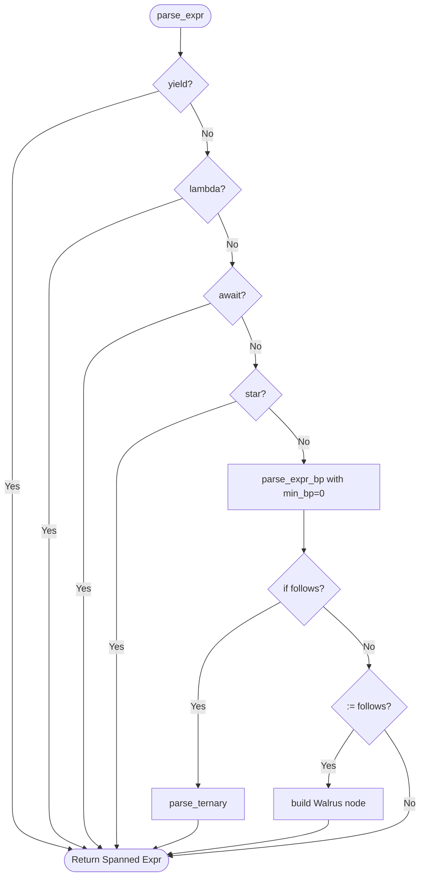
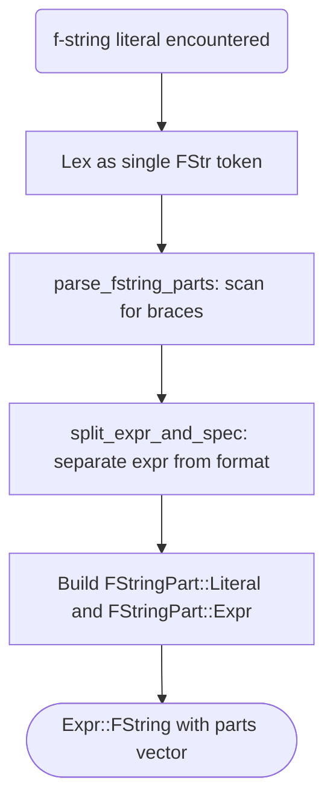

# Expression Parsing

## Overview

This specification covers the expression parser for Mamba. The parser is a recursive-descent parser using Pratt (precedence climbing) for binary operators. It handles all Python 3.12 expression forms including compound expressions (comprehensions, lambda, ternary), f-string interpolation, and walrus operator.

## Requirements

### R1 - Pratt Parser / Precedence Climbing for Binary Operators

```yaml
id: R1
priority: high
```

Binary expression parsing uses a `parse_expr_bp(min_bp)` loop with binding powers:

| Precedence | Operators                                           | Assoc |
|------------|-----------------------------------------------------|-------|
| 1-2        | `or`                                                | Left  |
| 3-4        | `and`                                               | Left  |
| 7-8        | `==`, `!=`, `<`, `>`, `<=`, `>=`, `is`, `is not`, `in`, `not in` | Left |
| 9-10       | `\|` (bitwise)                                      | Left  |
| 11-12      | `^`                                                 | Left  |
| 13-14      | `&`                                                 | Left  |
| 15-16      | `<<`, `>>`                                          | Left  |
| 17-18      | `+`, `-`                                            | Left  |
| 19-20      | `*`, `/`, `//`, `%`, `@`                            | Left  |
| 21         | Unary `+`, `-`, `~` (prefix)                        | --    |
| 24-23      | `**`                                                | Right |
| 5          | Unary `not` (prefix)                                | --    |

Multi-token operators (`is not`, `not in`) are detected via `peek_at(1)` lookahead and consume two tokens on advance. Postfix operations (call, attribute, index/slice) are handled in an inner loop before checking for infix operators, enabling chains like `obj.method(args)[0]`.

### R2 - Compound Expression Parsing

```yaml
id: R2
priority: high
```

Compound expressions are parsed in `expr_compound.rs`:

- **Ternary**: `body if condition else alt` -- detected when `If` follows a parsed expression.
- **Lambda**: `lambda params: body` -- params optionally typed, supports `*args`/`**kwargs` and defaults.
- **Yield/YieldFrom**: `yield expr` / `yield from expr`.
- **Await**: `await expr`.
- **Parenthesized**: `(expr)`, `(a, b)` (tuple), `()` (empty tuple), `(expr for x in iter)` (generator).
- **List**: `[elems]` or `[expr for x in iter if cond]` (list comprehension).
- **Dict/Set/Comprehension**: `{k: v}` (dict), `{elems}` (set), `{k: v for ...}` (dict comp), `{expr for ...}` (set comp).
- **Comprehension clauses**: `for target in iter if cond` with `is_async` flag, supporting multiple nested clauses.

### R3 - f-string Expression Parsing (PEP 701)

```yaml
id: R3
priority: medium
```

When the parser encounters an `FStr(content)` token, it calls `parse_fstring_parts(content)` which splits the raw content into `FStringPart::Literal` and `FStringPart::Expr` segments:

1. Scan bytes left to right.
2. `{{` and `}}` are escaped literal braces.
3. `{` opens an interpolation: track brace depth until matching `}`.
4. Within the interpolation, split on the first top-level `:` (not inside brackets/parens) to separate the expression from the optional format spec (e.g., `{x:.2f}`).
5. The expression text is stored as `Expr::Ident(text)` with a dummy span (full re-parsing is deferred).

### R4 - Starred Expression Parsing

```yaml
id: R4
priority: medium
```

When `*` appears at expression-start (outside binary context), it produces `Expr::Starred(Box<Spanned<Expr>>)`. This enables unpacking in function calls (`f(*args)`), assignments (`a, *rest = lst`), and comprehensions.

### R5 - Parser Infrastructure

```yaml
id: R5
priority: high
```

The `Parser` struct holds the token stream, position cursor, source text reference, and `FileId`. Key helpers:

| Method             | Purpose                                           |
|--------------------|---------------------------------------------------|
| `peek() / peek_kind()` | Look at current token without consuming        |
| `advance()`        | Consume current token, return `(start, end)`      |
| `expect(kind)`     | Consume if matching, else error                   |
| `expect_name()`    | Consume identifier or soft keyword as name        |
| `skip_newlines()`  | Skip past `Newline` tokens                        |
| `span_from(start)` | Create span from `start` to last consumed token   |
| `is_name_token()`  | Check if token can serve as a name (soft keywords) |

`parse_module()` is the entry point, iterating `parse_stmt()` until EOF. The top-level `parse(source, file_id)` convenience function runs lexing then parsing in sequence.

## Acceptance Criteria

### Scenario: Operator Precedence

- **WHEN** `1 + 2 * 3` is parsed.
- **THEN** the AST is `BinOp(Add, 1, BinOp(Mul, 2, 3))` (multiplication binds tighter).

### Scenario: Right-Associative Power

- **WHEN** `2 ** 3 ** 4` is parsed.
- **THEN** the AST is `BinOp(Pow, 2, BinOp(Pow, 3, 4))`.

### Scenario: List Comprehension

- **WHEN** `[x * 2 for x in range(10) if x > 3]` is parsed.
- **THEN** the result is `ListComp { element: BinOp(Mul, x, 2), generators: [Comprehension { target: "x", iter: Call(range, [10]), conditions: [BinOp(Gt, x, 3)] }] }`.

### Scenario: f-string with Format Spec

- **WHEN** `f"value: {x:.2f}"` is parsed.
- **THEN** the parts are `[Literal("value: "), Expr(Ident("x"), Some(".2f"))]`.

### Scenario: Walrus Operator

- **WHEN** `(n := len(items))` is parsed.
- **THEN** the result is `Walrus { target: "n", value: Call(len, [items]) }`.

## Diagrams

### Expression Parsing Entry Flow



### f-string Interpolation Flow


