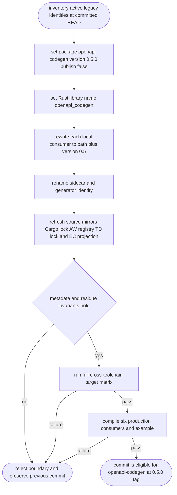

## Logic
<!-- type: logic lang: mermaid -->


## Changes
<!-- type: changes lang: yaml -->

```yaml
changes:
  - path: "libs/openapi-codegen/Cargo.toml"
    action: modify
    section: logic
    impl_mode: hand-written
    description: "Rename the package, assign independent version 0.5.0, rename the Rust library crate, and disable registry publication."
  - path: "libs/openapi-codegen/src/lib.rs"
    action: modify
    section: logic
    impl_mode: codegen
    description: "Rename the manifest filename and serialized generator identity."
  - path: "libs/openapi-codegen/tests/target_profile_matrix.rs"
    action: modify
    section: unit-test
    impl_mode: hand-written
    anchor: "opts for `fn opts`"
    description: "Consume the renamed Rust crate and assert the renamed materialized sidecar contract."
  - path: "libs/openapi-codegen/README.md"
    action: modify
    section: logic
    impl_mode: hand-written
    description: "Document the independent Git version boundary and renamed commands/artifacts."
  - path: "libs/openapi-codegen/aw.toml"
    action: modify
    section: unit-test
    impl_mode: hand-written
    description: "Project all EC and test commands through the renamed Cargo package."
  - path: "libs/openapi-codegen/external-contracts/behavior/multi-language-openapi-client-generation-contract.md"
    action: modify
    section: unit-test
    impl_mode: hand-written
    description: "Bind behavior contracts to the renamed package, crate, and sidecar."
  - path: "apps/defer/Cargo.toml"
    action: modify
    section: logic
    impl_mode: hand-written
    description: "Use the renamed local package with version 0.5 compatibility validation."
  - path: "apps/defer/src/bin/defer.rs"
    action: modify
    section: logic
    impl_mode: hand-written
    anchor: "spec for `fn spec`"
    description: "Import the renamed Rust library crate."
  - path: "apps/keep/Cargo.toml"
    action: modify
    section: logic
    impl_mode: hand-written
    description: "Use the renamed local package with version 0.5 compatibility validation."
  - path: "apps/keep/src/bin/keep.rs"
    action: modify
    section: logic
    impl_mode: hand-written
    anchor: "spec_gen for `fn spec_gen`"
    description: "Import the renamed Rust library crate."
  - path: "apps/keep/tests/spec_cli.rs"
    action: modify
    section: unit-test
    impl_mode: hand-written
    anchor: "spec_gen_composes_openapi_codegen_for_every_language for `fn spec_gen_composes_openapi_codegen_for_every_language`"
    description: "Verify Keep composes the renamed crate."
  - path: "apps/lumen/Cargo.toml"
    action: modify
    section: logic
    impl_mode: hand-written
    description: "Use the renamed local package with version 0.5 compatibility validation."
  - path: "apps/lumen/src/bin/lumen.rs"
    action: modify
    section: logic
    impl_mode: codegen
    description: "Import the renamed Rust library crate."
  - path: "apps/lumen/src/spec.rs"
    action: modify
    section: logic
    impl_mode: codegen
    description: "Compose the renamed library LLM topic."
  - path: "apps/lumen/tests/generated_clients_crud_e2e.rs"
    action: modify
    section: unit-test
    impl_mode: codegen
    description: "Run generated-client journeys through the renamed crate."
  - path: "apps/lumen/tests/spec_gen_e2e.rs"
    action: modify
    section: unit-test
    impl_mode: hand-written
    anchor: "gen_target_override_writes_the_requested_contract for `fn gen_target_override_writes_the_requested_contract`"
    description: "Assert the renamed sidecar contract."
  - path: "apps/relay/Cargo.toml"
    action: modify
    section: logic
    impl_mode: hand-written
    description: "Use the renamed local package with version 0.5 compatibility validation."
  - path: "apps/relay/src/bin/relay.rs"
    action: modify
    section: logic
    impl_mode: hand-written
    anchor: "spec_gen for `fn spec_gen`"
    description: "Import the renamed Rust library crate."
  - path: "apps/relay/tests/spec_cli.rs"
    action: modify
    section: unit-test
    impl_mode: hand-written
    anchor: "spec_gen_target_override_writes_the_requested_contract for `fn spec_gen_target_override_writes_the_requested_contract`"
    description: "Assert the renamed sidecar contract."
  - path: "apps/tape/Cargo.toml"
    action: modify
    section: logic
    impl_mode: hand-written
    description: "Use the renamed local package with version 0.5 compatibility validation."
  - path: "apps/tape/src/bin/tape.rs"
    action: modify
    section: logic
    impl_mode: hand-written
    anchor: "spec_gen for `fn spec_gen`"
    description: "Import the renamed Rust library crate."
  - path: "projects/sift/Cargo.toml"
    action: modify
    section: logic
    impl_mode: hand-written
    description: "Use the renamed local package with version 0.5 compatibility validation."
  - path: "projects/sift/src/bin/sift.rs"
    action: modify
    section: logic
    impl_mode: hand-written
    anchor: "spec_gen for `fn spec_gen`"
    description: "Import the renamed Rust library crate."
  - path: "examples/client-transport-policy/Cargo.toml"
    action: modify
    section: logic
    impl_mode: hand-written
    description: "Use the renamed local package with version 0.5 compatibility validation."
  - path: "examples/client-transport-policy/src/lib.rs"
    action: modify
    section: unit-test
    impl_mode: hand-written
    anchor: "opts for `fn opts`"
    description: "Compile the example through the renamed Rust library crate."
  - path: "CONTRIBUTING.md"
    action: modify
    section: logic
    impl_mode: hand-written
    description: "Use the independent openapi-codegen project identity in repository guidance."
  - path: "aw.toml"
    action: modify
    section: unit-test
    impl_mode: hand-written
    description: "Refresh the generated project registry and renamed package test command."
```

## Unit Test

```mermaid
---
id: openapi-codegen-git-version-boundary-verification
requirements:
  artifact_identity:
    id: R3
    text: "Explicit target output materializes .openapi-codegen.json with generator identity openapi-codegen."
    kind: functional
    risk: high
    verify: target_profile_matrix all_target_requirements_and_artifacts_are_deterministic
  aw_projection_integrity:
    id: R6
    text: "TD source mirrors, EC cases, project registry commands, and lock projections resolve through the renamed identity."
    kind: integration
    risk: medium
    verify: AW TD EC and project configuration checks
  consumer_version_contract:
    id: R2
    text: "Every in-repository production consumer uses the renamed local path dependency with a compatible 0.5 version requirement."
    kind: integration
    risk: high
    verify: reverse consumer cargo check matrix
  cross_toolchain_behavior:
    id: R5
    text: "The Python 3.11-3.14, TypeScript 5.0, Rust 2021/2024, legacy golden, and deterministic artifact matrix remains green after the rename."
    kind: regression
    risk: high
    verify: cargo test -p openapi-codegen
  legacy_identity_residue:
    id: R4
    text: "No active package, crate, sidecar, generator, command, or consumer reference retains the legacy cclab openapi-codegen identity."
    kind: regression
    risk: medium
    verify: repository legacy identity residue scan
  package_identity:
    id: R1
    text: "The Cargo package is openapi-codegen 0.5.0, the Rust crate is openapi_codegen, and registry publication is disabled."
    kind: functional
    risk: high
    verify: cargo metadata --no-deps --format-version 1 package identity assertion
---
flowchart TD
    r1[R1 package identity] --> cargo_metadata_no_deps_format_version_1_package_identity_assertion[cargo metadata --no-deps --format-version 1 package identity assertion]
    r2[R2 consumer version contract] --> reverse_consumer_cargo_check_matrix[reverse consumer cargo check matrix]
    r3[R3 artifact identity] --> target_profile_matrix_all_target_requirements_and_artifacts_are_deterministic[target_profile_matrix all_target_requirements_and_artifacts_are_deterministic]
    r4[R4 legacy identity residue] --> repository_legacy_identity_residue_scan[repository legacy identity residue scan]
    r5[R5 cross toolchain behavior] --> cargo_test_p_openapi_codegen[cargo test -p openapi-codegen]
    r6[R6 aw projection integrity] --> aw_td_ec_and_project_configuration_checks[AW TD EC and project configuration checks]
```

<!-- type: unit-test lang: mermaid -->


