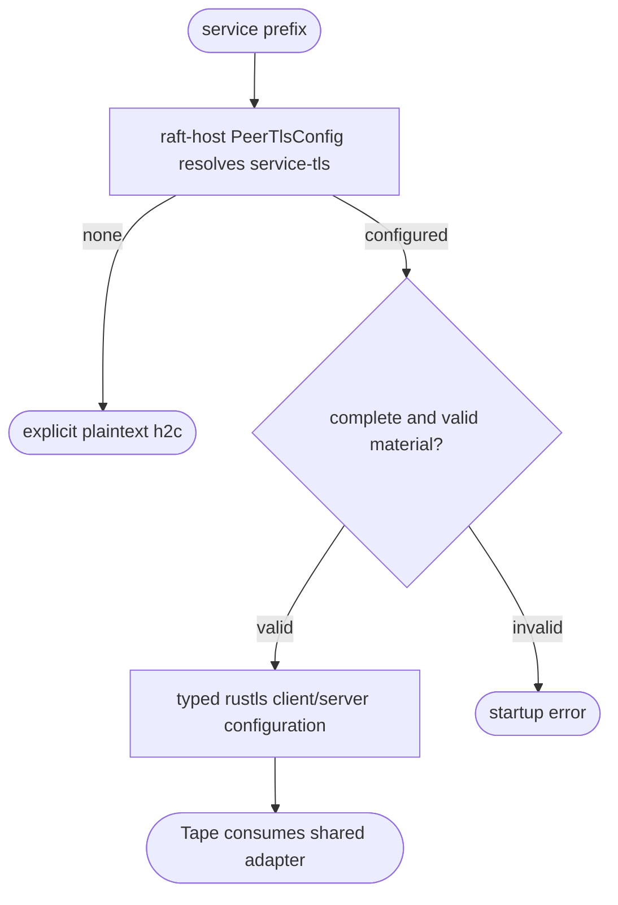
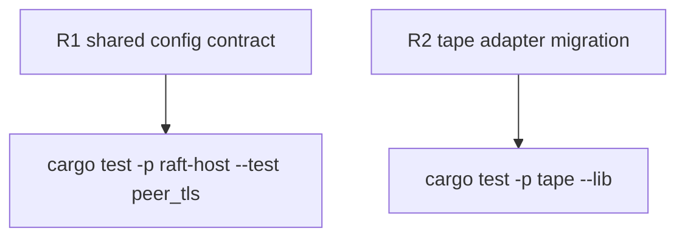

## Logic
<!-- type: logic lang: mermaid -->



`raft-host` owns the shared peer-transport configuration boundary. It delegates
PEM parsing, client/server config construction, and mTLS policy validation to
`service-tls`, preserving the existing all-or-nothing material contract. Tape
will consume this typed adapter instead of maintaining a local wrapper and
unsafe environment-mutating tests.

This slice deliberately does not claim TLS termination on the current h2c peer
router: that transport seam is absent today. A configured peer policy is
validated and represented by the host; actual acceptor/connector wiring remains
a later transport change.

## Changes
<!-- type: changes lang: yaml -->

```yaml
changes:
  - path: libs/raft-host/Cargo.toml
    action: modify
    section: logic
    impl_mode: hand-written
  - path: libs/raft-host/src/peer_tls.rs
    action: create
    section: logic
    impl_mode: hand-written
  - path: libs/raft-host/tech-design/semantic/source/libs-raft-host-src-lib-rs.md
    action: modify
    section: logic
    impl_mode: codegen
  - path: libs/raft-host/tests/peer_tls.rs
    action: create
    section: unit-test
    impl_mode: hand-written
  - path: apps/tape/Cargo.toml
    action: modify
    section: changes
    impl_mode: hand-written
  - path: apps/tape/src/peer_tls.rs
    action: modify
    section: changes
    impl_mode: hand-written
```

## Unit Test
<!-- type: unit-test lang: mermaid -->


