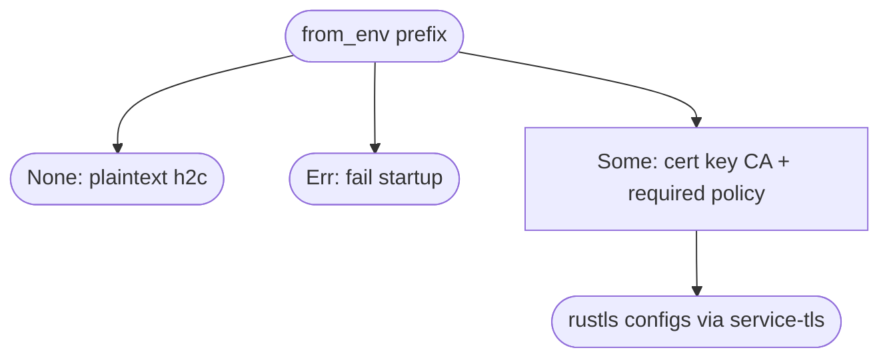
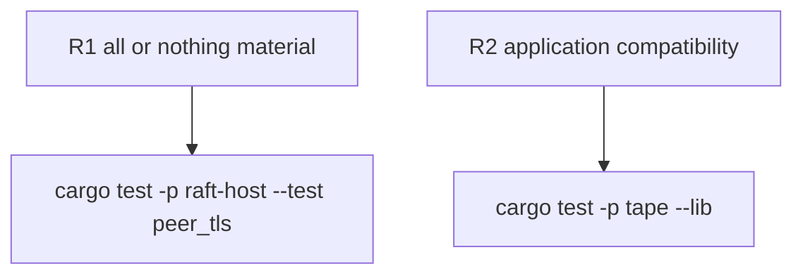

## Logic
<!-- type: logic lang: mermaid -->



The public contract is `raft_host::PeerTlsConfig`: `from_env(prefix)` returns
`None` only when all variables are absent, returns an error for partial or
unusable material, and exposes the validated paths and mTLS-required flag.
Its rustls builders delegate to `service-tls`; no private-key parsing or unsafe
operation is duplicated in service applications.

The contract explicitly does not change the Raft host's current h2c router or
peer dialing protocol. Consumers may validate and stage material now; TLS
termination requires a later acceptor/connector seam.
## Changes
<!-- type: changes lang: yaml -->

```yaml
changes:
  - path: libs/raft-host/src/peer_tls.rs
    action: create
    section: logic
    impl_mode: hand-written
  - path: libs/raft-host/tech-design/semantic/source/libs-raft-host-src-lib-rs.md
    action: modify
    section: logic
    impl_mode: codegen
  - path: apps/tape/src/peer_tls.rs
    action: modify
    section: logic
    impl_mode: hand-written
  - path: apps/tape/Cargo.toml
    action: modify
    section: logic
    impl_mode: hand-written
```
## Unit Test
<!-- type: unit-test lang: mermaid -->


