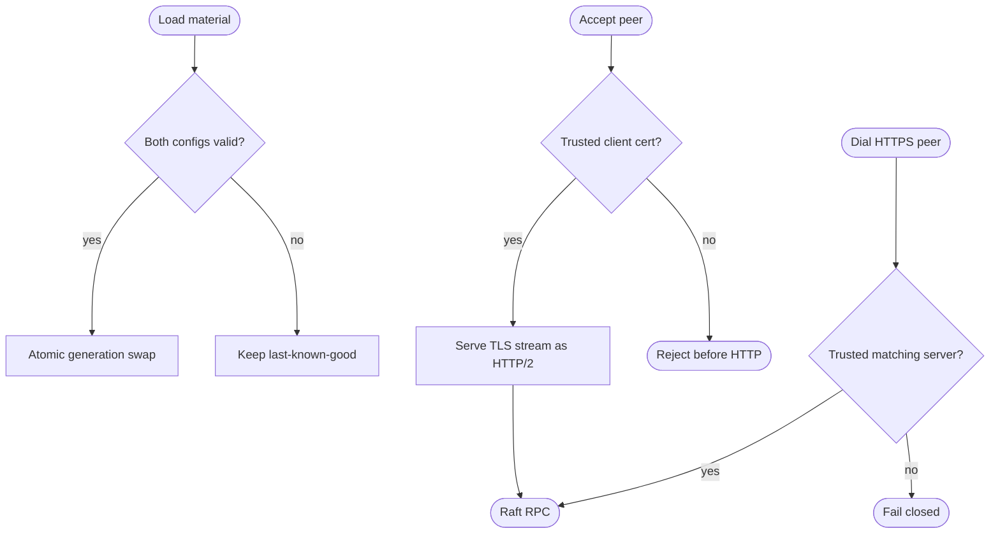

## Logic
<!-- type: logic lang: mermaid -->



## Changes
<!-- type: changes lang: yaml -->

```yaml
changes:
  - path: libs/raft-runtime/src/peer_transport.rs
    action: create
    section: logic
    impl_mode: hand-written
    description: "Reloadable last-known-good mTLS client/server snapshot, raw TLS connect/accept seams, HTTPS client, and TLS HTTP/2 listener."
  - path: libs/raft-runtime/src/lib.rs
    action: modify
    section: logic
    impl_mode: hand-written
    description: "Expose the peer mTLS transport contract."
  - path: libs/raft-runtime/tech-design/semantic/source/libs-raft-runtime-src-lib-rs.md
    action: modify
    section: source
    impl_mode: hand-written
    description: "Keep the raft-runtime public semantic source aligned."
  - path: libs/raft-runtime/src/host.rs
    action: modify
    section: logic
    impl_mode: hand-written
    description: "Add spawn_with_peer_transport and route outgoing Raft HTTPS requests through the reloadable shared client."
  - path: libs/raft-runtime/tech-design/semantic/source/libs-raft-runtime-src-host-rs.md
    action: modify
    section: source
    impl_mode: hand-written
    description: "Keep the host semantic source aligned with TLS transport adoption."
  - path: libs/raft-runtime/src/cluster.rs
    action: modify
    section: logic
    impl_mode: hand-written
    description: "Support caller-selected http or https peer URL projection while preserving the existing http default."
  - path: libs/raft-runtime/tech-design/semantic/source/libs-raft-runtime-src-cluster-rs.md
    action: modify
    section: source
    impl_mode: hand-written
    description: "Keep cluster topology semantic source aligned."
  - path: libs/raft-runtime/Cargo.toml
    action: modify
    section: changes
    impl_mode: hand-written
    description: "Add peer-tls, rustls, tokio-rustls, transport server feature, and rcgen test dependencies."
  - path: libs/raft-runtime/README.md
    action: modify
    section: changes
    impl_mode: hand-written
    description: "Publish the shared peer mTLS capability rooted at #1643."
  - path: libs/transport-h2c/src/server.rs
    action: modify
    section: logic
    impl_mode: hand-written
    description: "Generalize the per-connection HTTP/2 server from TcpStream to any Tokio AsyncRead/AsyncWrite stream, including rustls."
  - path: libs/transport-h2c/tech-design/semantic/source/libs-transport-h2c-src-server-rs.md
    action: modify
    section: source
    impl_mode: hand-written
    description: "Keep the generic server I/O semantic source aligned."
  - path: libs/peer-tls/src/lib.rs
    action: modify
    section: logic
    impl_mode: hand-written
    description: "Advertise h2 ALPN from both peer rustls configs."
  - path: libs/peer-tls/tech-design/semantic/source/libs-peer-tls-src-lib-rs.md
    action: modify
    section: source
    impl_mode: hand-written
    description: "Keep peer TLS material semantic source aligned."
  - path: apps/lumen/src/tls.rs
    action: modify
    section: logic
    impl_mode: hand-written
    description: "Expose Lumen's thin conversion into the shared raft-runtime PeerTransport."
  - path: apps/lumen/tech-design/semantic/source/apps-lumen-src-tls-rs.md
    action: modify
    section: source
    impl_mode: hand-written
    description: "Keep Lumen TLS semantic source aligned."
  - path: apps/tape/src/peer_tls.rs
    action: modify
    section: logic
    impl_mode: hand-written
    description: "Expose Tape's identical thin conversion into the shared runtime transport."
  - path: libs/raft-runtime/tests/peer_mtls.rs
    action: create
    section: unit-test
    impl_mode: hand-written
    description: "Ephemeral CA/certificate tests for mutual success, hostname mismatch, untrusted client rejection, and explicit reload preservation."
```
