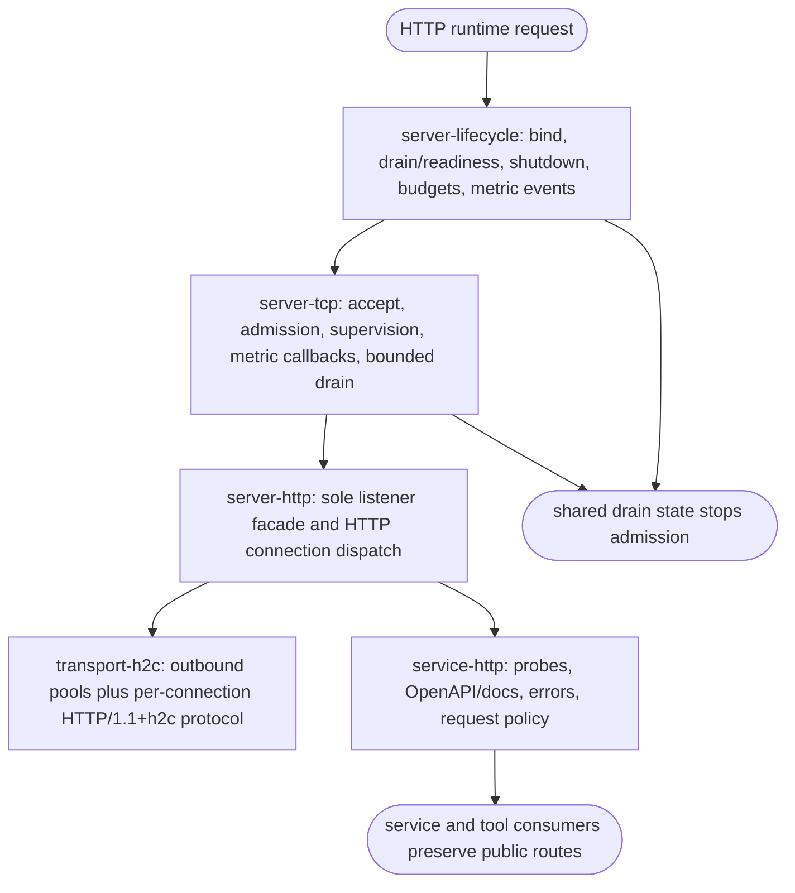
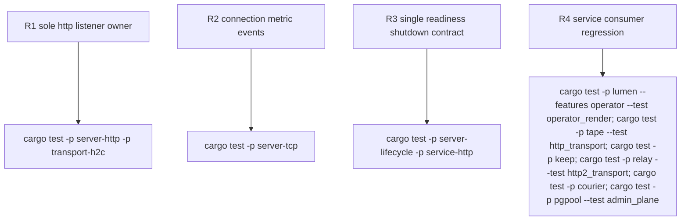

## Logic
<!-- type: logic lang: mermaid -->



## Changes
<!-- type: changes lang: yaml -->

```yaml
changes:
  - path: libs/server-lifecycle/src/readiness.rs
    action: create
    section: logic
    impl_mode: hand-written
    description: Own the protocol-neutral readiness/draining observation contract.
  - path: libs/server-lifecycle/src/lib.rs
    action: modify
    section: logic
    impl_mode: hand-written
    description: Export the single readiness and shutdown lifecycle surface.
  - path: libs/server-tcp/src/lib.rs
    action: modify
    section: logic
    impl_mode: hand-written
    description: Invoke connection metric callbacks around admission, rejection, and completion.
  - path: libs/transport-h2c/src/server.rs
    action: modify
    section: logic
    impl_mode: hand-written
    description: Narrow server support to one accepted connection without listener ownership.
  - path: libs/transport-h2c/src/lib.rs
    action: modify
    section: logic
    impl_mode: hand-written
    description: Export per-connection protocol machinery and remove listener-level serve exports.
  - path: libs/transport-h2c/Cargo.toml
    action: modify
    section: logic
    impl_mode: hand-written
    description: Align optional dependencies and crate description with the narrowed transport boundary.
  - path: libs/transport-h2c/src/llm.rs
    action: modify
    section: logic
    impl_mode: hand-written
    description: Advertise the source-backed transport boundary without listener ownership.
  - path: libs/server-http/src/lib.rs
    action: modify
    section: logic
    impl_mode: hand-written
    description: Own the HTTP listener facade by composing server-tcp with per-connection h2c.
  - path: libs/server-http/Cargo.toml
    action: modify
    section: logic
    impl_mode: hand-written
    description: Own HTTP runtime dependencies and expose lifecycle-aware configuration.
  - path: libs/server-http/README.md
    action: create
    section: logic
    impl_mode: hand-written
    description: Define the shared HTTP runtime capability and ownership boundary.
  - path: libs/service-http/src/readiness.rs
    action: modify
    section: logic
    impl_mode: hand-written
    description: Adapt the server-lifecycle readiness contract to HTTP probes without redefining it.
  - path: libs/service-http/src/signal.rs
    action: modify
    section: logic
    impl_mode: hand-written
    description: Delegate shutdown behavior to server-lifecycle without a parallel implementation.
  - path: libs/service-http/Cargo.toml
    action: modify
    section: logic
    impl_mode: hand-written
    description: Compose the protocol-neutral lifecycle owner explicitly.
  - path: libs/service-http/README.md
    action: modify
    section: logic
    impl_mode: hand-written
    description: Limit service-http ownership to the service HTTP policy shell.
  - path: README.md
    action: modify
    section: logic
    impl_mode: hand-written
    description: Correct the shared library inventory ownership descriptions.
  - path: CONTRIBUTING.md
    action: modify
    section: logic
    impl_mode: hand-written
    description: Record the listener, lifecycle, and per-connection transport boundaries.
```

## Unit Test
<!-- type: unit-test lang: mermaid -->


