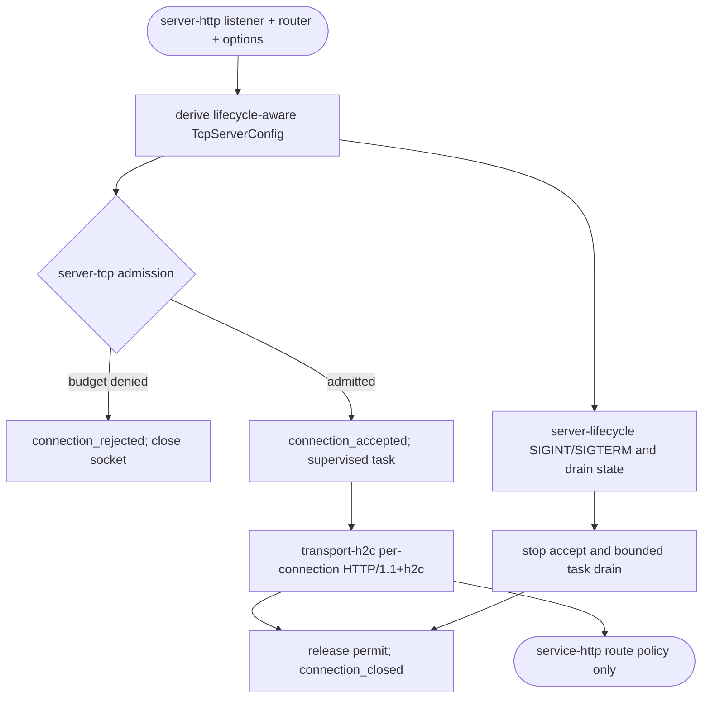
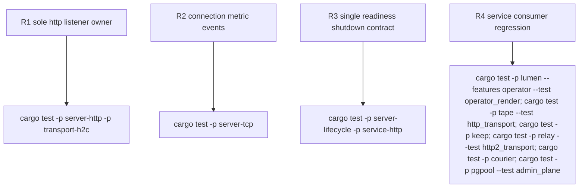

## Logic
<!-- type: logic lang: mermaid -->


## Changes
<!-- type: changes lang: yaml -->

```yaml
changes:
  - { path: libs/server-lifecycle/src/readiness.rs, action: create, section: logic, impl_mode: hand-written, description: "Own readiness and draining observation." }
  - { path: libs/server-lifecycle/src/lib.rs, action: modify, section: logic, impl_mode: hand-written, description: "Export the single lifecycle surface." }
  - { path: libs/server-tcp/src/lib.rs, action: modify, section: logic, impl_mode: hand-written, description: "Emit connection metrics around admission and task completion." }
  - { path: libs/transport-h2c/src/server.rs, action: modify, section: logic, impl_mode: hand-written, description: "Serve one accepted HTTP connection without owning a listener." }
  - { path: libs/transport-h2c/src/lib.rs, action: modify, section: logic, impl_mode: hand-written, description: "Export only per-connection server protocol support." }
  - { path: libs/transport-h2c/Cargo.toml, action: modify, section: logic, impl_mode: hand-written, description: "Align the narrowed transport dependency boundary." }
  - { path: libs/transport-h2c/src/llm.rs, action: modify, section: logic, impl_mode: hand-written, description: "Document the no-listener transport boundary." }
  - { path: libs/server-http/src/lib.rs, action: modify, section: logic, impl_mode: hand-written, description: "Compose server-tcp and per-connection h2c as the sole HTTP runtime." }
  - { path: libs/server-http/Cargo.toml, action: modify, section: logic, impl_mode: hand-written, description: "Own HTTP runtime dependencies and options." }
  - { path: libs/server-http/README.md, action: create, section: logic, impl_mode: hand-written, description: "Define the HTTP runtime capability boundary." }
  - { path: libs/service-http/src/readiness.rs, action: modify, section: logic, impl_mode: hand-written, description: "Adapt server-lifecycle readiness to probes." }
  - { path: libs/service-http/src/signal.rs, action: modify, section: logic, impl_mode: hand-written, description: "Delegate shutdown to server-lifecycle." }
  - { path: libs/service-http/Cargo.toml, action: modify, section: logic, impl_mode: hand-written, description: "Depend explicitly on the lifecycle owner." }
  - { path: libs/service-http/README.md, action: modify, section: logic, impl_mode: hand-written, description: "Limit ownership to the service HTTP policy shell." }
  - { path: README.md, action: modify, section: logic, impl_mode: hand-written, description: "Correct the library inventory boundaries." }
  - { path: CONTRIBUTING.md, action: modify, section: logic, impl_mode: hand-written, description: "Define listener, lifecycle, and transport ownership." }
```
## Unit Test
<!-- type: unit-test lang: mermaid -->


