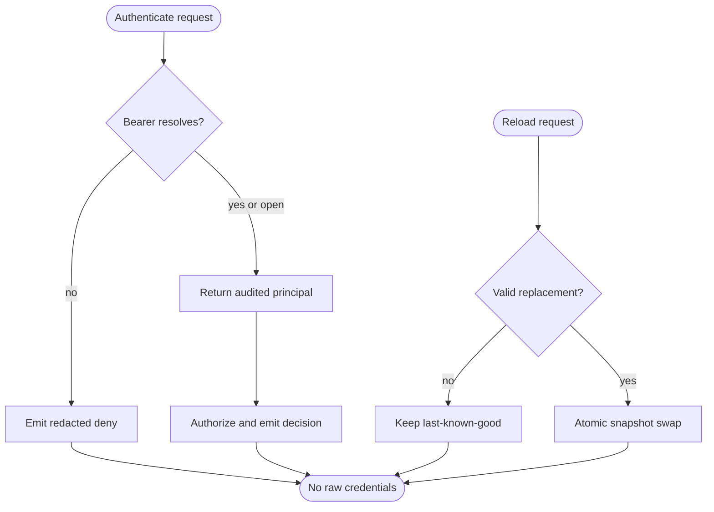

## Logic
<!-- type: logic lang: mermaid -->



## Changes
<!-- type: changes lang: yaml -->

```yaml
changes:
  - path: libs/service-auth/src/reload.rs
    action: create
    section: logic
    impl_mode: hand-written
    description: "Reloadable validated role-map snapshots, audited principals, redacted auth events, and backend-neutral event sinks."
  - path: libs/service-auth/src/lib.rs
    action: modify
    section: logic
    impl_mode: hand-written
    description: "Expose the shared reload/audit module and public contract."
  - path: libs/service-auth/tech-design/semantic/source/libs-service-auth-src-lib-rs.md
    action: modify
    section: source
    impl_mode: hand-written
    description: "Keep the canonical semantic source mirror aligned with the runtime module surface."
  - path: libs/service-auth/Cargo.toml
    action: modify
    section: changes
    impl_mode: hand-written
    description: "Add the tracing dependency used by the shared redacted event sink."
  - path: libs/service-auth/README.md
    action: modify
    section: changes
    impl_mode: hand-written
    description: "Publish the credential lifecycle and authorization-audit capability rooted at #1641."
  - path: apps/lumen/src/auth.rs
    action: modify
    section: logic
    impl_mode: hand-written
    description: "Adopt ReloadableRoleMapVerifier and expose explicit validated reload while preserving Lumen AuthContext."
  - path: apps/lumen/tech-design/semantic/source/projects-lumen-src-auth-rs.md
    action: modify
    section: source
    impl_mode: hand-written
    description: "Keep Lumen auth semantic source aligned with the shared reloadable verifier adoption."
  - path: apps/tape/src/auth.rs
    action: modify
    section: logic
    impl_mode: hand-written
    description: "Adopt the same reloadable verifier and audited-principal authorization helper."
  - path: apps/tape/src/server.rs
    action: modify
    section: logic
    impl_mode: hand-written
    description: "Run Tape data-plane auth with the shared reloadable verifier/principal types."
  - path: apps/tape/tests/service_auth.rs
    action: modify
    section: unit-test
    impl_mode: hand-written
    description: "Verify Tape rotation and authorization remain compatible through the shared lifecycle."
```
