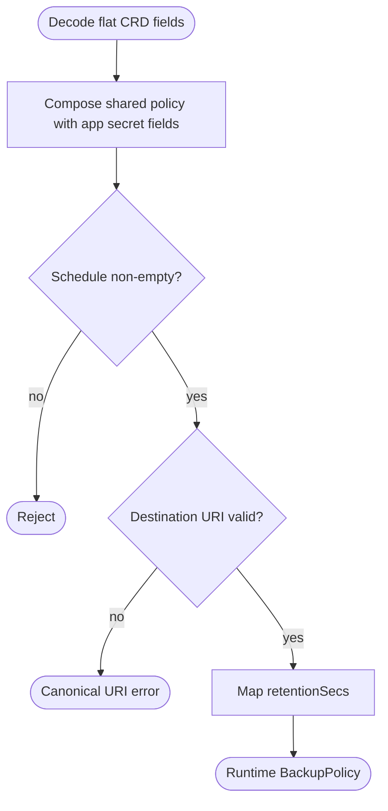
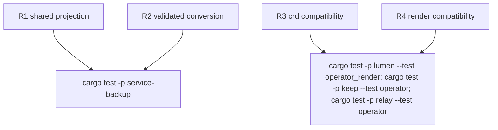

## Logic
<!-- type: logic lang: mermaid -->


## Changes
<!-- type: changes lang: yaml -->

```yaml
changes:
  - { path: libs/service-backup/tech-design/semantic/source/libs-service-backup-src-policy-rs.md, action: modify, section: logic, impl_mode: hand-written, description: Define ScheduledBackupPolicy and validated runtime conversion in the canonical source unit. }
  - { path: libs/service-backup/tech-design/semantic/source/libs-service-backup-src-lib-rs.md, action: modify, section: logic, impl_mode: hand-written, description: Export the shared CRD-safe policy. }
  - { path: libs/service-backup/README.md, action: modify, section: logic, impl_mode: hand-written, description: Document CRD and runtime policy ownership. }
  - { path: CONTRIBUTING.md, action: modify, section: logic, impl_mode: hand-written, description: Record the shared service-kit boundary. }
  - { path: apps/lumen/tech-design/semantic/source/apps-lumen-src-operator-crd-rs.md, action: modify, section: logic, impl_mode: hand-written, description: Flatten the shared policy beside Lumen token-secret fields. }
  - { path: apps/lumen/tests/operator_render.rs, action: modify, section: unit-test, impl_mode: hand-written, description: Prove serialization schema and operator rendering compatibility. }
  - { path: apps/keep/src/operator/crd.rs, action: modify, section: logic, impl_mode: hand-written, description: Replace Keep's duplicate DTO with the shared type. }
  - { path: apps/keep/tests/operator.rs, action: modify, section: unit-test, impl_mode: hand-written, description: Prove Keep CRD and rendering compatibility. }
  - { path: apps/relay/src/operator/crd.rs, action: modify, section: logic, impl_mode: hand-written, description: Flatten the shared policy beside Relay token-secret fields. }
  - { path: apps/relay/tests/operator.rs, action: modify, section: unit-test, impl_mode: hand-written, description: Prove Relay CRD and rendering compatibility. }
```
## Unit Test
<!-- type: unit-test lang: mermaid -->


