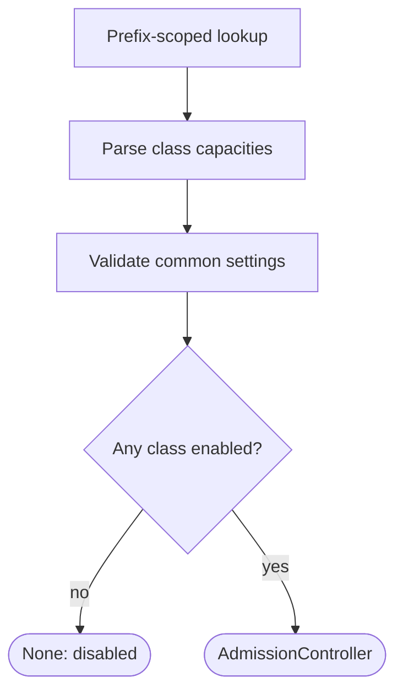

## Logic
<!-- type: logic lang: mermaid -->


## Changes
<!-- type: changes lang: yaml -->

```yaml
changes:
  - path: libs/service-http/src/admission.rs
    action: modify
    section: logic
    impl_mode: hand-written
    description: "Expose a typed optional controller configuration parser for all service adopters. generator gap: missing-generator:service-http-admission-config (#1823)."
```
## Unit Test

```mermaid
---
id: service-http-admission-config-verification
requirements:
  disabled:
    id: R1
    text: "No configured class capacities leave admission disabled without changing existing service behavior."
    kind: regression
    risk: medium
    verify: libs/service-http/src/admission.rs::tests::config_without_capacities_is_disabled
  invalid:
    id: R3
    text: "Malformed values and common settings without enabled classes fail with the exact environment key in the error."
    kind: negative
    risk: medium
    verify: libs/service-http/src/admission.rs::tests::config_rejects_invalid_or_orphaned_common_values
  valid:
    id: R2
    text: "A valid prefix config creates independently enabled read/write/admin policies with shared refill and key bounds."
    kind: functional
    risk: high
    verify: libs/service-http/src/admission.rs::tests::config_builds_multi_class_controller
---
flowchart TD
    r1[R1 disabled] --> libs_service_http_src_admission_rs_tests_config_without_capacities_is_disabled[libs/service-http/src/admission.rs::tests::config_without_capacities_is_disabled]
    r2[R2 valid] --> libs_service_http_src_admission_rs_tests_config_builds_multi_class_controller[libs/service-http/src/admission.rs::tests::config_builds_multi_class_controller]
    r3[R3 invalid] --> libs_service_http_src_admission_rs_tests_config_rejects_invalid_or_orphaned_common_values[libs/service-http/src/admission.rs::tests::config_rejects_invalid_or_orphaned_common_values]
```

<!-- type: unit-test lang: mermaid -->


