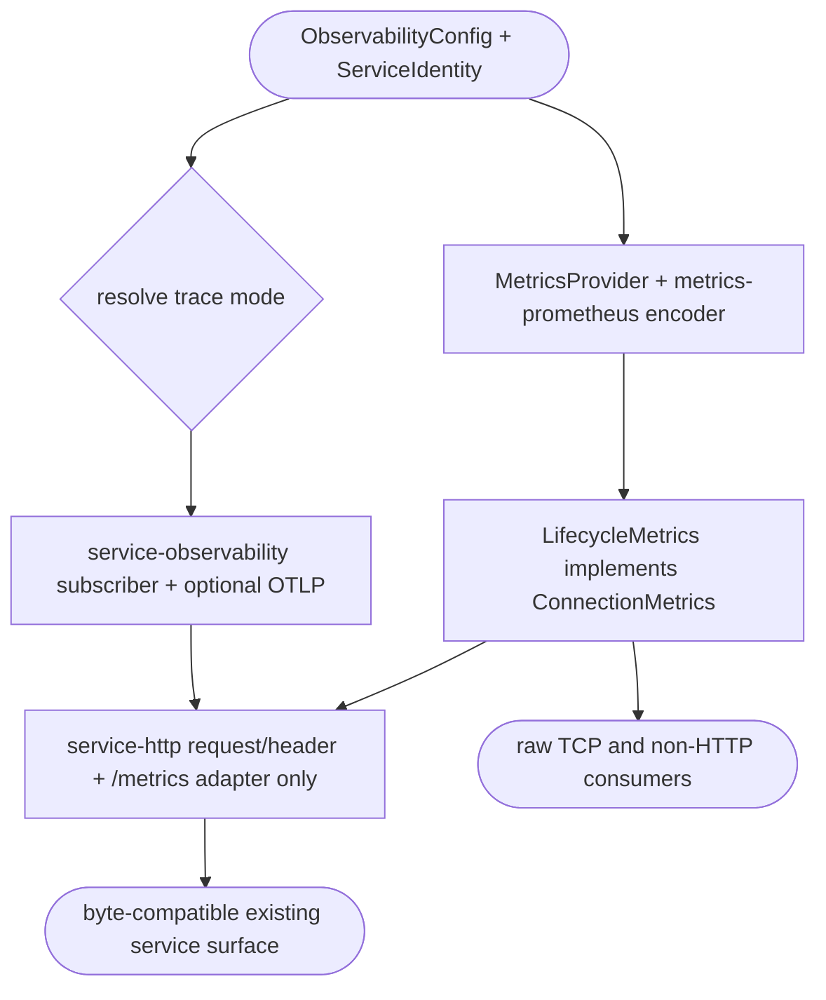

## Logic
<!-- type: logic lang: mermaid -->



## Changes
<!-- type: changes lang: yaml -->

```yaml
changes:
  - { path: libs/service-observability/Cargo.toml, action: create, section: logic, impl_mode: hand-written, description: "Declare the protocol-neutral observability integration crate and optional OTLP feature." }
  - { path: libs/service-observability/README.md, action: create, section: logic, impl_mode: hand-written, description: "Define the shared service observability capability and ownership boundary." }
  - { path: libs/service-observability/src/lib.rs, action: create, section: logic, impl_mode: hand-written, description: "Export typed configuration, tracing, metric provider, and lifecycle metrics." }
  - { path: libs/service-observability/src/config.rs, action: create, section: logic, impl_mode: hand-written, description: "Own LogFormat, ObservabilityConfig, and ServiceIdentity." }
  - { path: libs/service-observability/src/logging.rs, action: create, section: logic, impl_mode: hand-written, description: "Own logging, OTLP resolution, subscriber installation, and W3C extraction." }
  - { path: libs/service-observability/src/metrics.rs, action: create, section: logic, impl_mode: hand-written, description: "Own MetricsProvider and Prometheus-backed lifecycle connection counters." }
  - { path: libs/service-http/src/config.rs, action: modify, section: logic, impl_mode: codegen, description: "Retain HTTP knobs while adapting them into ObservabilityConfig." }
  - { path: libs/service-http/src/logging.rs, action: modify, section: logic, impl_mode: codegen, description: "Replace protocol-neutral implementation with compatibility delegation." }
  - { path: libs/service-http/src/metrics.rs, action: modify, section: logic, impl_mode: codegen, description: "Re-export the shared protocol-neutral MetricsProvider." }
  - { path: libs/service-http/src/transport.rs, action: modify, section: logic, impl_mode: codegen, description: "Keep only HTTP request-context propagation adaptation." }
  - { path: libs/service-http/src/lib.rs, action: modify, section: logic, impl_mode: codegen, description: "Expose compatibility re-exports without claiming observability ownership." }
  - { path: libs/service-http/tech-design/semantic/source/libs-service-http-src-config-rs.md, action: modify, section: logic, impl_mode: hand-written, description: "Author the HTTP-to-observability config adapter source." }
  - { path: libs/service-http/tech-design/semantic/source/libs-service-http-src-logging-rs.md, action: modify, section: logic, impl_mode: hand-written, description: "Author compatibility delegation to service-observability." }
  - { path: libs/service-http/tech-design/semantic/source/libs-service-http-src-metrics-rs.md, action: modify, section: logic, impl_mode: hand-written, description: "Author the provider re-export source." }
  - { path: libs/service-http/tech-design/semantic/source/libs-service-http-src-transport-rs.md, action: modify, section: logic, impl_mode: hand-written, description: "Author the HTTP-only propagation adapter source." }
  - { path: libs/service-http/tech-design/semantic/source/libs-service-http-src-lib-rs.md, action: modify, section: logic, impl_mode: hand-written, description: "Author the narrowed service-http public surface." }
  - { path: libs/service-http/tests/otlp_tracing.rs, action: modify, section: unit-test, impl_mode: hand-written, description: "Verify compatibility delegation and OTLP feature behavior." }
  - { path: libs/service-http/Cargo.toml, action: modify, section: logic, impl_mode: hand-written, description: "Delegate protocol-neutral dependencies and forward the OTLP feature." }
  - { path: libs/service-http/README.md, action: modify, section: logic, impl_mode: hand-written, description: "Document HTTP-only policy and adaptation ownership." }
  - { path: Cargo.toml, action: modify, section: logic, impl_mode: hand-written, description: "Register service-observability in the workspace." }
  - { path: aw.toml, action: modify, section: logic, impl_mode: codegen, description: "Register service-observability as an AW project." }
  - { path: Cargo.lock, action: modify, section: logic, impl_mode: codegen, description: "Refresh the dependency graph." }
  - { path: README.md, action: modify, section: logic, impl_mode: hand-written, description: "Name one owner for every observability layer." }
  - { path: CONTRIBUTING.md, action: modify, section: logic, impl_mode: hand-written, description: "Define service-observability, metrics-prometheus, server lifecycle, and HTTP adapter boundaries." }
```
