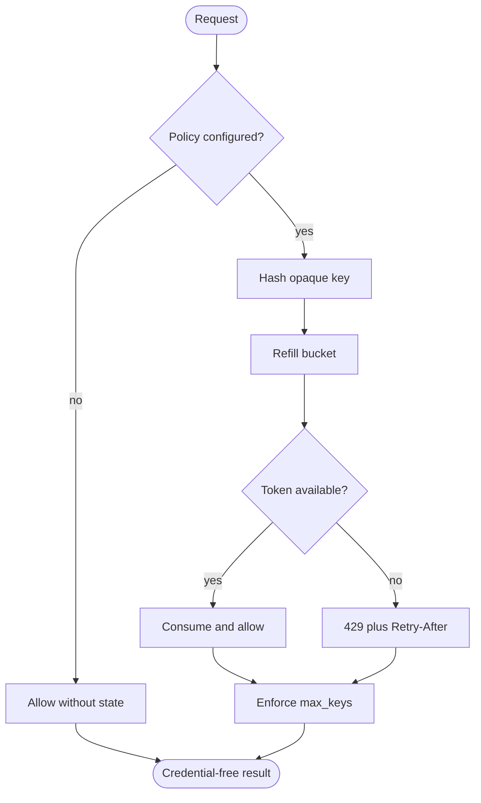
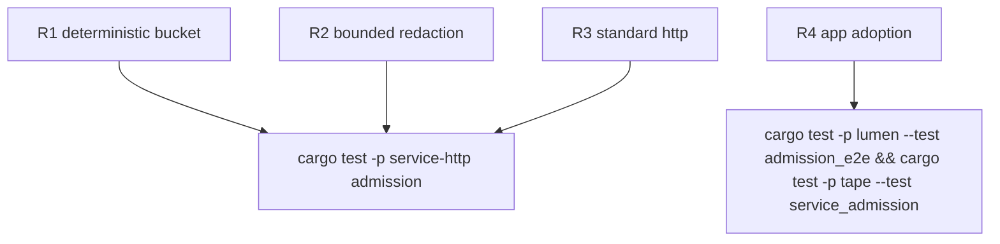

## Logic
<!-- type: logic lang: mermaid -->



## Changes
<!-- type: changes lang: yaml -->

```yaml
changes:
  - path: libs/service-http/src/admission.rs
    action: create
    section: logic
    impl_mode: hand-written
    description: "Bounded deterministic opaque-key token buckets, redacted decision hooks, standard Retry-After rejection, and reusable axum middleware."
  - path: libs/service-http/src/lib.rs
    action: modify
    section: logic
    impl_mode: hand-written
    description: "Expose the shared admission module and public contract."
  - path: libs/service-http/tech-design/semantic/source/libs-service-http-src-lib-rs.md
    action: modify
    section: source
    impl_mode: hand-written
    description: "Keep the semantic source mirror aligned with the admission export."
  - path: libs/service-http/Cargo.toml
    action: modify
    section: changes
    impl_mode: hand-written
    description: "Add the SHA-256 implementation used to fingerprint opaque keys before retention."
  - path: libs/service-http/README.md
    action: modify
    section: changes
    impl_mode: hand-written
    description: "Publish the shared opaque-key admission capability rooted at #1642."
  - path: apps/lumen/src/api.rs
    action: modify
    section: logic
    impl_mode: hand-written
    description: "Expose an opt-in router_with_admission boundary so Lumen chooses endpoint classes and policies without owning enforcement."
  - path: apps/lumen/tech-design/semantic/source/projects-lumen-src-api-rs.md
    action: modify
    section: source
    impl_mode: hand-written
    description: "Keep Lumen API semantic source aligned with the optional shared admission layer."
  - path: apps/lumen/tests/admission_e2e.rs
    action: create
    section: unit-test
    impl_mode: hand-written
    description: "Verify Lumen-selected collection-read policy rejects excess requests while the default router remains unchanged."
  - path: apps/tape/src/server.rs
    action: modify
    section: logic
    impl_mode: hand-written
    description: "Expose the same opt-in router boundary with Tape-selected route classes and policy values."
  - path: apps/tape/tests/service_admission.rs
    action: create
    section: unit-test
    impl_mode: hand-written
    description: "Verify Tape-selected append policy uses shared enforcement and default routing stays disabled."
```

## Unit Test
<!-- type: unit-test lang: mermaid -->


