## Logic

```mermaid
---
id: service-http-request-completion-flow
entry: request
nodes:
  request:
    kind: start
    label: "Inbound HTTP request with optional W3C traceparent"
  span:
    kind: process
    label: "CorrelatingMakeSpan validates parent context or creates a fresh local root and records method, uri, trace fields"
  handler:
    kind: process
    label: "The service router handles the request and produces an HTTP response"
  completion:
    kind: process
    label: "The shared response callback emits one INFO http_request_complete event with status and latency_ms inside the request span"
  jsonl:
    kind: process
    label: "ServiceJsonFormatter serializes the event and inherited request-span fields as axiom.service.log.v1 JSONL"
  boundary:
    kind: terminal
    label: "stdout carries JSONL; external collector owns all routing, credentials, retention, and Sift integration"
edges:
  - { from: request, to: span }
  - { from: span, to: handler }
  - { from: handler, to: completion }
  - { from: completion, to: jsonl }
  - { from: jsonl, to: boundary }
---
flowchart LR
    request([HTTP request plus traceparent]) --> span[CorrelatingMakeSpan]
    span --> handler[Service router handler]
    handler --> completion[INFO http_request_complete]
    completion --> jsonl[axiom.service.log.v1 JSONL]
    jsonl --> boundary([stdout to external collector])
```

<!-- type: logic lang: mermaid -->


## Changes
<!-- type: changes lang: yaml -->

```yaml
changes:
  - path: "libs/service-http/src/transport.rs"
    action: modify
    section: logic
    impl_mode: hand-written
    anchor: "pub fn trace_layer"
  - path: "libs/service-http/Cargo.toml"
    action: modify
    section: unit-test
    impl_mode: hand-written
  - path: "libs/service-http/tests/request_completion_event.rs"
    action: create
    section: unit-test
    impl_mode: hand-written
```
## Unit Test

```mermaid
---
id: service-http-request-completion-verification
requirements:
  collector_boundary:
    id: R4
    text: "The request trace layer exposes no collector endpoint, credential, routing, storage, or Sift-specific argument; it emits only standard tracing events."
    kind: functional
    risk: medium
    verify: request_completion_event::trace_layer_has_no_collector_configuration_surface
  completion_record:
    id: R1
    text: "A completed HTTP request emits exactly one decoded INFO axiom.service.log.v1 record named http_request_complete with method, uri, status, and non-negative latency_ms attributes."
    kind: functional
    risk: high
    verify: request_completion_event::completion_record_is_schema_valid_and_complete
  fallback_context:
    id: R3
    text: "Missing and malformed traceparent inputs each produce exactly one completion record with a fresh valid root context and no parent span id."
    kind: regression
    risk: high
    verify: request_completion_event::missing_or_malformed_parent_falls_back_without_losing_completion_event
  valid_parent:
    id: R2
    text: "A valid W3C traceparent is preserved on the same completion record with a distinct local span id and the original trace flags."
    kind: regression
    risk: high
    verify: request_completion_event::valid_w3c_parent_is_preserved_on_completion_record
---
flowchart TD
    r1[R1 completion record] --> request_completion_event_completion_record_is_schema_valid_and_complete[request_completion_event::completion_record_is_schema_valid_and_complete]
    r2[R2 valid parent] --> request_completion_event_valid_w3c_parent_is_preserved_on_completion_record[request_completion_event::valid_w3c_parent_is_preserved_on_completion_record]
    r3[R3 fallback context] --> request_completion_event_missing_or_malformed_parent_falls_back_without_losing_completion_event[request_completion_event::missing_or_malformed_parent_falls_back_without_losing_completion_event]
    r4[R4 collector boundary] --> request_completion_event_trace_layer_has_no_collector_configuration_surface[request_completion_event::trace_layer_has_no_collector_configuration_surface]
```

<!-- type: unit-test lang: mermaid -->


