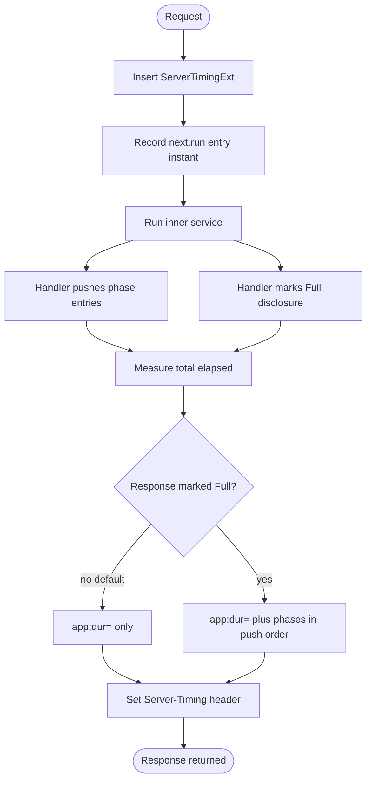

## Logic
<!-- type: logic lang: mermaid -->


## Changes
<!-- type: changes lang: yaml -->

```yaml
changes:
  - path: libs/service-http/src/server_timing.rs
    action: create
    section: logic
    impl_mode: hand-written
    description: "Server-Timing response middleware: always renders the app;dur= baseline measured at the same next.run boundary trace_layer spans, exposes a per-request ServerTimingExt phase-append extension, and gates the phase breakdown on a response-side ServerTimingDisclosure marker (TotalOnly by default, since this crate cannot see auth outcome)."
  - path: libs/service-http/src/lib.rs
    action: modify
    section: logic
    impl_mode: hand-written
    description: "Wire the server_timing module into the crate's public re-export surface and document the composition point (same outer layer as trace_layer) and disclosure posture in the crate root docs."
  - path: libs/service-http/tech-design/semantic/source/libs-service-http-src-lib-rs.md
    action: modify
    section: source
    impl_mode: hand-written
    description: "Keep the semantic source mirror aligned with the server_timing export and crate-doc changes."
  - path: libs/service-http/tests/server_timing.rs
    action: create
    section: unit-test
    impl_mode: hand-written
    description: "Live-router coverage: header present and parseable, default posture hides pushed phases, Full disclosure reveals phases in push order after the baseline, the phase-append extension is per-request (not shared across calls), and disallowed phase-name bytes are sanitized rather than dropped."
  - path: libs/service-http/README.md
    action: modify
    section: changes
    impl_mode: hand-written
    description: "Publish the Server-Timing response attribution capability rooted at #2490."
```
## Unit Test

```mermaid
---
id: server-timing-attribution-verification
requirements:
  header_present_and_parseable:
    id: R1
    text: "Every response leaving server_timing_middleware carries a Server-Timing header whose value parses as W3C Server-Timing (comma-separated name;dur=<ms> entries) and whose app;dur= reflects the handler's real elapsed time."
    kind: functional
    risk: high
    verify: cargo test -p service-http --test server_timing header_is_present_and_parseable_on_a_live_router
  phase_append_round_trip:
    id: R2
    text: "Handlers can push named (name, duration) phase entries onto the per-request ServerTimingExt extension, and — when the response opts into Full disclosure — those entries render after app;dur= in push order with their pushed durations; the collector is per-request, not shared across calls."
    kind: functional
    risk: medium
    verify: cargo test -p service-http --test server_timing full_disclosure_reveals_phases_in_push_order_after_baseline phase_append_extension_is_per_request_not_shared_across_calls
  posture_default_is_total_only:
    id: R3
    text: "A response with no ServerTimingDisclosure marker (the default posture for every response today, since this crate cannot see request auth outcome) renders app;dur= only — pushed phases never leak without an explicit response-side opt-in."
    kind: functional
    risk: high
    verify: cargo test -p service-http --test server_timing default_posture_hides_pushed_phases
  header_grammar_safety:
    id: R4
    text: "A phase name containing header-grammar-breaking bytes (';' ',' etc.) is sanitized to a safe token rather than dropped or corrupting the header, so the header still parses as exactly the expected number of entries."
    kind: functional
    risk: low
    verify: cargo test -p service-http --test server_timing disallowed_phase_name_bytes_are_sanitized_not_dropped
  unit_helpers:
    id: R5
    text: "The millisecond formatter, token sanitizer, phase-collector push/drain, and header renderer (TotalOnly and Full) behave correctly in isolation."
    kind: functional
    risk: low
    verify: cargo test -p service-http server_timing
---
flowchart TD
    r1[R1 header present and parseable] --> cargo_test_r1[cargo test -p service-http --test server_timing header_is_present_and_parseable_on_a_live_router]
    r2[R2 phase append round trip] --> cargo_test_r2[cargo test -p service-http --test server_timing full_disclosure_reveals_phases_in_push_order_after_baseline phase_append_extension_is_per_request_not_shared_across_calls]
    r3[R3 posture default total only] --> cargo_test_r3[cargo test -p service-http --test server_timing default_posture_hides_pushed_phases]
    r4[R4 header grammar safety] --> cargo_test_r4[cargo test -p service-http --test server_timing disallowed_phase_name_bytes_are_sanitized_not_dropped]
    r5[R5 unit helpers] --> cargo_test_r5[cargo test -p service-http server_timing]
```

<!-- type: unit-test lang: mermaid -->


