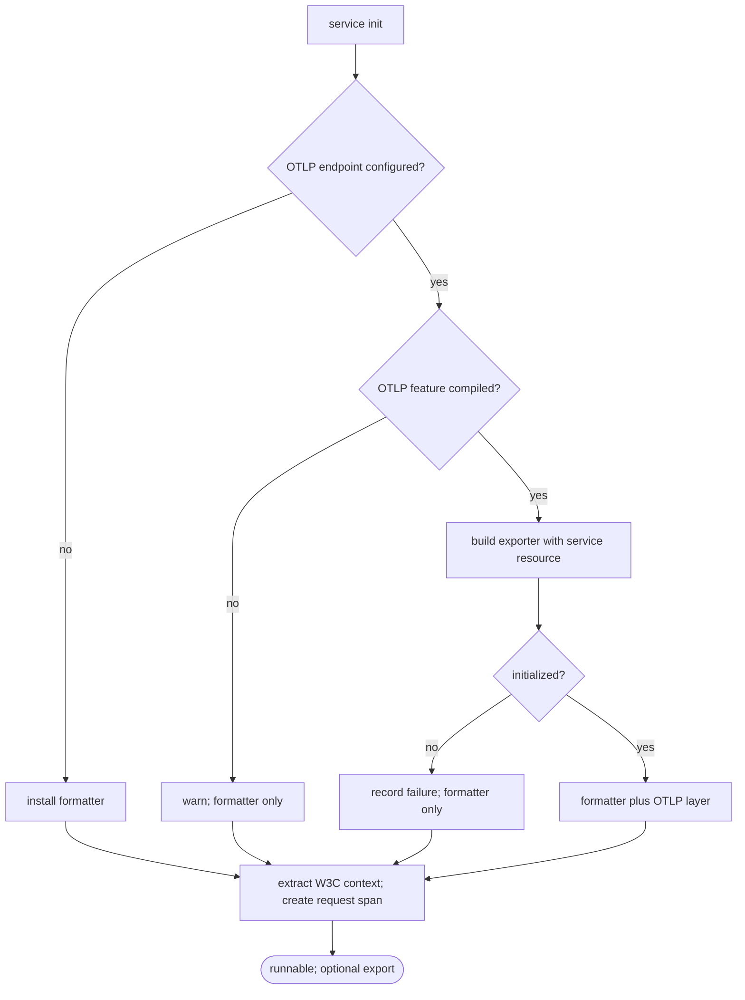

## Logic
<!-- type: logic lang: mermaid -->



## Changes
<!-- type: changes lang: yaml -->

```yaml
changes:
  - path: libs/service-http/Cargo.toml
    action: modify
    section: logic
    impl_mode: hand-written
    description: Add an optional OTLP feature and its tracing/export dependencies without changing the default logging-only dependency graph.
  - path: libs/service-http/src/config.rs
    action: modify
    section: logic
    impl_mode: hand-written
    description: Define explicit stable service identity input alongside the existing optional OTLP endpoint configuration.
  - path: libs/service-http/src/logging.rs
    action: modify
    section: logic
    impl_mode: hand-written
    description: Replace the OTLP TODO with feature-gated exporter setup, resource attributes, and non-fatal logging-only fallback.
  - path: libs/service-http/src/transport.rs
    action: modify
    section: logic
    impl_mode: hand-written
    description: Extend the standard request trace layer with W3C trace-context extraction while preserving the existing span shape.
  - path: libs/service-http/src/lib.rs
    action: modify
    section: contract
    impl_mode: hand-written
    description: Export the stable tracing identity and initialization contract for service binaries.
  - path: libs/service-http/README.md
    action: modify
    section: contract
    impl_mode: hand-written
    description: Document logging-only defaults, opt-in OTLP behavior, stable resource fields, and ownership boundaries.
  - path: libs/service-http/external-contracts/behavior/shared-http-service-scaffold-contract.md
    action: modify
    section: contract
    impl_mode: hand-written
    description: Extend the shared service-scaffold claim with optional trace export and context propagation behavior.
  - path: libs/service-http/tests/otlp_tracing.rs
    action: create
    section: unit-test
    impl_mode: hand-written
    description: Verify default logging-only initialization, explicit OTLP service identity, graceful exporter fallback, and propagated request context without a vendor collector.
  - path: libs/service-http/tech-design/semantic/source/libs-service-http-src-config-rs.md
    action: modify
    section: source
    impl_mode: hand-written
    description: Refresh semantic source coverage for the tracing identity configuration.
  - path: libs/service-http/tech-design/semantic/source/libs-service-http-src-logging-rs.md
    action: modify
    section: source
    impl_mode: hand-written
    description: Refresh semantic source coverage for exporter and fallback behavior.
  - path: libs/service-http/tech-design/semantic/source/libs-service-http-src-transport-rs.md
    action: modify
    section: source
    impl_mode: hand-written
    description: Refresh semantic source coverage for propagated request tracing.
  - path: libs/service-http/tech-design/semantic/source/libs-service-http-src-lib-rs.md
    action: modify
    section: source
    impl_mode: hand-written
    description: Refresh semantic source coverage for the public tracing API.
  - path: libs/service-http/tech-design/semantic/source/libs-service-http-tests-otlp-tracing-rs.md
    action: create
    section: source
    impl_mode: hand-written
    description: Add semantic source coverage for OTLP contract tests.
```
